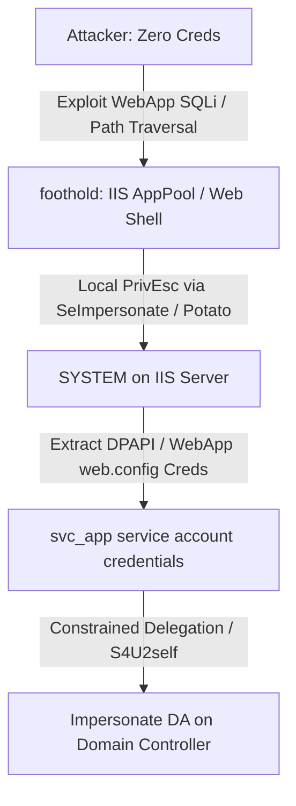
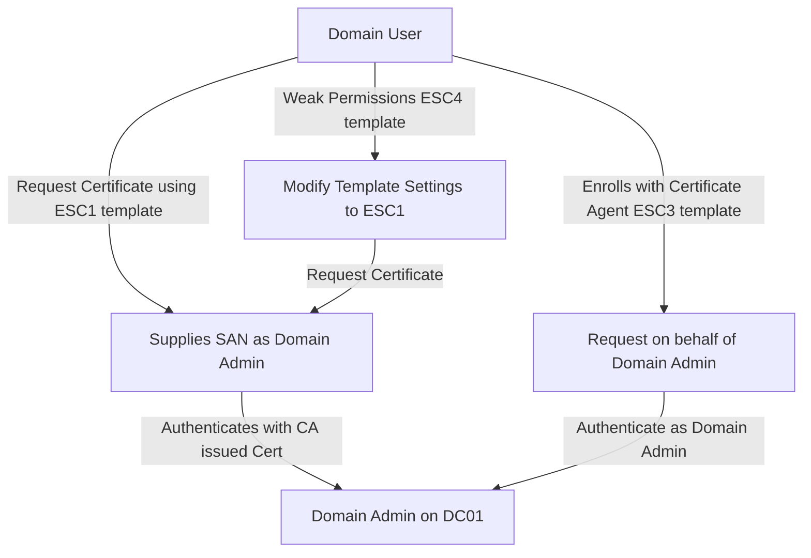
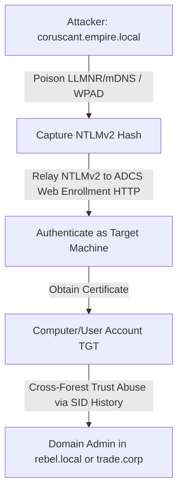

# Documentation Structure and Update Plan

This document details the layout structure, specific file modifications, new documents to create, and Mermaid diagrams to represent the vulnerability chains in the repository.

## 1. Documentation Structure & File Layout

We will update the existing walkthrough documentation files under `docs/` and add host-specific/service-specific documents to eliminate all gaps.

### A. Existing Walkthrough Updates
- `docs/02a-initial-access.md`:
  - Document additional zero-credential vectors: `IA-052` (LNK bait), `IA-053` (AutoPlay), `IA-056` (HTA bait), `IA-063` (CHM bait), `IA-076` (IIS default pages), `IA-078` (WebDAV write), `IA-084` (RDP NLA), `IA-085` (OpenSSH unauth), `IA-113` (Domain password policy), `IA-114` (PSO), `IA-115` (AdminCount=1), `IA-117` (MAQ=100), `IA-119` (GPO cleartext).
- `docs/03-credential-access.md`:
  - Document additional credential access vectors: `CRED-066` (DPAPI backup keys), `CRED-067` (CredGuard disabled), `CRED-068` (LSA Notification Packages), `CRED-121`..`CRED-130` (browser logs, KeePass, RDP, AWS, Azure, Terraform cred files).
  - Resolve the mismatch for `CRED-014` (GenericAll on DC vs DCSync via GetChangesAll).
- `docs/04-lateral-movement.md`:
  - Document coercion, relay, and advanced lateral movements: `LAT-001`..`LAT-015`, `LAT-017`..`LAT-020`, `LAT-023`..`LAT-025`, `LAT-029`..`LAT-032`, `LAT-035`..`LAT-036`, `LAT-041`..`LAT-048`, `LAT-061`, `LAT-070`..`LAT-076`, `LAT-080`, `LAT-090`, `LAT-095`.
  - Add explicit execution commands for PrinterBug, PetitPotam, mDNS, shadow credentials, and cross-forest relays.
- `docs/05-privilege-escalation.md`:
  - Document privilege escalation paths: `PE-061`..`PE-070` (registry run keys, print processor DLLs, custom SSPs), `PE-081`..`PE-100` (secedit privilege grants), `PE-101` (kernel driver loading), `PE-110` (hypervisor LPE), `PE-115` (BYOVD), `PE-123` (LAPS missing), `PE-126` (Protected Users empty), `PE-128` (developer2 GenericWrite on EntAdmins).
  - Document CVEs: `PE-CVE-2021-36934` (HiveNightmare), `PE-CVE-2023-36874` (WER), `PE-CVE-2024-26230` (Telephony), `PE-CVE-2021-1732`, `PE-CVE-2024-38080`, `PE-CVE-2025-21333`.
- `docs/06-persistence.md`:
  - Resolve naming drifts: `PER-003` (Startup folder), `PER-004` (Scheduled task), `PER-005` (COM hijack), `PER-017` (Service binary), `PER-019` (DLL search order), `PER-020` (IFEO debugger sethc), `PER-021` (AppInit_DLLs), `PER-022` (Winlogon helper), `PER-023` (Time provider), `PER-031` (GPO boot script).

### B. New Documentation Files
- `docs/10-web-vulnerabilities.md`:
  - Document all `WEB-001` to `WEB-070` vulnerability configurations (IIS default configs, WebDAV PUT/PROPFIND, SQLi, XSS, ViewState without MAC, JWT none algorithm, open redirect, IDOR, SSRF, XXE).
- `docs/11-network-vulnerabilities.md`:
  - Document all `NET-001` to `NET-012` network protocol misconfigurations (WPAD DNS, mDNS, insecure DNS updates, TFTP, NetBIOS, NTP, SMTP open relay, POP3 plaintext, DHCP starvation).
- `docs/hosts/linux01-corp.md`:
  - Document Linux-in-AD and services vulnerabilities on Mandalore Base: `B1`..`B8` (krb5.keytab, passwordless sudo, SSSD cache, cron job, SUID find, NFS export no_root_squash, weak SSH) and services (Redis unauth, MongoDB no auth, Memcached, MySQL root remote, WebApp RCE).

---

## 2. Visual Attack Graphs (Mermaid Diagrams)

We will include detailed Mermaid diagrams illustrating the complex attack paths in the following walkthrough files:

### Graph 1: Web Shell to AD Domain Admin Chain (`docs/10-web-vulnerabilities.md`)

### Graph 2: ADCS ESC Vulnerability Paths (`docs/07-forest-compromise.md`)

### Graph 3: Cross-Forest and Relays (`docs/07-forest-compromise.md`)

