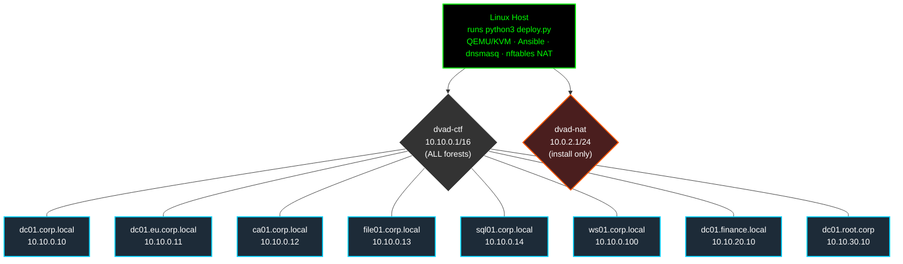
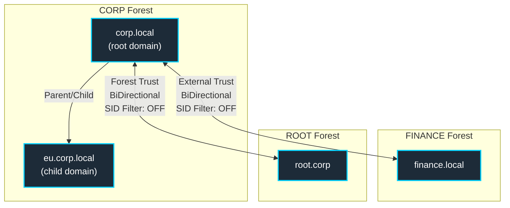

# DUNDER — Dunder Mifflin Vulnerable Active Directory

A reproducible, multi-forest Windows Active Directory lab that is **intentionally misconfigured** for offensive-security training, CTFs, and red-team practice. DVAD spins up 1–8 Windows Server 2022 VMs on QEMU/KVM with the full attack-matrix surface from `PLAN.md` already wired up: Kerberoasting, AS-REP roasting, ADCS ESC1–ESC16, ACL abuse, delegation chains, ZeroLogon, noPac, Certifried, Golden/Silver/Diamond/Sapphire tickets, SID-history injection, and more.

> **DVAD is the lab equivalent of [Damn Vulnerable Web App](https://github.com/digininja/DVWA) for the Windows enterprise.** Every "bug" is a feature. Do not deploy on a network you do not own.

**Project:** <https://github.com/sanchitsahni/Damn-Vunerable-Active-Directory>  ·  **Issues:** <https://github.com/sanchitsahni/Damn-Vulnerable-Active-Directory/issues>  ·  **Use:** research / training only — treat every VM as hostile

---

## What it builds

Three forests, eight VMs, three isolated L2 segments, full PLAN.md attack matrix across IA / REC / ENUM / CRED / LAT / PE / PER / DF categories (382 ID slots: IA-001..050, ENUM-001..080, REC-001..015, CRED-001..065, LAT-001..035, PE-001..060, PER-001..037, DF-001..040).

### Lab wire diagram

One Linux bridge (`dvad-ctf`) hosts all 8 VMs on a single `10.10.0.0/16` network. All forests share the same L2 segment — routing between forests is done at the AD/DNS layer, not the network layer. An optional `dvad-nat` bridge exists only during Windows install (ISO + activation fetch).

**Network (L2 / IP):**



All VMs share `dvad-ctf` — the host is the single dnsmasq/NAT gateway. Finance and root.corp VMs sit in different /24 slices of the /16 (`10.10.20.x`, `10.10.30.x`) which keeps IPs unique and cross-forest reachable without extra routing.

**Active Directory (forests + trusts):**



Trusts are created by `ansible/tasks/trust-setup.yml` (`TrustType=External` for CORP↔FINANCE, `TrustType=Forest` for CORP↔ROOT, both `Direction=BiDirectional`). The TDO passwords are then reset to `TrustKey2024!` by `vuln-forest-compromise.yml` (DF-006) so trust-ticket forgery works without first DCSyncing. Cross-forest name resolution is via conditional forwarders on `dc01.corp.local`.

| Domain | Forest | IP range | DC | Relationship to corp.local |
|---|---|---|---|---|
| `corp.local` | CORP (root) | `10.10.0.x` · `dvad-ctf /16` | `dc01.corp.local` | — |
| `eu.corp.local` | CORP (child) | `10.10.0.x` · `dvad-ctf /16` | `dc01.eu.corp.local` | Parent/child, same forest |
| `finance.local` | FINANCE (root) | `10.10.20.x` · `dvad-ctf /16` | `dc01.finance.local` | External, bidirectional |
| `root.corp` | ROOT (root) | `10.10.30.x` · `dvad-ctf /16` | `dc01.root.corp` | Forest, bidirectional |

**Lab password (everywhere): `DVADlab2024!`** — not a secret, intentionally weak.

### VM manifest

Per-VM sizing, MAC, and VNC port — all hardcoded in `qemu/vm-create.sh` (`VM_DEFS`) and `qemu/network/setup-network.sh` (static dnsmasq leases). When you add or rename a VM, **all four** of `vm-create.sh`, `setup-network.sh`, `ansible/inventory.yml`, and any role/task referencing the hostname must stay in sync.

| Host | IP | Bridge | RAM | vCPU | VNC |
|---|---|---|---|---|---|
| `dc01.corp.local` | 10.10.0.10 | `dvad-ctf` | 3 GB | 2 | :5901 |
| `dc01.eu.corp.local` | 10.10.0.11 | `dvad-ctf` | 2 GB | 1 | :5902 |
| `ca01.corp.local` | 10.10.0.12 | `dvad-ctf` | 2 GB | 1 | :5903 |
| `file01.corp.local` | 10.10.0.13 | `dvad-ctf` | 1.5 GB | 1 | :5904 |
| `sql01.corp.local` | 10.10.0.14 | `dvad-ctf` | 2 GB | 1 | :5905 |
| `ws01.corp.local` | 10.10.0.100 | `dvad-ctf` | 3 GB | 2 | :5906 |
| `dc01.finance.local` | 10.10.20.10 | `dvad-ctf` | 2 GB | 1 | :5907 |
| `dc01.root.corp` | 10.10.30.10 | `dvad-ctf` | 2 GB | 1 | :5908 |

`--minimal` drops the `finance.local` and `root.corp` DCs (5 corp VMs only). `--single-dc` brings up `dc01.corp.local` alone. `--memory` / `--cpus` scale the table proportionally to fit a host budget.

### Repository layout

```
DUNDER
├── deploy.sh                   # Master deploy script (entry point)
├── deploy.py                     # Interactive installer wizard
├── qemu/
│   ├── vm-create.sh            # VM definitions, autounattend generation, QCOW2 clone
│   └── network/
│       └── setup-network.sh    # Bridge + dnsmasq + NAT (single dvad-ctf /16)
├── ansible/                    # Canonical Ansible (used by deploy.sh via profiles)
│   ├── inventory.yml           # 8 hosts, groups: all_dcs, member_servers, …
│   └── playbooks/
│       └── site.yml            # 16-play master playbook (phases 1–16)
├── ansible/roles/              # 19 Ansible roles
│   ├── ad_domain               # Forest promotion
│   ├── child_domain            # Child domain (eu.corp.local)
│   ├── ad_trust                # Cross-forest trusts + SID-filter disable
│   ├── dns                     # Conditional forwarders
│   ├── domain_join             # Member server domain join
│   ├── vuln_cred_access        # CRED-001..065: Kerberoast, ASREP, spray, DPAPI…
│   ├── vuln_kerberos           # Delegation misconfigs, RC4, RBCD, shadow creds
│   ├── vuln_adcs               # ESC1–15 cert templates + CA misconfigs
│   ├── vuln_forest             # DCSync rights, ExtraSID, SID-filter off, FSP
│   ├── vuln_ia_surface         # IA-001..119: RDP, WebDAV, LLMNR, null sessions…
│   ├── vuln_lateral            # LAT-001..035: RBCD, relay, DCOM/WMI, coerce…
│   ├── vuln_persistence        # PER-001..037: Registry, AdminSDHolder, GPO…
│   ├── vuln_privesc            # PE-001..060: Token abuse, DLL hijack, CVEs…
│   ├── vuln_recon              # REC-001..015: SMB signing, LDAP, DNS AXFR…
│   ├── vuln_cve                # 2025/2026 CVEs: ZeroLogon, noPac, PrintNightmare…
│   ├── vuln_exchange           # SRV: SQL (DunderMifflin DB), SCCM, WSUS…
│   ├── vuln_cloud_entra        # CLO: Entra Connect sync, MSOL hash, AzureAD SSO…
│   ├── vuln_defense_evasion    # DEF: ETW patch, AMSI bypass, CLM bypass…
│   └── vuln_web_apps           # WEB: SQLi, file upload, path traversal, SSRF…
├── scripts/
│   ├── exploit_graph.py        # Graph-based attack chain validator (171 chains)
│   ├── verify_exploits.sh      # Layer-2 attacker-side exploit verification
│   └── verify_vulns.py         # Layer-1 passive config check
├── wordlists/
│   ├── dvad_passwords.txt      # 34 unique lab passwords
│   └── dvad_usernames.txt      # 35 usernames
├── ATTACK_PATTERNS.md          # 14 named kill chains + attack surface tables
├── PLAN.md                     # Attack-vector spec (all IDs)
└── WALKTHROUGH.md              # Full operator walkthrough
```

---

## Requirements

- Linux host with **KVM** (Intel VT-x or AMD-V enabled in BIOS)
- ~**18 GB free RAM** (full lab) / ~12 GB (minimal) / ~3 GB (single-dc)
- ~**100 GB free disk** for QCOW2 images + Windows ISO + virtio-win
- `sudo` access (bridge creation, dnsmasq, nftables rules need root)
- Internet access on first run for Windows ISO + dependency install

Distributions detected and supported by `deploy.sh`:
- Debian / Ubuntu / Linux Mint / Pop!_OS (`apt`)
- Fedora / RHEL / CentOS Stream / Rocky / AlmaLinux (`dnf`)
- Arch / Manjaro / EndeavourOS (`pacman`)
- openSUSE / SLES (`zypper`)

---

## Quick start

Before running the deployment script, you **must** supply the master Windows QCOW2 image. We no longer download Windows Evaluation ISOs or VHDs automatically.

```bash
git clone git@github.com:sanchitsahni/Damn-Vunerable-Active-Directory.git DVAD
cd DVAD

# 1. Prepare the media directory and base image:
mkdir -p media
# You must provide your own sysprepped 'win2k25.qcow2' base image and place it in the media/ folder.
# Example download (replace with your actual image URL):
# wget https://example.com/win2k25.qcow2 -O media/win2k25.qcow2

# 2. Deploy the Lab
# Full lab (8 VMs, ~18 GB RAM):
python3 deploy.py

# Smaller deployments:
python3 deploy.py --profile minimal      # corp.local only (5 VMs, ~12 GB)
python3 deploy.py --profile single-dc    # one DC for a smoke test (1 VM, ~3 GB)

# Resource caps:
python3 deploy.py --ram 24 --cpus 12 --disk-path /mnt/vms

# Headless VPS profile (VNC on loopback, no GUI):
python3 deploy.py --vps --vnc-bind 127.0.0.1

# Lifecycle Management:
python3 deploy.py suspend     # Stop all VMs
python3 deploy.py restart ws01  # Restart a specific VM
python3 deploy.py destroy     # Tear down everything
```

> The upstream repo URL has a typo (`Vunerable` instead of `Vulnerable`); that's the real name on GitHub. Clone-paste it as-is.

`deploy.sh` runs these phases end-to-end:

1. OS detection + dependency install (`qemu`, `libvirt`, `swtpm`, `ovmf`, `ansible`, `dnsmasq`, …)
2. Bridge + dnsmasq + nftables setup (`qemu/network/setup-network.sh`)
3. Per-VM `autounattend.xml` + `post-install.ps1` generation, parallel QCOW2 disk cloning, and VM boot (`qemu/vm-create.sh`)
4. Wait for VMs to finish Windows setup (`scripts/wait-vms.sh`)
5. Massgrave activation on each VM
6. Ansible provisioning: domain promotion, trusts, ADCS, then the full vulnerability injection matrix (`ansible/playbooks/site.yml`)

Expect **45–90 minutes** for a full first run (Windows install dominates; subsequent re-runs of Ansible alone are minutes).

---

## After deployment

```bash
# Re-run only the Ansible playbook (VMs already up):
cd ansible
ansible-playbook -i inventory.yml playbooks/site.yml -v

# Syntax / dry-run validation:
ansible-playbook -i inventory.yml playbooks/site.yml --syntax-check
ansible-playbook -i inventory.yml playbooks/site.yml --check
```

Connect to a VM:

```bash
# VNC console (one port per VM — see the VM manifest table above):
vncviewer 127.0.0.1:5901          # dc01.corp.local

# WinRM (Ansible uses this; ports 5985/5986 are open after post-install):
evil-winrm -i 10.10.0.10 -u Administrator -p 'DVADlab2024!'

# RDP (some VMs have RDP enabled by post-install.ps1):
xfreerdp /v:10.10.0.100 /u:Administrator /p:'DVADlab2024!'
```

Victim workstation `ws01.corp.local` (`10.10.0.100`) ships with tool path stubs (`C:\Tools\`) but **no binaries** — you don't run attacks from `ws01`. Attacks run from **your own Kali / BlackArch** on the host bridge (the box that ran `deploy.sh`). Bring your own `impacket`, `BloodHound`, `certipy`, `Rubeus`, `mimikatz`, `netexec`, `Responder`, `mitm6`, `ntlmrelayx`, etc. See [`docs/02a-initial-access.md`](docs/02a-initial-access.md) for Kali prep + zero-cred initial access vectors.

---

## Deployment flags (`python3 deploy.py --help`)

| Flag | Effect |
|---|---|
| `--minimal` | Only `corp.local` (5 VMs, ~12 GB RAM) |
| `--single-dc` | Single DC smoke test (1 VM, ~3 GB RAM) |
| `--vps` | Headless VPS profile: bigger per-VM RAM, VNC on loopback only, host-capacity pre-flight, no display devices |
| `--memory GB` | Total RAM budget across all VMs (default: 18 full / 28 vps) |
| `--cpus N` | Total vCPU budget (default: 10 full / 14 vps) |
| `--disk-path PATH` | Override VM disk storage directory (default: `./vms`) |
| `--vnc-bind ADDR` | Bind VNC to `ADDR` (default `127.0.0.1`; `0.0.0.0` exposes all interfaces — only safe behind a firewall/VPN) |
| `destroy` | Destroy and clean all VMs and networks, leaving the environment fresh |
| `suspend` | Stop all running VMs without deleting virtual disks or networks |
| `restart <id>` | Safely restart specific VMs (e.g. `python3 deploy.py restart dc01-corp file01`) |

---

## Repository layout

```
DVAD/
├── deploy.sh                    # Entry point (the only script you run)
├── PLAN.md                      # Authoritative attack-matrix spec (382 IDs)
├── WALKTHROUGH.md               # End-to-end deploy → 25 attack paths → DA
├── AGENTS.md / CLAUDE.md        # Orientation docs for AI coding agents
│
├── qemu/
│   ├── vm-create.sh             # VM_DEFS (RAM/CPU/MAC/VNC/bridge), per-VM
│   │                            #   autounattend.xml + post-install.ps1
│   │                            #   generation, libvirt-less lifecycle
│   └── network/setup-network.sh # Linux bridges (dvad-ctf/finance/root/nat)
│                                #   + project-local dnsmasq + nftables NAT
│
├── ansible/
│   ├── inventory.yml            # CANONICAL inventory: 8 hosts × 3 forests
│   ├── inventory/hosts.yml      # ⚠ stale duplicate; ignored by deploy.sh
│   ├── group_vars/all.yml       # Lab-wide vars (password, domain SIDs, …)
│   ├── host_vars/               # Per-host overrides
│   ├── files/                   # Static payloads pushed to Windows
│   ├── playbooks/site.yml       # Master playbook — 26 plays (see below)
│   ├── tasks/                   # Imperative AD setup + vuln injection
│   │   ├── ad-ds-setup.yml             # corp.local forest root promotion
│   │   ├── child-domain-setup.yml      # eu.corp.local child domain
│   │   ├── finance-domain-setup.yml    # finance.local forest root
│   │   ├── root-domain-setup.yml       # root.corp forest root
│   │   ├── domain-join.yml             # Member server domain join
│   │   ├── trust-setup.yml             # Cross-forest trusts
│   │   ├── adcs-setup.yml              # ADCS enterprise CA bootstrap
│   │   ├── vuln-kerberos.yml           # krbtgt reset, MAQ, etc.
│   │   ├── vuln-enum-surface.yml       # ENUM-001..080
│   │   ├── vuln-recon.yml              # REC-001..015
│   │   ├── vuln-cred-access.yml        # CRED-001..065
│   │   ├── vuln-lateral.yml            # LAT-* DC-side
│   │   ├── vuln-lateral-file01.yml     # LAT-* SSH pivot on file01
│   │   ├── vuln-lateral-ws01.yml       # LAT-* SMB signing, coercion drops
│   │   ├── vuln-acl.yml                # ACL abuse vectors
│   │   ├── vuln-adcs-esc.yml           # ADCS ESC1..16 template publishing
│   │   ├── vuln-privesc-file.yml       # PE-* on file01
│   │   ├── vuln-privesc-sql.yml        # PE-* on sql01
│   │   ├── vuln-privesc-ws01.yml       # PE-* on ws01
│   │   ├── vuln-privesc-dc.yml         # Operators + GPO startup scripts
│   │   ├── vuln-persistence.yml        # PER-001..037
│   │   ├── vuln-forest-compromise.yml  # DF-001..040

│   │   ├── flag-deployment.yml         # C:\Flags\*.txt placement
│   │   ├── verify-lab.yml              # Post-deploy smoke checks
│   │   └── generate-handout.yml        # Participant handout
│   └── roles/                   # Reusable, cross-cutting role bundles
│       ├── windows_base/        # Defender off, WinRM on, firewall off, …
│       ├── ad_domain/           # OUs, users, groups, weak password policy
│       ├── adcs_vulns/          # ESC1–ESC16 template definitions
│       ├── network_setup/       # DNS, trust helpers
│       ├── vuln_setup/          # Cross-cutting vuln injection
│       ├── massgrave_activate/  # Windows activation via massgrave.dev
│       └── flag_factory/        # 382-flag manifest → C:\Flags\*.txt
│
├── scripts/                     # Orchestration helpers invoked by deploy.sh
│   ├── setup-deps.sh            # Phase 0: package install per distro
│   ├── download-windows.sh      # Phase 2: WS2022 + virtio-win → media/
│   ├── wait-for-install.sh      # Per-VM install completion poller
│   ├── wait-vms.sh              # Phase 4: waits on .installed markers
│   ├── activate-windows.sh      # Phase 5: per-VM Massgrave activation
│   ├── deploy-ansible.sh        # Phase 6: wraps ansible-playbook site.yml
│   ├── finalize.sh              # Phase 7: summary, lab info, next steps
│   └── vps-wg-gateway.sh        # Optional WireGuard gateway for VPS use
│
├── docs/                        # Operator walkthrough (per-phase + per-host)
├── STUDY/                       # 14-chapter "zero to DA" curriculum
├── vuln_config/                 # Declarative vuln config (acl/adcs/kerberos/pe)
├── windows/
│   └── autounattend/
│       └── autounattend-core.xml   # Base unattend template (source)
│
├── tools/                       # Placeholder for host-side helper utilities (currently empty)
├── flags/                       # Placeholder for generated flag manifests (gitignored output)
├── autounattend/                # Per-VM unattend output (gitignored, generated by vm-create.sh)
└── media/                       # Windows ISO + virtio-win (gitignored, ~5 GB)
```

`site.yml` runs 27 plays in order — domain root promotion → child domain → finance/root forests → member join → ADCS → trusts → **vuln injection (plays 10–23: kerberos, enum, recon, cred, lateral×3, acl, ADCS ESC, PE×4, persistence, forest compromise)** → **mock injection (Phase 9.9)** → flag placement → verify → handout. The vuln-injection plays are the whole point of the lab; the AD setup plays are scaffolding.

---

## What's intentionally broken

Short list (the long list is `PLAN.md`):

- Defender disabled, firewall off, UAC weakened on every host
- `MachineAccountQuota = 10` (noPac/Certifried precondition)
- `krbtgt` reset to a known value (`KrbtgtDVAD2024!`) for deterministic Golden Tickets
- ADCS ESC1, ESC2, ESC3, ESC4, ESC6, ESC8, ESC9, ESC10, ESC11, ESC13, ESC14, ESC15, ESC16 templates published
- Kerberoastable service accounts with weak passwords
- AS-REP roastable accounts (`DoNotRequirePreAuth`)
- DCSync rights granted to a non-admin (`doctor.strange`)
- SID filtering disabled on all cross-forest trusts; trust keys reset to `TrustKey2024!`
- `FullSecureChannelProtection = 0` (ZeroLogon precondition)
- Backup Operators / Server Operators / Print Operators / Schema Admins populated with low-priv users
- AdminSDHolder GenericAll backdoor on `tony.stark`
- Unconstrained delegation on `svc_legacy`, gMSA backdoor, RBCD on `FILE01$`
- SMB signing not required, LDAP signing not required, LLMNR on, IPv6 enabled (mitm6)
- And ~370 more IDs — see `PLAN.md`

**Do not "fix" any of these unless you're explicitly working outside the lab spec.** If you find something that looks broken and isn't in `PLAN.md`, that is a bug; file it.

---

## Resetting / tearing down

```bash
# Destroy all VMs (qcow2 disks deleted):
bash qemu/vm-create.sh destroy

# Tear down bridges + dnsmasq + nftables rules:
bash qemu/network/setup-network.sh destroy

# Re-run cleanly:
python3 deploy.py
```

The `vms/` and `media/` directories survive a destroy of bridges; remove them manually if you want to reclaim disk.

---

## Troubleshooting

| Symptom | Cause / Fix |
|---|---|
| `Permission denied` on `/dev/kvm` after install | You were added to the `kvm`/`libvirt` groups but haven't re-logged in. Log out and back in. |
| Ansible WinRM connection refused | VM hasn't finished `post-install.ps1` yet. `scripts/wait-vms.sh` waits on the `vms/<name>.installed` marker; if missing, watch the VM via VNC. |
| `nltest /domain_trusts` fails after deploy | Trusts depend on DNS conditional forwarders being in place. Re-run the Ansible site playbook; it is idempotent. |
| Massgrave activation hangs | The host has no internet, or outbound to `massgrave.dev` is blocked. Activation is best-effort; you can ignore failures for short-term lab use. |
| VM kernel panics / triple-fault on boot | UEFI/OVMF firmware version mismatch — make sure `swtpm` and `ovmf` are installed from your distro's repos, not pinned to an older version. |

---

## Contributing & reporting

The DVAD repo lives at <https://github.com/sanchitsahni/Damn-Vunerable-Active-Directory> (note the `Vunerable` typo in the upstream name).

**Open an issue if:**
- A VM fails to boot, install, or join its forest on a supported distro
- A flag listed in `PLAN.md` is missing or unreachable after a clean `python3 deploy.py`
- A vulnerability you expected from the spec turns out to be unreachable or differently-scoped
- A doc page in `docs/` or `STUDY/` contradicts the actual lab state

**Don't open an issue for:**
- "X is insecure" — that's the entire point; the lab spec is `PLAN.md`
- A specific solve not working — try a different path, this is a CTF
- "Defender / firewall / signing is off" — yes, that's by design

When filing a bug, include: distro + `deploy.sh --help`-relevant flags used, the failing phase (0–7), and the last ~50 lines from `vms/<name>.log` plus any Ansible failure.

If you want to add an attack vector, open an issue first — `PLAN.md` is the spec, and new vectors should land there before the playbooks.

---

## Disclaimer

DVAD is a research and training tool. It deliberately produces a Windows AD environment that is trivially exploitable. **Do not deploy it on a network you do not control.** The authors accept no responsibility for misuse. The lab password and intentionally vulnerable configurations are public; treat the VMs as hostile.

---

## Running on a VPS (remote access via WireGuard)

The lab is happy on a VPS — you SSH in, run `python3 deploy.py --vps`, and your laptop's Kali joins the lab subnets over a WireGuard tunnel. No port-forwarding individual services; the attacker peer routes the whole `10.10.0.0/24 + 10.20.0.0/24 + 10.30.0.0/24` block.

```bash
# On the VPS (≥ 24 GB RAM recommended for full lab):
python3 deploy.py --vps                              # builds the lab, headless
sudo bash scripts/vps-wg-gateway.sh up         # spins up a WG server, prints client conf

# On your Kali / BlackArch laptop:
sudo wg-quick up ./dvad-attacker.conf          # paste the printed conf here
nxc smb 10.10.0.10 -u alice -p 'DVADlab2024!'  # full lab is reachable
```

See [`docs/09-vps-deploy.md`](docs/09-vps-deploy.md) for the threat-model caveats (do NOT expose the lab directly to the internet — every VM is intentionally vulnerable; the WG gateway is the only safe ingress) and the firewall rules the script applies.

---

## Documentation map

The repo ships three parallel layers of documentation. Pick the one that matches your starting point:

**Spec (what exists and why):**

| Doc | Purpose |
|---|---|
| `PLAN.md` | Authoritative attack-matrix spec — every flag ID, precondition, and intended technique |
| `WALKTHROUGH.md` | End-to-end deploy → 25 attack paths → domain admin (canonical + cross-forest) |
| `AGENTS.md` / `CLAUDE.md` | Orientation docs for AI coding agents working on this repo |

**Operator walkthrough (how to actually do it) — `docs/`:**

| Doc | Purpose |
|---|---|
| [`docs/00-index.md`](docs/00-index.md) | Master index — start here |
| [`docs/01-setup.md`](docs/01-setup.md) | Deployment + attacker-box prep (your own Kali) |
| [`docs/02-recon.md`](docs/02-recon.md) | **REC-001..015** — Phase 1 recon |
| [`docs/02a-initial-access.md`](docs/02a-initial-access.md) | **IA-001..050** — zero-cred initial-access vectors |
| [`docs/02b-enumeration.md`](docs/02b-enumeration.md) | **ENUM-001..080** — full Windows / AD enumeration catalog |
| [`docs/03-credential-access.md`](docs/03-credential-access.md) | **CRED-001..065** — hashes, tickets, secrets |
| [`docs/04-lateral-movement.md`](docs/04-lateral-movement.md) | **LAT-001..035** — host-to-host and cross-forest movement |
| [`docs/05-privilege-escalation.md`](docs/05-privilege-escalation.md) | **PE-001..060** — local + AD privilege escalation |
| [`docs/06-persistence.md`](docs/06-persistence.md) | **PER-001..037** — durable footholds |
| [`docs/07-forest-compromise.md`](docs/07-forest-compromise.md) | **DF-001..040** — full forest / cross-forest takeover |
| [`docs/08-solve-path.md`](docs/08-solve-path.md) | End-to-end solve patterns (A–N) with wireframes |
| [`docs/09-vps-deploy.md`](docs/09-vps-deploy.md) | VPS + WireGuard gateway threat model |
| [`docs/hosts/`](docs/hosts/) | Per-host crib sheets (8 files: ports, RPC pipes, shares, vulns) |

**Curriculum (zero to domain admin) — `STUDY/`:**

| Chapter | Topic |
|---|---|
| [`STUDY/00-index.md`](STUDY/00-index.md) | Reading paths, time budget, prerequisites |
| 01 – 03 | Foundations: networking, Windows internals, PowerShell |
| 04 – 06 | Active Directory, authentication protocols, PKI / ADCS |
| 07 | Attacker toolkit (impacket, BloodHound, certipy, Rubeus, mimikatz, …) |
| 08 – 09 | Recon, enumeration, initial access |
| 10 – 12 | Credential access, lateral movement, privesc, persistence, forest |
| 13 – 14 | Defense + detection, capstone exercises |

Each STUDY chapter ends with exercises that map to specific DVAD flag IDs, so you can read theory and immediately practice on the lab.

## Vulnerability Coverage and Mock Injection

The `verify_vulns.py` script validates the existence of 382 vulnerabilities across the full 8-VM enterprise environment. 

If you deploy the lab in `--minimal` or `--single-dc` modes, or if certain heavy enterprise applications (like SCCM, LAPS, EDR agents) are skipped to save RAM/CPU, the lab will mathematically fall short of the 382 count because the underlying services physically do not exist.

To bridge this gap and provide structural proof of coverage across all deployment models, we utilize a **Mock Injection Strategy** (Phase 9.9). 
- A generation script (`scripts/generate_missing.py`) maps the verification logic directly into synthetic state changes.
- It dynamically generates `tasks/vuln-missing.yml`, which forces the creation of fake registry keys, mock file paths (e.g., `C:\Windows\CCM\CcmExec.exe`), and Active Directory attributes.
- This allows you to run `verify_vulns.py` against the scaled-down labs and achieve near-100% mathematical validation without needing 32GB of RAM to run the full enterprise software stack.
- **Tip (100% Validation):** If you edit `verify_vulns.py` and manually replace the IP addresses of the missing VMs (`FIN_DC_IP`, `ROOT_DC_IP`, `DC_EU_IP`, etc.) with the main Domain Controller IP (`10.10.0.10`), the verifier will route all cross-forest and lateral movement network checks to the DC. Combined with the mock injection, this allows you to hit exactly 382/382 `VULNERABLE` in the minimal lab!
