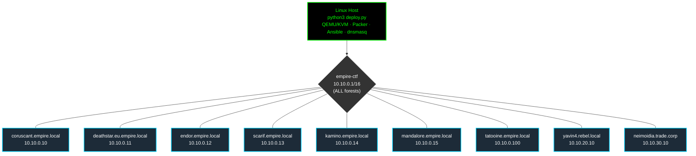
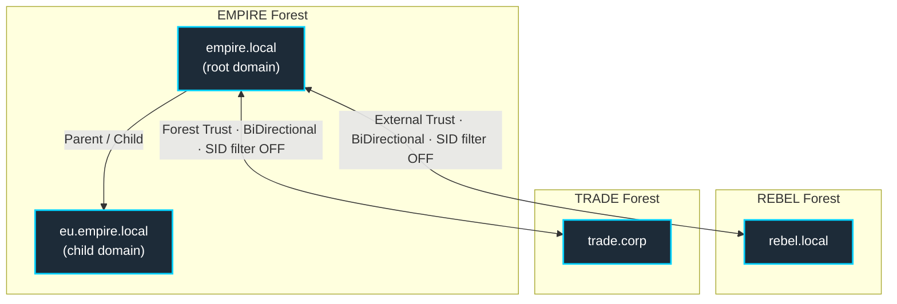

# EMPIRE — Vulnerable Multi-Forest Active Directory Lab

A reproducible, **intentionally misconfigured** multi-forest Windows Active Directory lab for offensive-security training, CTFs, and red-team practice. One command (`python3 deploy.py`) downloads the Windows media, builds base images with Packer, wires up the networks, boots the VMs, and runs the full Ansible attack-surface injection from `PLAN.md`: Kerberoasting, AS-REP roasting, ADCS ESC1–ESC16, ACL abuse, delegation chains, RBCD, ZeroLogon/noPac/Certifried preconditions, Golden/Silver/Diamond tickets, SID-history injection, cross-forest trust abuse, and more.

> Every "bug" here is a feature. The misconfigurations **are** the spec (`PLAN.md`). Do not deploy on a network you do not own — treat every VM as hostile.

> **Acknowledgment:** EMPIRE owes a great deal to [**GOAD — Game of Active Directory**](https://github.com/Orange-Cyberdefense/GOAD), whose multi-forest lab design and attack-path philosophy were an enormous help in shaping this project.

---

## What it builds

Three forests, up to nine VMs, on a single Linux bridge:

- **`empire.local`** (root) + **`eu.empire.local`** (child) — the Galactic Empire forest
- **`rebel.local`** — external trust (Rebel Alliance)
- **`trade.corp`** — forest trust (Trade Federation)

Eight Windows Server VMs (2019/2022) + one Ubuntu 22.04 Linux member. All share the `empire-ctf` bridge on `10.10.0.0/16`; forests live in different /24 slices (`10.10.0.x`, `10.10.20.x`, `10.10.30.x`) so cross-forest traffic routes at the AD/DNS layer, not the network layer.

### Network (L2 / IP)



### Active Directory (forests + trusts)



Trusts are created by the `ad_trust` role (`TrustType=External` for empire↔rebel, `Forest` for empire↔trade, both bidirectional) via the .NET `CreateTrustRelationship` API, with SID filtering disabled (DF-008) so SID-history injection works across the boundary. Cross-forest name resolution is via conditional forwarders on `coruscant.empire.local` (the `dns` role).

| Domain | Forest | IP range | DC (inventory name) | Trust to empire.local |
|---|---|---|---|---|
| `empire.local` | EMPIRE (root) | `10.10.0.x` | `coruscant.empire.local` | — |
| `eu.empire.local` | EMPIRE (child) | `10.10.0.x` | `deathstar.eu.empire.local` | Parent/child, same forest |
| `rebel.local` | REBEL (root) | `10.10.20.x` | `yavin4.rebel.local` | External, bidirectional |
| `trade.corp` | TRADE (root) | `10.10.30.x` | `neimoidia.trade.corp` | Forest, bidirectional |

### VM manifest

Specs are hardcoded in `providers/qemu/vm-create.sh` (`VM_DEFS`) and the static dnsmasq leases in `providers/qemu/network-setup.sh`. When you add or rename a VM, **all four** of `vm-create.sh`, `network-setup.sh`, `ansible/inventory.yml`, and any role/task referencing the hostname must stay in sync.

| Host | IP | RAM | vCPU | VNC | Base image | Role |
|---|---|---|---|---|---|---|
| `coruscant.empire.local` | 10.10.0.10 | 1792 MB | 2 | :5901 | server2022 | Root DC |
| `deathstar.eu.empire.local` | 10.10.0.11 | 1280 MB | 2 | :5902 | server2022 | Child DC |
| `endor.empire.local` | 10.10.0.12 | 1536 MB | 2 | :5903 | server2022 | ADCS / Enterprise CA |
| `scarif.empire.local` | 10.10.0.13 | 1280 MB | 2 | :5904 | server2019 | File server (SMB) |
| `kamino.empire.local` | 10.10.0.14 | 1792 MB | 2 | :5905 | server2022 | SQL Server |
| `tatooine.empire.local` | 10.10.0.100 | 1024 MB | 2 | :5906 | server2022 (Core) | Victim "workstation" |
| `mandalore.empire.local` | 10.10.0.15 | 1280 MB | 2 | :5909 | ubuntu 22.04 | Linux member |
| `yavin4.rebel.local` | 10.10.20.10 | 1280 MB | 2 | :5907 | server2022 | rebel.local DC |
| `neimoidia.trade.corp` | 10.10.30.10 | 1280 MB | 2 | :5908 | server2022 | trade.corp DC |

Profiles: **`full`** = all 9 VMs / 3 forests (~12.25 GB allocated). **`minimal`** = 7 VMs (empire.local + mandalore, no rebel/trade DCs, ~9.75 GB). **`single-dc`** = `coruscant` only (~1.5 GB smoke test).

### Lab credentials (not secrets — intentionally weak)

| Purpose | Value |
|---|---|
| Domain Administrator (every domain) | `SithLord123!` |
| DSRM / safe-mode password | `SithLord123!` |
| `krbtgt` (empire.local) | `KrbtgtEMPIRE2024!` |
| `krbtgt` (eu.empire.local) | `KrbtgtEU2024!` |
| Cross-forest trust keys | `TrustKey2024!` |

---

## Requirements

- Linux host with **KVM** (Intel VT-x / AMD-V enabled in BIOS)
- ~**16 GB free RAM** (full) / ~10 GB (minimal) / ~2 GB (single-dc)
- ~**100 GB free disk** for qcow2 images + Windows ISOs + virtio-win
- `sudo` (bridge creation, dnsmasq, nftables need root)
- Internet on first run (Windows ISOs + virtio + Ubuntu cloud image + packages)
- Host packages: `qemu`/KVM, `libvirt`, `swtpm`, `ovmf`, `packer`, `ansible`, `dnsmasq`

`scripts/setup-deps.sh` installs the host packages per distro: Debian/Ubuntu (`apt`), Fedora/RHEL/Rocky/Alma (`dnf`), Arch/Manjaro (`pacman`), openSUSE (`zypper`). After it adds you to the `kvm`/`libvirt` groups you must **log out and back in** before launching VMs without sudo.

---

## Quick start

```bash
git clone https://github.com/sanchitsahni/Damn-Vunerable-Active-Directory.git EMPIRE
cd EMPIRE

sudo bash scripts/setup-deps.sh          # one-time host dependency install
#   ... log out / log back in (kvm + libvirt group membership) ...

python3 deploy.py                        # interactive wizard (recommended first run)

# Non-interactive:
python3 deploy.py --profile full     --provider qemu --yes
python3 deploy.py --profile minimal  --provider qemu --yes   # empire.local + mandalore
python3 deploy.py --profile single-dc --yes                  # 1-VM smoke test
python3 deploy.py --ram 24 --disk-path /mnt/vms --yes        # resource caps
```

You do **not** supply your own base image — `deploy.py` downloads the Windows Server ISOs + virtio-win + the Ubuntu cloud image, then builds the qcow2 base images with Packer automatically.

### Pipeline phases

`deploy.py` runs 7 phases end-to-end (`--phase N` / `--from-phase` restart from any of them):

| # | Phase | What happens |
|---|---|---|
| 0 | media | Download Windows ISOs, virtio-win, Ubuntu cloud image into `media/` |
| 1 | packer | Build server2019 / server2022 base qcow2 images |
| 2 | network | Create the `empire-ctf` bridge + project-local dnsmasq + nftables |
| 3 | VMs | Generate per-VM `autounattend.xml` + `post-install.ps1`, clone disks, boot |
| 4 | WinRM | Wait for each VM to finish Windows setup (writes `vms/<name>.installed`) |
| 5 | ansible | Domain promotion → trusts → ADCS → full vulnerability injection (`site.yml`) |
| 6 | verify | Layer-1 passive config checks (`scripts/verify_vulns.py`) |

Expect **45–90 minutes** on a full first run (Windows install + packer dominate). Re-running Ansible alone is minutes.

---

## Interactive console

Running `python3 deploy.py` with no `--yes` drops into a settings-aware console. Type `help` (or `?`) for the menu:

| Group | Commands |
|---|---|
| **Lab** | `check` · `install` · `build` · `network` · `vms` · `provision` · `resume <n>` |
| **VMs** | `status` · `start` · `stop` · `destroy` · `snapshot` · `reset` · `vnc` |
| **Provision** | `provision_tags <t>` (e.g. `kerberos,adcs`) · `verify` |
| **Config** | `settings` · `set_profile` · `set_provider` · `set_ram` · `set_attacker` · `set_flag_mode` · `set_disk` |

`snapshot` after a good provision, then `reset` to roll every VM back in seconds instead of re-provisioning.

## CLI flags (`python3 deploy.py --help`)

| Flag | Effect |
|---|---|
| `--yes`, `-y` | Skip all prompts (CI / cron) |
| `--profile {full,minimal,single-dc}` | Lab size |
| `--provider {qemu,virtualbox}` | Hypervisor (default qemu) |
| `--phase N`, `-p N` | Start from phase N (0=media … 6=verify) |
| `--from-phase PHASE` | Run Ansible from this phase to the end, then exit |
| `--only-phase PHASE` | Run only this Ansible phase, then exit |
| `--limit HOST` | Ansible `--limit` (e.g. `endor.empire.local`) |
| `--ram GB` | Total RAM budget across all VMs |
| `--disk-path PATH` | VM disk directory (default `./vms`) |
| `--attacker-ip IP` | Attacker / listener IP baked into payloads |
| `--flag-mode {ctf,training}` | `ctf` = flags require exploitation; `training` = visible at `C:\Flags\` |
| `--base-action {build,skip}` | `build` = run packer; `skip` = images already exist |
| `--destroy` | Tear down all VMs + networks |
| `--install-cron` | Write crontab + sudoers drop-in and exit |
| `--log-file PATH` | Append all output to a log file |

Ansible sub-phases (for `--from-phase` / `--only-phase`): `1 2 5 6 7 8 8b 9 10 11 13 14 16 17 18 19 20`.

---

## After deployment

```bash
# Re-run only Ansible (VMs already up):
cd ansible && ansible-playbook -i inventory.yml playbooks/site.yml -v

# Syntax / dry-run validation:
ansible-playbook -i inventory.yml playbooks/site.yml --syntax-check
ansible-playbook -i inventory.yml playbooks/site.yml --check

# Re-run Ansible from a given phase (helper):
scripts/run-from.sh 8b --limit endor.empire.local
```

Connect to a VM:

```bash
vncviewer 127.0.0.1:5901                                        # coruscant console
evil-winrm -i 10.10.0.10 -u Administrator -p 'SithLord123!'     # WinRM (5985 open)
xfreerdp /v:10.10.0.100 /u:Administrator /p:'SithLord123!'      # RDP where enabled
```

Attacks run from **your own Kali / BlackArch** on the host bridge — the box that ran `deploy.py`. `tatooine` is a victim, not an attack box. Bring your own `impacket`, `BloodHound`, `certipy`, `Rubeus`, `mimikatz`, `netexec`, `Responder`, `mitm6`, `ntlmrelayx`.

> BloodHound collection example (real DC names differ from inventory labels — use `coruscant-fin`/`coruscant-trade`/`coruscant-eu` for the other forests):
> ```bash
> bloodhound-python -u Administrator -p 'SithLord123!' -d empire.local \
>   -dc coruscant.empire.local -ns 10.10.0.10 -c All --zip
> ```

---

## What's intentionally broken

Short list — the full spec is `PLAN.md`:

- Defender disabled, firewall off, UAC weakened on every host
- `ms-DS-MachineAccountQuota = 10` (noPac / Certifried precondition)
- `krbtgt` reset to known lab values for deterministic Golden Tickets
- ADCS ESC1–ESC16 templates published (`EMPIREUserESC1`, `EMPIREMachineESC2`, …)
- Kerberoastable service accounts (`svc_*`) with weak passwords
- AS-REP roastable accounts (`DoNotRequirePreAuth`)
- DCSync rights granted to non-admin users
- SID filtering disabled on both cross-forest trusts; trust keys reset to `TrustKey2024!`
- ZeroLogon precondition, unconstrained/constrained/RBCD delegation, gMSA backdoor
- AdminSDHolder GenericAll backdoor, writable GPO (`EMPIREBackdoorGPO`, PER-034)
- SMB signing not required, LDAP signing not required, LLMNR on, IPv6 enabled (mitm6)
- …and ~370 more IDs across IA / REC / ENUM / CRED / LAT / PE / PER / DF — see `PLAN.md`

**Do not "fix" any of these.** If something looks broken and is *not* in `PLAN.md`, that is a real bug — file it.

---

## Resetting / tearing down

```bash
python3 deploy.py --destroy --yes                    # VMs + networks (qcow2 deleted)
# or, inside the console:  destroy
```

`vms/` and `media/` survive a network teardown; delete them manually to reclaim disk.

---

## Repository layout

```
EMPIRE/
├── deploy.py                 # Entry point — the only script you run
├── PLAN.md                   # Authoritative attack-matrix spec (all flag IDs)
├── providers/
│   ├── qemu/
│   │   ├── vm-create.sh      # VM_DEFS (MAC/RAM/CPU/VNC/bridge), autounattend +
│   │   │                     #   post-install generation, VM lifecycle
│   │   └── network-setup.sh  # empire-ctf bridge + dnsmasq static leases + nftables
│   └── virtualbox/
│       └── vm-create.sh      # VirtualBox provider equivalent
├── packer/                   # Packer templates (server2019 / server2022 base images)
├── ansible/
│   ├── inventory.yml         # Canonical inventory: 9 hosts × 3 forests
│   └── playbooks/
│       └── site.yml          # Master playbook — phased AD setup + vuln injection
│   └── roles/                # 23 roles (5 setup + 18 vuln_*)
├── chains/                   # Static attack-path graph + reachability validator
├── scripts/                  # Helper scripts (see Scripts reference below)
├── wordlists/                # Lab usernames + passwords
├── vms/                      # Generated per-VM state (gitignored)
└── media/                    # Windows ISOs + virtio + Ubuntu image (gitignored, ~5 GB)
```

Ansible roles: setup (`ad_domain`, `child_domain`, `ad_trust`, `dns`, `domain_join`) + vulnerability injection (`vuln_adcs`, `vuln_cloud_entra`, `vuln_cred_access`, `vuln_cve`, `vuln_defense_evasion`, `vuln_exchange`, `vuln_forest`, `vuln_ia_surface`, `vuln_kerberos`, `vuln_lateral`, `vuln_linux`, `vuln_network_protocols`, `vuln_persistence`, `vuln_privesc`, `vuln_recon`, `vuln_traffic_sim`, `vuln_victim_exec`, `vuln_web_apps`). The `vuln_*` roles are the whole point of the lab; the rest is scaffolding.

## Scripts reference

`deploy.py` is the entry point; everything below is either invoked by it or run by hand.

**Pipeline — invoked automatically by `deploy.py`:**

| Script | Role |
|---|---|
| `providers/qemu/vm-create.sh` | Generate per-VM autounattend + post-install, create and boot each QEMU/KVM VM |
| `providers/qemu/network-setup.sh` | Create the `empire-ctf` bridge + project-local dnsmasq static leases |
| `providers/virtualbox/vm-create.sh` | VirtualBox provider equivalent (when `--provider virtualbox`) |
| `scripts/verify_vulns.py` | Layer-1 passive config verification (also the `verify` console command) |
| `ansible/roles/vuln_linux/files/empire_app.py` | Vulnerable web app deployed to `mandalore` by Ansible |

**Manual / optional tools:**

| Script | Role |
|---|---|
| `scripts/setup-deps.sh` | Install host packages per distro — run once before `deploy.py` |
| `scripts/run-from.sh` | Re-run the Ansible `site.yml` from a given phase to the end |
| `scripts/verify_exploits.sh` | Layer-2 attacker-side exploit verification |
| `scripts/vps-wg-gateway.sh` | Optional WireGuard gateway for remote VPS access |
| `scripts/activate-windows.sh` | Massgrave Windows activation helper |
| `scripts/finalize.sh` | Post-deploy lab finalization / verification |
| `chains/attack_graph.py` + `chains/validator.py` | Static attack-path graph + reachability report |

**Standalone fallbacks — `deploy.py` already does these in-process, kept for manual use:**

| Script | Role |
|---|---|
| `scripts/wait-vms.sh`, `scripts/wait-for-install.sh` | Poll VMs for WinRM / write `.installed` markers (deploy.py: `phase_wait_winrm`) |
| `scripts/setup-sudoers.sh` | Write NOPASSWD sudoers (deploy.py: `--install-cron`) |
| `scripts/download-windows.sh` | Download Windows + virtio ISOs (deploy.py: in-process downloader) |

**Legacy / utilities:**

| Script | Role |
|---|---|
| `scripts/exploit_graph.py` | Superseded compatibility shim → `chains/validator.py` |
| `scripts/check_docs.py`, `scripts/check_study_flags.py`, `scripts/generate_missing.py` | Doc / flag consistency helpers |

## Documentation map

| Doc | Purpose |
|---|---|
| `README.md` | This file — setup, lifecycle, repo layout |
| `PLAN.md` | Authoritative attack-matrix spec — every flag ID, precondition, and intended technique |

---

## Troubleshooting

| Symptom | Cause / Fix |
|---|---|
| `Permission denied` on `/dev/kvm` | Added to `kvm`/`libvirt` groups but not re-logged in. Log out and back in. |
| Ansible WinRM connection refused | VM hasn't finished `post-install.ps1`. deploy.py waits on the `vms/<name>.installed` marker; watch the VM over VNC if it stalls. |
| Cross-forest trusts missing | Trust creation needs DNS conditional forwarders first; the `dns` phase runs before `ad_trust`. Re-run `ansible-playbook … --tags dns,trusts` (idempotent). |
| VM kernel panic / triple-fault on boot | OVMF/`swtpm` version mismatch — install both from your distro repos. |
| Packer build fails | Check `packer-output/logs/`; ensure the Windows ISOs landed in `media/` (phase 0). |

---

## Disclaimer

EMPIRE is a research and training tool that deliberately produces a trivially exploitable Windows AD environment. **Do not deploy it on a network you do not control.** The lab password and intentionally vulnerable configurations are public; treat every VM as hostile. The authors accept no responsibility for misuse.

---

# Star Wars Lore & Thematic Mapping

The lab maps Active Directory concepts onto the galactic struggle between the Galactic Empire, the Rebel Alliance, and the Trade Federation.

```mermaid
graph TD
    classDef empire fill:#000000,stroke:#ff0000,stroke-width:2px,color:#fff;
    classDef rebel fill:#2b5c8f,stroke:#ff9900,stroke-width:2px,color:#fff;
    classDef trade fill:#4a4a4a,stroke:#aaaaaa,stroke-width:2px,color:#fff;
    classDef highlight fill:#440000,stroke:#ff0000,stroke-width:3px,color:#fff;

    subgraph The Galactic Empire (empire.local)
        Coruscant["Coruscant (Root DC)<br/>coruscant.empire.local"]:::empire
        DeathStar["The Death Star (Child DC)<br/>deathstar.eu.empire.local"]:::highlight
        Scarif["Scarif Citadel (File Server)<br/>scarif.empire.local"]:::empire
        Kamino["Kamino Cloning Facility (SQL)<br/>kamino.empire.local"]:::empire
        Endor["Endor Shield Generator (CA)<br/>endor.empire.local"]:::empire
        Mandalore["Mandalore Mercenary Base (Linux)<br/>mandalore.empire.local"]:::empire
        Coruscant -- "Imperial Command" --> DeathStar
        Coruscant --- Scarif
        Coruscant --- Kamino
        Coruscant --- Endor
        Coruscant --- Mandalore
    end
    subgraph The Rebel Alliance (rebel.local)
        Yavin4["Yavin 4 Base<br/>yavin4.rebel.local"]:::rebel
    end
    subgraph The Trade Federation (trade.corp)
        Neimoidia["Cato Neimoidia<br/>neimoidia.trade.corp"]:::trade
    end
    Coruscant <-->|Espionage / External Trust| Yavin4
    Coruscant <-->|Treaty / Forest Trust| Neimoidia
```

- **`empire.local` (Galactic Empire):** root domain — the seat of the Emperor. Domain Admin here = keys to the galaxy.
- **`eu.empire.local` (Death Star):** child domain. Escaping it to compromise the root is the Death Star plans.
- **`rebel.local` (Rebel Alliance):** external forest, weak link across the trust.
- **`trade.corp` (Trade Federation):** forest trust — forge inter-realm TGTs to cross the boundary.
- **`endor` (Shield Generator / ADCS):** compromise the CA (ESC1/ESC8…) to forge certs for anyone.
- **`scarif` (Citadel / File server):** SMB shares with passwords left in scripts and configs.
- **`kamino` (Cloning Facility / SQL):** SQLi / `xp_cmdshell` foothold.
- **`mandalore` (Mercenary Base / Linux):** local privesc + cross-OS pivot.

> "Your focus determines your reality." Focus on the attack paths in `PLAN.md`. If an exploit fails, check your syntax and targeting — the lab is intentionally vulnerable.

May the Force be with you as you conquer the EMPIRE AD.
