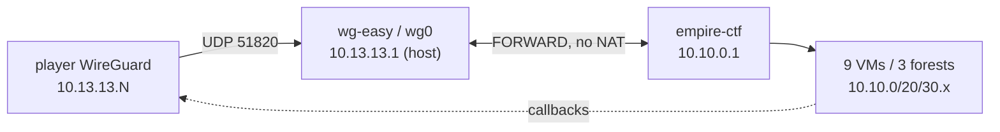

# Remote lab access — WireGuard (wg-easy)

Expose the EMPIRE lab to remote players over WireGuard. wg-easy gives a web UI
to mint/revoke per-player configs (with QR codes). Players VPN in and attack the
lab directly.

## Prereqs
- Lab already deployed (`empire-ctf` bridge up, gateway `10.10.0.1`, VMs running).
- Docker on the VPS: `curl -fsSL https://get.docker.com | sudo sh`
- UDP `51820` reachable from the internet (cloud-provider firewall + ufw).

## Setup
```bash
cd deploy/wireguard
cp .env.example .env

# generate the admin UI password hash, paste into .env (PASSWORD_HASH=...)
docker run --rm ghcr.io/wg-easy/wg-easy wgpw 'YOUR_ADMIN_PASS'

# edit .env: set WG_HOST=<VPS_PUBLIC_IP> and the hash
docker compose up -d

# lock it down (see below)
sudo ADMIN_IP=<your.admin.ip> ./harden.sh
```

## How players connect
1. Open the UI: `http://<VPS_IP>:51821` → log in.
2. **New Client** → name → download `.conf` or show QR.
3. Player imports into the WireGuard app, toggles on → gets `10.13.13.N`.
4. They attack the lab directly:
   ```bash
   nmap 10.10.0.10
   uvx --from bloodhound-ce bloodhound-ce-python -u Administrator -p 'SithLord123!' \
     -d empire.local -dc coruscant.empire.local -ns 10.10.0.10 -c All --zip
   ```
   `WG_DEFAULT_DNS=10.10.0.10` (coruscant) resolves `*.empire.local`.

## Why host networking + no NAT to the lab
`network_mode: host` places `wg0` in the host namespace beside `empire-ctf`.
wg-easy's default PostUp allows `FORWARD` to/from `wg0` and masquerades only out
the WAN iface — so lab-bound traffic (`10.10.0.0/16`) is **routed, not NATed**.
That preserves each player's tunnel IP, so lab VMs can call **back** to the
player for reverse shells, NTLM relay, and coercion (PetitPotam/PrinterBug).

`WG_ALLOWED_IPS=10.10.0.0/16` is what's pushed to clients: only lab traffic goes
through the tunnel; their normal internet stays direct. The single `/16` covers
all three forests (`10.10.0.x` empire/eu, `10.10.20.x` rebel, `10.10.30.x` trade).



## Hardening (`harden.sh`)
The lab is intentionally RCE-vulnerable. "Nothing on the host but the lab" still
leaves three real risks — `harden.sh` covers them:

1. **Host takeover** — host is `10.10.0.1`, reachable by every VM. A popped box
   that roots the host owns all VMs + all WireGuard keys. → drop lab→host
   `22/2375/2376/51821`.
2. **Egress abuse** — lab is NATed to the internet; a popped box becomes an
   attack/DoS origin and the provider terminates the VPS. → drop lab→internet
   except DNS.
3. **Cross-player** — peers attacking each other. → `wg0↔wg0` DROP.

SSH and the wg-easy UI are restricted to `ADMIN_IP`.

> [!warning] Run open at your own risk
> Skipping `harden.sh` means a single player can reset the lab for everyone or
> get your VPS terminated. The egress rule (#2) is the one that bites hardest.

## Files
- `docker-compose.yml` — wg-easy service (host net, routed-not-NATed to lab)
- `.env.example` — copy to `.env`; holds `WG_HOST` + `PASSWORD_HASH`
- `harden.sh` — firewall the 3 risks; `sudo ADMIN_IP=x.x.x.x ./harden.sh`
- `wg-easy-data/` — generated peer configs/keys (gitignored)
