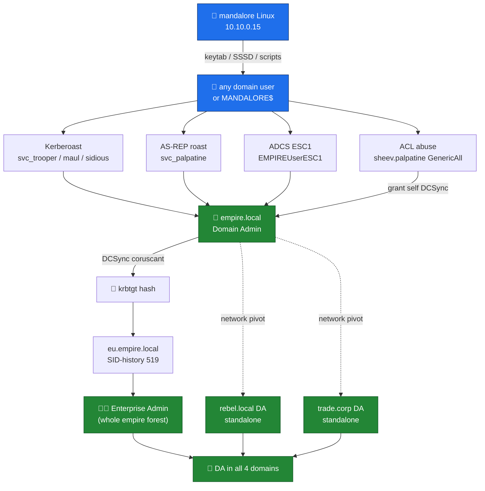

# 🗺️ EMPIRE Lab — Attack Path Index

> [!warning] Authorized lab testing only
> Every file is one fully-explained chain from a low-privilege start (a user or a machine) up to Domain / Enterprise Admin.

## Where do I start?

> [!tip] Pick your foothold
> | You have… | Go to |
> |---|---|
> | Only SSH to Linux box (`mandalore`) | [[01-foothold-mandalore-linux]] |
> | Any valid domain user | [[02-kerberoast-to-da]] · [[03-asrep-roast]] |
> | `sheev.palpatine` (or its hash) | [[04-acl-sheev-palpatine-dcsync]] |
> | A user who can enrol a cert | [[05-adcs-esc1-esc8]] |
> | Network + a machine account | [[06-coerce-relay]] |
> | `svc_trooper` / delegation principal | [[07-delegation]] |
> | DA in `empire.local` | [[08-child-eu-to-enterprise-admin]] |
> | Route to other forests | [[09-rebel-forest]] · [[10-trade-forest]] |
> | `HelpDesk` / `IT_Team` membership | [[11-laps-helpdesk-chain]] |
> | DA anywhere (lock it in) | [[12-persistence]] |
>
> Full secret list: [[appendix-seeded-secrets]]

## Target map

| Forest | Domain | NetBIOS | DC | DC IP |
|---|---|---|---|---|
| empire (root) | `empire.local` | EMPIRE | coruscant | `10.10.0.10` |
| empire (child) | `eu.empire.local` | EU | deathstar | `10.10.0.11` |
| rebel | `rebel.local` | REBEL | yavin4 | `10.10.20.10` |
| trade | `trade.corp` | TRADE | neimoidia | `10.10.30.10` |

Members (empire.local): endor `.0.12` (ADCS CA), scarif `.0.13`, kamino `.0.14`, tatooine WS `.0.100`, mandalore Linux `.0.15`.

## The whole campaign at a glance



> [!info] Fastest path
> If you can grab `sheev.palpatine`, [[04-acl-sheev-palpatine-dcsync]] is **one hop** to DA. Otherwise crack a roastable account ([[02-kerberoast-to-da]] / [[03-asrep-roast]]) then ride ADCS ESC1 ([[05-adcs-esc1-esc8]]).

## Setup (once)

```bash
pipx install impacket netexec certipy-ad bloodyAD coercer
echo "10.10.0.10  coruscant.empire.local empire.local"        | sudo tee -a /etc/hosts
echo "10.10.0.11  deathstar.eu.empire.local eu.empire.local"  | sudo tee -a /etc/hosts
echo "10.10.20.10 yavin4.rebel.local rebel.local"             | sudo tee -a /etc/hosts
echo "10.10.30.10 neimoidia.trade.corp trade.corp"            | sudo tee -a /etc/hosts
```
